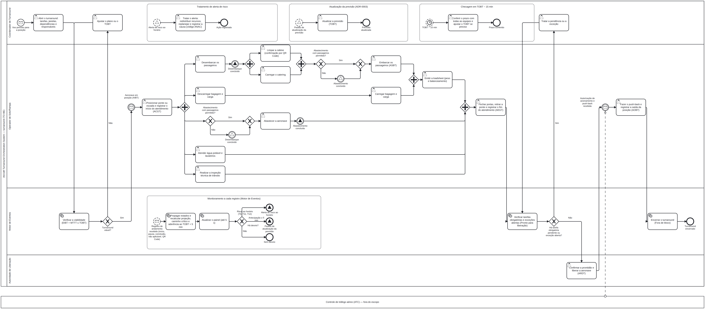

# 4 MAPEAMENTO DE NEGÓCIOS

Processo de negócio do turnaround na versão **TO BE**, ou seja, como ele acontece com o Aircraft Turnaround Orchestration System, em notação **BPMN 2.0**.

*Fonte editável: [`diagramas/04-bpmn-to-be.bpmn`](diagramas/04-bpmn-to-be.bpmn) (abre no bpmn.io ou no Camunda Modeler).*

**Leitura do diagrama**

- **Pool e lanes.** O pool principal é o turnaround dentro do sistema, com uma lane para cada ator que participa do processo: Coordenador de Turnaround, Operador de Solo/Rampa, Motor de Eventos e Autoridade de Liberação. O Administrador do Sistema não tem lane, porque não atua no turnaround (ADR-0010). O controle de tráfego aéreo (ATC) aparece como pool externo fechado, só para marcar a fronteira: a autorização de acionamento e push-back chega de fora e não é emitida pelo sistema.
- **Caminho principal.** O Coordenador de Turnaround abre o turnaround e o Motor de Eventos verifica a viabilidade, isto é, se o horário estimado de chegada à posição (EIBT) somado ao tempo mínimo de turnaround (MTTT) cabe antes do horário-alvo de prontidão (TOBT) [3][7]. Com a aeronave em posição (AIBT), o Operador de Solo/Rampa registra o início do atendimento em solo (ACGT) e as tarefas correm em paralelo, conforme as dependências levantadas na pesquisa [20][22][29]. Depois vêm o embarque (ASBT), a loadsheet, o fechamento de portas com o fim do atendimento (AEGT), a verificação de pendências, a confirmação da prontidão pela Autoridade de Liberação (ARDT) e a saída da posição (AOBT) [2].
- **Gateways com condição.**
  - "Turnaround viável?": se não, o Coordenador de Turnaround ajusta o plano ou o TOBT.
  - "Abastecimento com passageiros permitido?": a regra é configurável por operador (ADR-0005) [26][27]. Se não for permitido, o abastecimento espera o fim do desembarque e o embarque espera o fim do abastecimento.
  - "Há tarefa obrigatória pendente ou exceção aberta?": se houver, o Coordenador de Turnaround trata a pendência antes da liberação.
  - "Há desvio?": separa risco ao horário, antecipação de 5 minutos ou mais e ausência de desvio.
- **Eventos e mensagens.**
  - Mensagens de chegada da aeronave e de autorização do ATC.
  - Sinais de "Desembarque concluído" e "Abastecimento concluído", que sincronizam as tarefas dependentes.
  - Temporizador em TOBT − 15 minutos para a checagem com as equipes [13].
- **Subprocessos de evento.** Rodam em paralelo ao caminho principal:
  - **Monitoramento a cada registro:** o Motor de Eventos propaga os estados, recalcula projeção, caminho crítico e aderência ao TOBT + 5 minutos (ADR-0001) e atualiza o painel. Se houver risco ao horário pelos gatilhos da tomada de decisão colaborativa em aeroportos (A-CDM) [2][3], emite um alerta; se houver antecipação de 5 minutos ou mais, pede a atualização da previsão (ADR-0003).
  - **Tratamento de alerta de risco:** o Coordenador de Turnaround redistribui recursos, replaneja e registra a causa com o código da tabela da ANAC (ADR-0006) [62].
  - **Atualização da previsão:** o Coordenador de Turnaround atualiza o TOBT.
  - **Checagem em TOBT − 15 minutos:** o Coordenador de Turnaround confere o prazo com todas as equipes.
- **QR Code.** A limpeza da cabine é confirmada por leitura de QR Code no celular do operador (ADR-0007).

Fontes citadas: [2], [3], [7], [13], [20], [22], [26], [27], [29] e [62], conforme a numeração de `pesquisa/fontes.md`.
