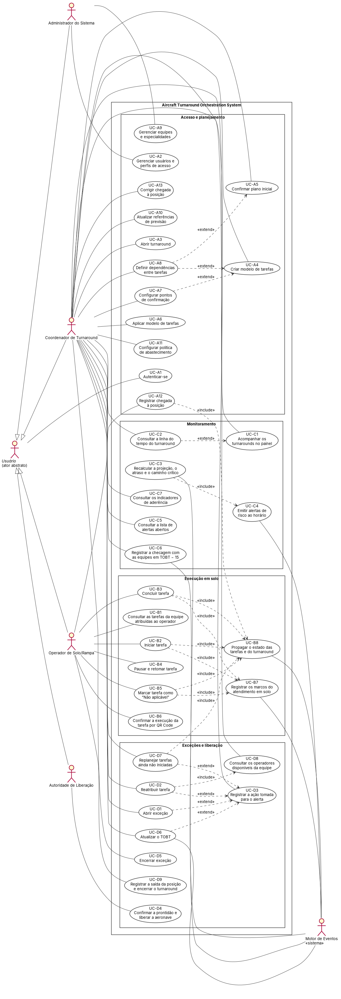

# 9 DIAGRAMA GERAL DE CASOS DE USO

**PRODUTO:** Aircraft Turnaround Orchestration System

O diagrama reúne os 37 casos de uso do sistema, agrupados em quatro conjuntos de funções: acesso e planejamento, execução em solo, monitoramento, e exceções e liberação. Os atores são os do item 5. Os quatro atores humanos (Operador de Solo/Rampa, Coordenador de Turnaround, Autoridade de Liberação e Administrador do Sistema) especializam o ator abstrato Usuário, que se autentica no sistema (ADR-0010). O Motor de Eventos é o ator não humano que propaga estados, recalcula a projeção e emite os alertas. As setas «include» partem do caso de uso que inclui; as setas «extend» partem do caso de uso que estende. Nos nomes dos casos de uso, TOBT é o horário-alvo de prontidão (TOBT) [2]. A especificação de cada caso de uso está no item 10.

Fonte citada: [2], conforme a numeração de `pesquisa/fontes.md`.

<!-- Fonte: especificacao/diagramas/09-casos-de-uso.puml · Imagem: especificacao/diagramas/09-casos-de-uso.png. Nomes, atores e relacionamentos vêm das tabelas no topo de especificacao/10-especificacoes-de-caso-de-uso/area-a.md a area-d.md. -->
