**Casos de uso da área A no diagrama geral (item 9).** Os nomes e os atores abaixo são os que o diagrama deve usar (critério C10.8).

| UC | Nome | Ator | Relacionamentos | RF e estória |
|---|---|---|---|---|
| UC-A1 | Autenticar-se | Usuário (ator abstrato) | — | RF-A1, US-A1 |
| UC-A2 | Gerenciar usuários e perfis de acesso | Administrador do Sistema | — | RF-A2, US-A2 |
| UC-A3 | Abrir turnaround | Coordenador de Turnaround | — | RF-A3, US-A3 |
| UC-A4 | Criar modelo de tarefas | Coordenador de Turnaround | estendido por UC-A7 e UC-A8 | RF-A4, US-A4 |
| UC-A5 | Confirmar plano inicial | Coordenador de Turnaround | estendido por UC-A8 | RF-A5, US-A5 |
| UC-A6 | Aplicar modelo de tarefas | Coordenador de Turnaround | — | RF-A6, US-A6 |
| UC-A7 | Configurar pontos de confirmação | Coordenador de Turnaround | «extend» UC-A4 | RF-A7, US-A7 |
| UC-A8 | Definir dependências entre tarefas | Coordenador de Turnaround | «extend» UC-A4 e UC-A5 | RF-A8, US-A8 |
| UC-A9 | Gerenciar equipes e especialidades | Administrador do Sistema | — | RF-A9, US-A9 |
| UC-A10 | Atualizar referências de previsão | Coordenador de Turnaround | — | RF-A10, US-A10 |
| UC-A11 | Configurar política de abastecimento | Coordenador de Turnaround | — | RF-A11, US-A11 |
| UC-A12 | Registrar chegada à posição | Operador de Solo/Rampa | «include» UC-B8 | RF-A12, US-A12 |
| UC-A13 | Corrigir chegada à posição | Coordenador de Turnaround | — | RF-A13, US-A13 |

## UC-A1 – Autenticar-se

| Campo | |
|---|---|
| **Nome do caso de uso** | UC-A1 – Autenticar-se |
| **Ator(es)** | Usuário (abstrato), generalizando Operador de Solo/Rampa, Coordenador de Turnaround, Autoridade de Liberação e Administrador do Sistema (ADR-0010) |
| **Descrição** | O usuário informa credenciais e acessa a visão correspondente ao perfil cadastrado. Atende ao RF-A1 e à US-A1. |
| **Pré-condições** | 1. Existe cadastro com identificador, credencial e um dos quatro perfis humanos. 2. A tela de autenticação está acessível. |
| **Pós-condições** | Sucesso: sessão autenticada e visão do perfil exibida. Recusa: nenhuma sessão criada nem dado protegido exibido. |
| **Regras de negócio** | **RN1.** RF-A1 exige cadastro ativo e credenciais válidas; Usuário não é um quinto perfil selecionável. **RN2.** O perfil vem do cadastro, não de uma escolha no login. Identificador inexistente, senha incorreta e usuário desativado recebem a mesma mensagem. **RN3.** A autorização é verificada em cada operação; desativação revoga o acesso na próxima requisição (RNF-A1). |
| **Protótipo(s) de tela** | Autenticação pelo identificador de acesso e senha, no computador e no celular. 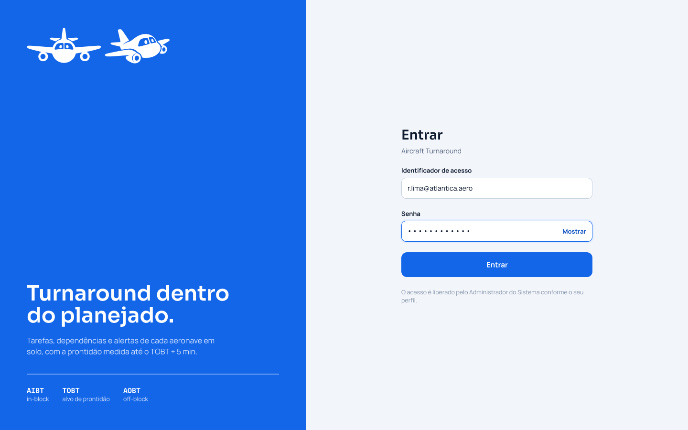  |

### Fluxo básico

| Ações do ator | Ações do sistema |
|---|---|
| 1. O Usuário abre a tela de autenticação. |  |
|  | 2. O sistema exibe Identificador de acesso, Senha e Entrar. |
| 3. O Usuário preenche os campos e seleciona Entrar (**E2**). |  |
|  | 4. O sistema verifica credenciais, situação e perfil (**E1**, **E3**). |
|  | 5. O sistema cria a sessão e abre tarefas do operador, painel do coordenador, pendências da autoridade ou usuários do administrador. O caso de uso termina. |

### Fluxo alternativo A1 – Cancelar (passo 3)

| Ações do ator | Ações do sistema |
|---|---|
| A1.1. O Usuário fecha a tela sem enviar. |  |
|  | A1.2. Nenhuma sessão é criada. |

### Fluxo de exceção E1 – Credenciais inválidas ou usuário desativado (passo 4)

| Ações do ator | Ações do sistema |
|---|---|
|  | E1.1. O sistema exibe "Não foi possível autenticar. Verifique suas credenciais ou contate o administrador" e volta ao passo 3 sem sessão. |

### Fluxo de exceção E2 – Campo vazio (passo 3)

| Ações do ator | Ações do sistema |
|---|---|
|  | E2.1. O sistema indica o campo obrigatório e mantém a tela para correção. |

### Fluxo de exceção E3 – Serviço indisponível (passo 4)

| Ações do ator | Ações do sistema |
|---|---|
|  | E3.1. O sistema informa a falha e permite nova tentativa, sem apresentar o usuário como autenticado. |

## UC-A2 – Gerenciar usuários e perfis de acesso

| Campo | |
|---|---|
| **Nome do caso de uso** | UC-A2 – Gerenciar usuários e perfis de acesso |
| **Ator(es)** | Administrador do Sistema |
| **Descrição** | O administrador cadastra, altera e desativa usuários e define perfil e equipe. Atende ao RF-A2 e à US-A2. |
| **Pré-condições** | 1. O Administrador do Sistema está autenticado e ativo. 2. Há equipes ativas disponíveis quando o cadastro for de operador. |
| **Pós-condições** | Sucesso: usuário criado, alterado ou desativado com auditoria. Recusa ou cancelamento: cadastro anterior preservado. |
| **Regras de negócio** | **RN1.** RF-A2 exige nome, identificador único, perfil e, na criação, senha inicial protegida pelo RNF-A3. Operador de Solo/Rampa também exige equipe ativa. **RN2.** Somente o Administrador do Sistema executa a gestão. Administrar não concede permissão de atuar nos turnarounds. **RN3.** Desativar preserva histórico e vínculos e revoga o acesso. Desativar um Operador de Solo/Rampa com tarefa pendente (fora de "Concluída" e "Não aplicável") em turnaround não encerrado é recusado até a tarefa ser reatribuída (UC-A5 antes do início das tarefas; UC-D2 depois); o sistema não reatribui sozinho. Editar dados não reativa um cadastro desativado. **RN4.** Editar perfil ou equipe mantém a senha, sem exibi-la. A senha inicial é entregue por canal autorizado fora deste caso, nunca pela auditoria ou resposta de cadastro. |
| **Protótipo(s) de tela** | Lista de usuários e cadastro com identificador de acesso, senha inicial, perfil e equipe do operador. 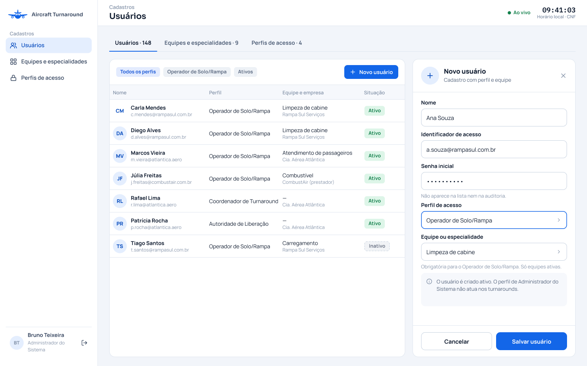 |

### Fluxo básico

| Ações do ator | Ações do sistema |
|---|---|
| 1. O Administrador do Sistema abre Usuários e seleciona Novo usuário. |  |
|  | 2. O sistema apresenta o formulário. |
| 3. O administrador informa nome, identificador, senha inicial, perfil e equipe se for operador. |  |
| 4. O administrador seleciona Salvar usuário. |  |
|  | 5. O sistema verifica autorização, campos, unicidade e equipe ativa (**E1**, **E2**). |
|  | 6. O sistema protege a senha inicial conforme RNF-A3, salva o cadastro ativo e a auditoria e apresenta o usuário na lista sem a credencial (**E3**). |
|  | 7. O caso de uso termina. |

### Fluxo alternativo A1 – Alterar (passo 1)

| Ações do ator | Ações do sistema |
|---|---|
| A1.1. O administrador abre um usuário, edita e salva. |  |
|  | A1.2. O sistema valida os mesmos campos, sem exigir nova senha. |
|  | A1.3. Salva as alterações e a auditoria, mantendo identificador interno, senha e situação ativa/desativada, e encerra no passo 7. |
|  | A1.4. Dados inválidos seguem E1. |

### Fluxo alternativo A2 – Desativar (passo 1)

| Ações do ator | Ações do sistema |
|---|---|
| A2.1. O administrador seleciona usuário ativo e Desativar. |  |
|  | A2.2. O sistema pede confirmação e, se confirmada, verifica autorização, preserva o histórico e registra desativação e auditoria. |

### Fluxo alternativo A3 – Cancelar (passo 4 ou A2)

| Ações do ator | Ações do sistema |
|---|---|
| A3.1. O administrador cancela e retorna à lista sem gravar. |  |

### Fluxo de exceção E1 – Campo inválido (passo 5)

| Ações do ator | Ações do sistema |
|---|---|
|  | E1.1. Dados obrigatórios ausentes, senha inicial vazia na criação, identificador duplicado, perfil inválido ou equipe ausente/inativa são indicados. |
|  | E1.2. Não há gravação e o fluxo volta ao passo 3. |

### Fluxo de exceção E2 – Acesso revogado (passo 5 ou A2)

| Ações do ator | Ações do sistema |
|---|---|
|  | E2.1. O sistema recusa sem alterar dados. |

### Fluxo de exceção E3 – Falha ao salvar (passo 6)

| Ações do ator | Ações do sistema |
|---|---|
|  | E3.1. O sistema informa a falha, mantém os dados anteriores e permite nova tentativa. |

### Fluxo de exceção E4 – Operador com tarefa pendente (A2)

| Ações do ator | Ações do sistema |
|---|---|
|  | E4.1. O usuário a desativar é Operador de Solo/Rampa com tarefa pendente em turnaround não encerrado. |
|  | E4.2. O sistema recusa a desativação, lista as tarefas a reatribuir e o usuário continua ativo (RN3; US-A2, critério 7). |

## UC-A3 – Abrir turnaround

| Campo | |
|---|---|
| **Nome do caso de uso** | UC-A3 – Abrir turnaround |
| **Ator(es)** | Coordenador de Turnaround |
| **Descrição** | O coordenador reúne voos existentes e suas referências em um cadastro para planejamento. Atende ao RF-A3 e à US-A3. |
| **Pré-condições** | 1. O Coordenador de Turnaround está autenticado e ativo. 2. Há dados dos voos, companhia operadora, aeronave, posição e referências de tempo. |
| **Pós-condições** | Sucesso: cadastro único com identificador, referências e auditoria, disponível para aplicação de modelo. Recusa ou cancelamento: nenhum novo cadastro criado. |
| **Regras de negócio** | **RN1.** RF-A3 exige voos e datas, companhia operadora, aeronave, posição, horário programado de chegada à posição (SIBT), horário programado de saída da posição (SOBT), horário estimado de chegada à posição (EIBT), horário-alvo de prontidão (TOBT) e tempo mínimo de turnaround (MTTT) em minutos positivos [2][4]. **RN2.** Horários têm data e fuso. TOBT planejado é fixo e o vigente começa igual a ele (ADR-0003). **RN3.** Só pode existir um turnaround para os mesmos voos e datas. A programação dos voos não é alterada. **RN4.** Abrir não registra horário real de chegada à posição (AIBT) [2][4], não entra em "Em solo" nem inicia tarefas. A chegada é registrada no UC-A12. |
| **Protótipo(s) de tela** | Abertura do turnaround com voos, companhia, aeronave, posição e referências de tempo. 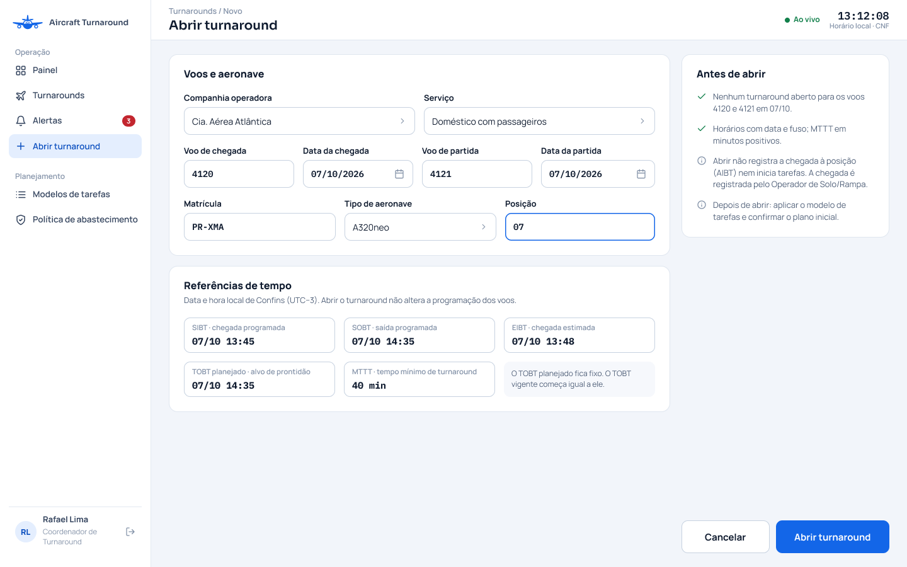 |

### Fluxo básico

| Ações do ator | Ações do sistema |
|---|---|
| 1. O Coordenador de Turnaround seleciona Novo turnaround. |  |
|  | 2. O sistema apresenta os dados de voo, companhia, aeronave, posição e referências de tempo. |
| 3. O coordenador preenche os campos e seleciona Abrir turnaround. |  |
|  | 4. O sistema verifica autorização, campos, formatos, MTTT positivo e duplicidade (**E1**, **E2**). |
|  | 5. O sistema grava cadastro e auditoria, mantendo TOBT planejado fixo e inicializando o vigente (**E3**). |
|  | 6. O sistema exibe identificador e dados com acesso à aplicação de modelo. O caso de uso termina. |

### Fluxo alternativo A1 – Virada do dia (passo 3)

| Ações do ator | Ações do sistema |
|---|---|
| A1.1. O coordenador informa a partida e a prontidão na data seguinte. |  |
|  | A1.2. O sistema preserva as datas e segue no passo 4. |

### Fluxo alternativo A2 – Cancelar (passo 3)

| Ações do ator | Ações do sistema |
|---|---|
| A2.1. O coordenador cancela. |  |
|  | A2.2. O sistema fecha o formulário sem criar cadastro. |

### Fluxo de exceção E1 – Dado inválido (passo 4)

| Ações do ator | Ações do sistema |
|---|---|
|  | E1.1. O sistema indica campo obrigatório, horário inválido ou MTTT não positivo e retorna ao passo 3 sem gravar. |

### Fluxo de exceção E2 – Duplicidade (passo 4)

| Ações do ator | Ações do sistema |
|---|---|
|  | E2.1. O sistema apresenta o identificador existente e não cria outro cadastro. |

### Fluxo de exceção E3 – Resposta perdida (passo 5)

| Ações do ator | Ações do sistema |
|---|---|
|  | E3.1. A nova tentativa consulta os voos e datas e mostra o cadastro existente, sem criar outro. |

## UC-A4 – Criar modelo de tarefas

| Campo | |
|---|---|
| **Nome do caso de uso** | UC-A4 – Criar modelo de tarefas |
| **Ator(es)** | Coordenador de Turnaround |
| **Descrição** | O coordenador define um modelo reutilizável por tipo de aeronave e serviço, com tarefas classificadas. Pode ser estendido pelo UC-A7 (pontos de confirmação) e pelo UC-A8 (dependências). Atende ao RF-A4 e à US-A4. |
| **Pré-condições** | 1. O Coordenador de Turnaround está autenticado e ativo. 2. Há equipes ativas cadastradas. |
| **Pós-condições** | Sucesso: modelo e configurações de tarefas gravados com auditoria. Recusa ou cancelamento: nenhum modelo criado. |
| **Regras de negócio** | **RN1.** RF-A4 exige nome do modelo, tipo de aeronave, serviço e ao menos uma tarefa com nome, tipo de atividade, equipe ativa, duração positiva, obrigatoriedade, permissão de "Não aplicável" e indicação "sob demanda". **RN2.** Embarque, desembarque e abastecimento têm tipos explícitos; a identificação não depende do nome digitado. Para serviço com embarque de passageiros, exatamente uma tarefa representa o embarque [22][45]. **RN3.** Criar modelo não copia tarefas para turnaround nem atribui operadores. Dependências e pontos são configurados nos casos próprios. **RN4.** A permissão de "Não aplicável" é por tarefa e não muda sua situação durante a criação do modelo. **RN5.** Tarefas marcadas "sob demanda" ficam no catálogo, com tipo, equipe e duração planejada. Não entram no plano até serem acionadas pelo Coordenador de Turnaround (ADR-0014) [69][70][71]. |
| **Protótipo(s) de tela** | Criação do modelo com configurações das tarefas regulares e do catálogo sob demanda. 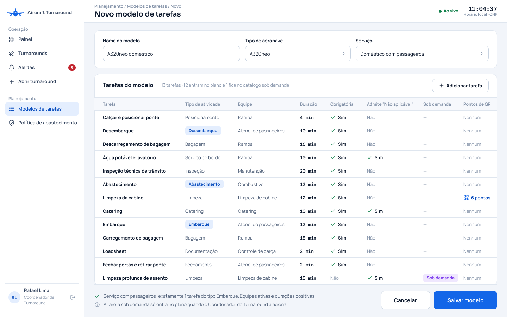 |

### Fluxo básico

| Ações do ator | Ações do sistema |
|---|---|
| 1. O Coordenador de Turnaround abre Modelos e seleciona Novo modelo. |  |
|  | 2. O sistema apresenta identificação do modelo e lista de tarefas. |
| 3. O coordenador informa nome, tipo de aeronave e serviço e adiciona tarefas com seus campos. |  |
| 4. O coordenador seleciona Salvar modelo. |  |
|  | 5. O sistema verifica os campos, as equipes ativas, durações positivas e a identificação do embarque (**E1**). |
|  | 6. O sistema grava o modelo e a auditoria e exibe a configuração salva (**E2**). O caso de uso termina. |

### Fluxo alternativo A1 – Serviço sem embarque de passageiros (passo 3)

| Ações do ator | Ações do sistema |
|---|---|
| A1.1. O coordenador escolhe esse serviço. |  |
|  | A1.2. O sistema não exige tarefa de embarque. |

### Fluxo alternativo A2 – Cancelar (passo 4)

| Ações do ator | Ações do sistema |
|---|---|
| A2.1. O coordenador cancela sem salvar. |  |

### Fluxo alternativo A3 – Serviço sob demanda (passo 3)

| Ações do ator | Ações do sistema |
|---|---|
| A3.1. O coordenador marca uma tarefa, como limpeza profunda, como "sob demanda". |  |
|  | A3.2. O sistema a mantém no catálogo sem incluir automaticamente no plano. |

### Fluxo de exceção E1 – Configuração inválida (passo 5)

| Ações do ator | Ações do sistema |
|---|---|
|  | E1.1. Campo vazio, equipe inativa, duração não positiva ou número inválido de tarefas de embarque são indicados. |
|  | E1.2. O fluxo volta ao passo 3 sem gravação. |

### Fluxo de exceção E2 – Falha de gravação (passo 6)

| Ações do ator | Ações do sistema |
|---|---|
|  | E2.1. Não é persistido modelo parcial nem apresentada confirmação de sucesso. |

## UC-A5 – Confirmar plano inicial

| Campo | |
|---|---|
| **Nome do caso de uso** | UC-A5 – Confirmar plano inicial |
| **Ator(es)** | Coordenador de Turnaround |
| **Descrição** | O coordenador define responsáveis e horários e confirma o plano antes do início das tarefas. Pode ser estendido pelo UC-A8 (dependências). Atende ao RF-A5 e à US-A5. |
| **Pré-condições** | 1. O Coordenador de Turnaround está autenticado e ativo. 2. Há modelo aplicado e nenhuma tarefa iniciada. 3. Há operadores ativos das equipes necessárias. |
| **Pós-condições** | Sucesso: plano completo confirmado com responsáveis, horários, obrigatoriedade e auditoria. Recusa ou cancelamento: último plano confirmado preservado e nenhum início real registrado. |
| **Regras de negócio** | **RN1.** RF-A5 exige um operador ativo da equipe correspondente para 100% das tarefas; equipe do operador e da tarefa devem coincidir. **RN2.** Horários planejados incluem data e fuso; o fim deve ser posterior ao início. O início planejado da sucessora deve ser igual ou posterior ao fim planejado das predecessoras. **RN3.** Dependências não têm ciclos e respeitam a política de abastecimento. Tarefas independentes podem se sobrepor com operadores distintos. **RN4.** O sistema verifica ausência de tarefa iniciada também ao salvar. Depois do primeiro início, alterações operacionais ficam no UC-D7. **RN5.** Plano e auditoria são salvos juntos, sem salvar apenas parte das tarefas (RNF-A2 e RNF-A4). **RN6.** Serviço sob demanda já conhecido pode ser acionado do catálogo e incluído no plano inicial, com responsável, janela, dependências e política válidos (RF-A4, RF-A8 e RF-A11; ADR-0014). Os serviços não acionados permanecem fora do plano. |
| **Protótipo(s) de tela** | Plano inicial com responsáveis, janelas, dependências, obrigatoriedade e inclusão de serviço sob demanda. 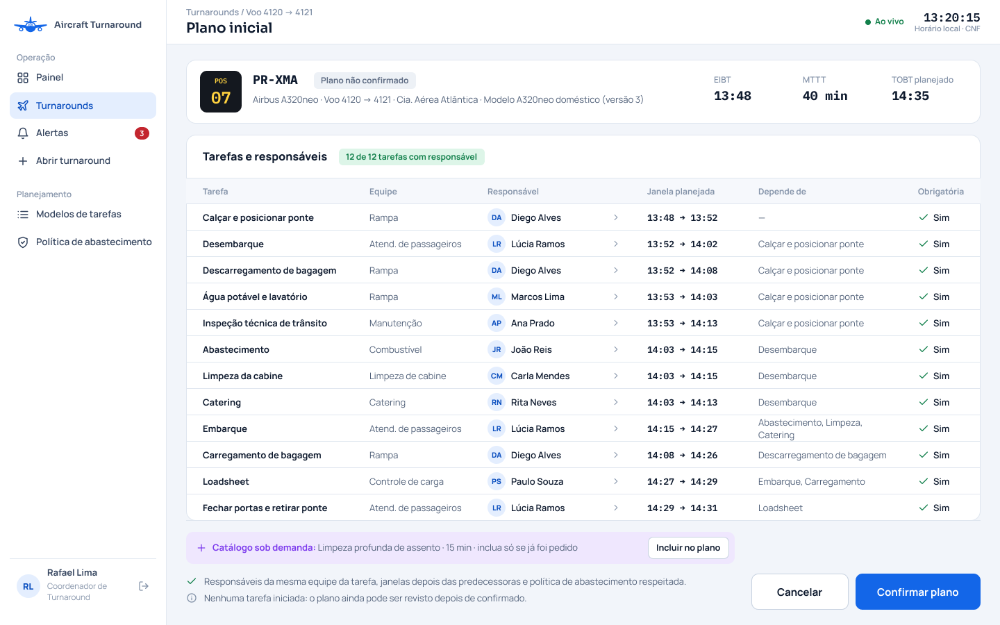 |

### Fluxo básico

| Ações do ator | Ações do sistema |
|---|---|
| 1. O Coordenador de Turnaround abre o planejamento. |  |
|  | 2. O sistema exibe tarefas, equipes, tipos, obrigatoriedade, dependências e política de abastecimento, com operadores ativos disponíveis para seleção. |
| 3. O coordenador atribui um operador e janela de início e fim a cada tarefa e define obrigatoriedade. |  |
| 4. O coordenador seleciona Confirmar plano. |  |
|  | 5. O sistema verifica autorização, ausência de início, responsáveis, janelas, dependências e política (**E1**, **E2**, **E3**). |
|  | 6. O sistema salva o plano completo e a auditoria e apresenta a confirmação (**E4**). O caso de uso termina. |

### Fluxo alternativo A1 – Revisar antes do início (passo 1)

| Ações do ator | Ações do sistema |
|---|---|
| A1.1. O coordenador abre um plano confirmado ainda sem início, altera os dados e segue no passo 4. |  |

### Fluxo alternativo A2 – Tarefas paralelas (passo 3)

| Ações do ator | Ações do sistema |
|---|---|
| A2.1. O coordenador atribui operadores distintos a tarefas independentes com janelas sobrepostas. |  |
|  | A2.2. O sistema aceita se as demais validações forem satisfeitas. |

### Fluxo alternativo A3 – Cancelar (passo 4)

| Ações do ator | Ações do sistema |
|---|---|
| A3.1. O coordenador cancela e preserva o plano anterior. |  |

### Fluxo alternativo A4 – Acionar serviço conhecido (passo 3)

| Ações do ator | Ações do sistema |
|---|---|
| A4.1. O coordenador seleciona um serviço do catálogo sob demanda, inclui no plano e define responsável, janela e dependências. |  |
|  | A4.2. Segue no passo 4. |
|  | A4.3. O sistema aplica todas as validações do plano. |

### Fluxo de exceção E1 – Responsável inválido (passo 5)

| Ações do ator | Ações do sistema |
|---|---|
|  | E1.1. O sistema lista tarefas sem operador ativo da equipe correspondente e não confirma. |

### Fluxo de exceção E2 – Janela, dependência ou política inválida (passo 5)

| Ações do ator | Ações do sistema |
|---|---|
|  | E2.1. O sistema indica o conflito e retorna ao passo 3 sem alterar o último plano. |

### Fluxo de exceção E3 – Operação iniciada durante a edição (passo 5)

| Ações do ator | Ações do sistema |
|---|---|
|  | E3.1. O sistema recusa a alteração e preserva o plano em vigor. |

### Fluxo de exceção E4 – Falha ao salvar (passo 6)

| Ações do ator | Ações do sistema |
|---|---|
|  | E4.1. O sistema informa a falha. |
|  | E4.2. Uma nova tentativa consulta o plano atual. |

## UC-A6 – Aplicar modelo de tarefas

| Campo | |
|---|---|
| **Nome do caso de uso** | UC-A6 – Aplicar modelo de tarefas |
| **Ator(es)** | Coordenador de Turnaround |
| **Descrição** | O coordenador copia um modelo compatível para preparar as tarefas de um turnaround. Atende ao RF-A6 e à US-A6. |
| **Pré-condições** | 1. O Coordenador de Turnaround está autenticado e ativo. 2. O turnaround existe, não tem plano confirmado e nenhuma tarefa foi iniciada. 3. Existe um modelo compatível com aeronave e serviço e uma política de abastecimento da companhia, usando padrão desabilitado na ausência de configuração. |
| **Pós-condições** | Sucesso: cópia independente das tarefas regulares, do catálogo sob demanda e de suas configurações, com auditoria. Recusa ou cancelamento: cópia anterior e modelo original preservados. |
| **Regras de negócio** | **RN1.** RF-A6 exige compatibilidade de tipo de aeronave e serviço; não é permitido substituir tarefas com plano confirmado ou tarefa iniciada. **RN2.** Tarefas e pontos de código de resposta rápida (QR Code) recebem identificadores próprios. As dependências e os pontos ficam ligados às tarefas copiadas. **RN3.** A cópia preserva tipo, equipe, duração, obrigatoriedade, permissão de "Não aplicável" e indicação "sob demanda". A política da companhia é copiada com versão; com permissão desabilitada, a sequência de abastecimento é exigida. **RN4.** Substituição exige confirmação. Copiar não atribui operadores, não inicia tarefas e não modifica o modelo original; edições futuras no modelo não alteram cópias existentes. **RN5.** O catálogo sob demanda é copiado com dependências e pontos, mas suas tarefas ficam fora do plano até acionamento pelo RF-A5 ou UC-D7 (ADR-0014). |
| **Protótipo(s) de tela** | Seleção do modelo compatível e confirmação da cópia de tarefas, catálogo, dependências, pontos e política. 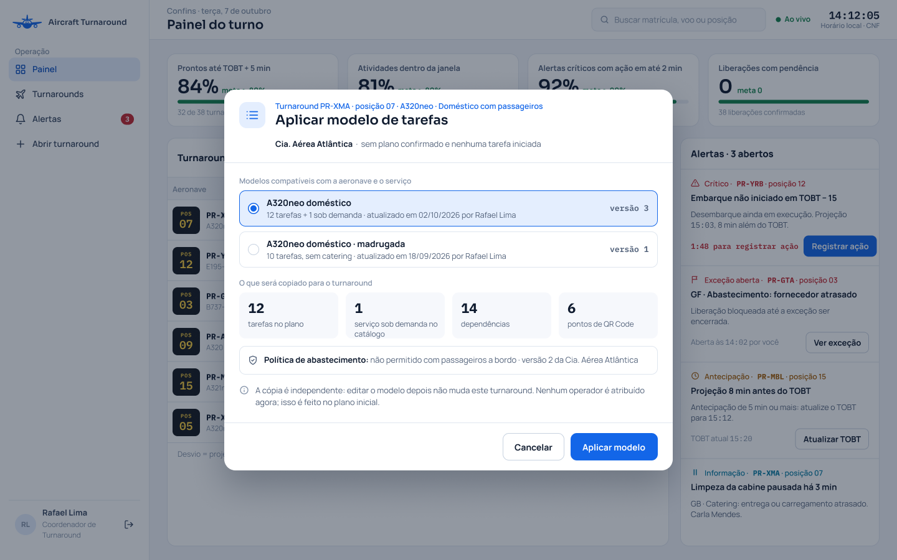 |

### Fluxo básico

| Ações do ator | Ações do sistema |
|---|---|
| 1. O Coordenador de Turnaround abre o turnaround e seleciona Aplicar modelo. |  |
|  | 2. O sistema lista os modelos compatíveis. |
| 3. O coordenador seleciona um modelo. |  |
|  | 4. O sistema exibe as tarefas regulares, o catálogo sob demanda, dependências, pontos e política que serão copiados. |
| 5. O coordenador confirma Aplicar modelo. |  |
|  | 6. O sistema verifica autorização e pré-condições, copia integralmente os dados e grava auditoria (**E1**, **E2**, **E3**). |
|  | 7. O sistema apresenta a cópia, distinguindo tarefas no plano e serviços ainda no catálogo, e acesso ao planejamento. O caso de uso termina. |

### Fluxo alternativo A1 – Substituir cópia (passo 5)

| Ações do ator | Ações do sistema |
|---|---|
|  | A1.1. Sem plano confirmado ou tarefa iniciada, o sistema pede confirmação para substituir a cópia anterior. |
|  | A1.2. Se o coordenador cancelar, mantém a anterior. |

### Fluxo alternativo A2 – Cancelar (passo 5)

| Ações do ator | Ações do sistema |
|---|---|
| A2.1. O coordenador cancela sem copiar. |  |

### Fluxo de exceção E1 – Modelo incompatível, plano confirmado ou tarefa iniciada (passo 6)

| Ações do ator | Ações do sistema |
|---|---|
|  | E1.1. O sistema explica o impedimento e mantém os dados atuais. |

### Fluxo de exceção E2 – Modelo sem configuração compatível com a política (passo 6)

| Ações do ator | Ações do sistema |
|---|---|
|  | E2.1. O sistema indica as tarefas faltantes ou conflitantes e não copia. |

### Fluxo de exceção E3 – Falha ao copiar (passo 6)

| Ações do ator | Ações do sistema |
|---|---|
|  | E3.1. A cópia anterior permanece, sem tarefas parcialmente copiadas. |

## UC-A7 – Configurar pontos de confirmação

| Campo | |
|---|---|
| **Nome do caso de uso** | UC-A7 – Configurar pontos de confirmação |
| **Ator(es)** | Coordenador de Turnaround |
| **Descrição** | O coordenador define no modelo os pontos cuja confirmação será exigida na execução. Estende o UC-A4. Atende ao RF-A7 e à US-A7. |
| **Pré-condições** | 1. O Coordenador de Turnaround está autenticado e ativo. 2. Existe tarefa no modelo para configurar. |
| **Pós-condições** | Sucesso: lista de pontos exigidos salva no modelo com auditoria. Recusa ou cancelamento: configuração anterior preservada. |
| **Regras de negócio** | **RN1.** RF-A7 permite definir pontos de código de resposta rápida (QR Code), cada um com nome e identificador únicos na mesma tarefa (ADR-0007). **RN2.** Sem pontos cadastrados, não há exigência de leitura por pontos. A leitura fica no UC-B6 e o bloqueio da conclusão no UC-B3. **RN3.** Os pontos são copiados quando o modelo é aplicado; editar o modelo não altera uma cópia existente nem confirma pontos automaticamente. |
| **Protótipo(s) de tela** | Configuração dos pontos de confirmação da tarefa, com nome e identificador. 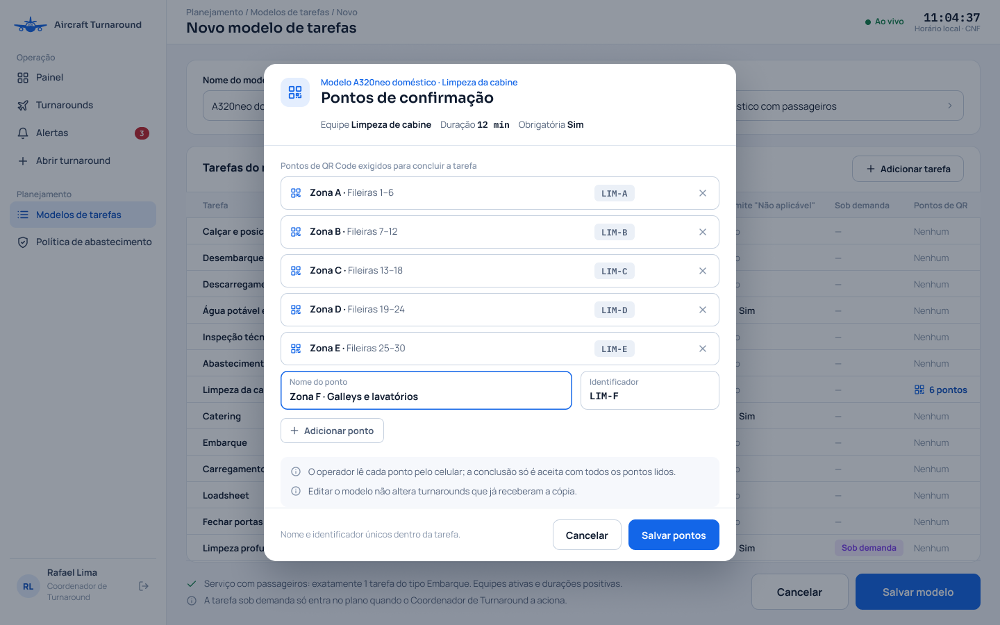 |

### Fluxo básico

| Ações do ator | Ações do sistema |
|---|---|
| 1. O Coordenador de Turnaround abre uma tarefa do modelo e seleciona Pontos de confirmação. |  |
|  | 2. O sistema apresenta os pontos existentes e a ação Adicionar ponto. |
| 3. O coordenador informa nome e identificador dos pontos exigidos. |  |
| 4. O coordenador seleciona Salvar pontos. |  |
|  | 5. O sistema verifica autorização, campos e unicidade dentro da tarefa (**E1**). |
|  | 6. O sistema salva a lista e a auditoria e exibe a configuração (**E2**). O caso de uso termina. |

### Fluxo alternativo A1 – Sem pontos (passo 3)

| Ações do ator | Ações do sistema |
|---|---|
| A1.1. O coordenador mantém a lista vazia e salva. |  |
|  | A1.2. O sistema registra que a tarefa não exige confirmação por pontos. |

### Fluxo alternativo A2 – Remover ponto (passo 3)

| Ações do ator | Ações do sistema |
|---|---|
| A2.1. O coordenador remove um ponto do modelo e segue no passo 4, sem alterar cópias existentes. |  |

### Fluxo alternativo A3 – Cancelar (passo 4)

| Ações do ator | Ações do sistema |
|---|---|
|  | A3.1. A lista anterior é preservada. |

### Fluxo de exceção E1 – Dado vazio ou duplicado (passo 5)

| Ações do ator | Ações do sistema |
|---|---|
|  | E1.1. O sistema indica o ponto e não salva. |

### Fluxo de exceção E2 – Falha de gravação (passo 6)

| Ações do ator | Ações do sistema |
|---|---|
|  | E2.1. A configuração anterior permanece e o sistema permite nova tentativa. |

## UC-A8 – Definir dependências entre tarefas

| Campo | |
|---|---|
| **Nome do caso de uso** | UC-A8 – Definir dependências entre tarefas |
| **Ator(es)** | Coordenador de Turnaround |
| **Descrição** | O coordenador define predecessoras no modelo ou plano inicial para coordenar a ordem das tarefas. Estende o UC-A4 e o UC-A5. Atende ao RF-A8 e à US-A8. |
| **Pré-condições** | 1. O Coordenador de Turnaround está autenticado e ativo. 2. Existe modelo ou conjunto de tarefas no turnaround; no plano inicial, nenhuma tarefa começou. |
| **Pós-condições** | Sucesso: dependências válidas gravadas com auditoria. Recusa ou cancelamento: dependências anteriores preservadas. |
| **Regras de negócio** | **RN1.** RF-A8 define predecessoras: tarefas que precisam terminar antes de outra. Só aceita tarefas do mesmo modelo ou turnaround; recusa tarefa inexistente, a própria tarefa e ciclos (como A depender de B e B depender de A). **RN2.** Ao confirmar o plano, o início planejado de cada tarefa deve ser igual ou posterior ao fim planejado de todas as suas predecessoras. **RN3.** Tarefas independentes podem executar em paralelo com operadores distintos, respeitada a política de abastecimento [22][45]. **RN4.** Editar o modelo não muda suas cópias. Alterações do plano durante a operação ficam no UC-D7. |
| **Protótipo(s) de tela** | Configuração das predecessoras, com vínculos exigidos pela política de abastecimento. 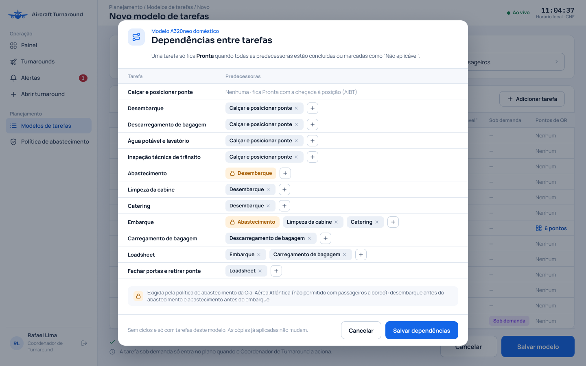 |

### Fluxo básico

| Ações do ator | Ações do sistema |
|---|---|
| 1. O Coordenador de Turnaround abre Dependências no modelo ou plano inicial. |  |
|  | 2. O sistema apresenta tarefas e predecessoras atuais. |
| 3. O coordenador adiciona ou remove relações entre tarefas. |  |
| 4. O coordenador seleciona Salvar dependências. |  |
|  | 5. O sistema verifica autorização, referências, ausência de ciclos, política e, no plano, ausência de início e compatibilidade com as janelas (**E1**, **E2**, **E3**). |
|  | 6. O sistema grava as dependências e a auditoria e exibe as relações. O caso de uso termina. |

### Fluxo alternativo A1 – Tarefa independente (passo 3)

| Ações do ator | Ações do sistema |
|---|---|
| A1.1. O coordenador remove uma relação opcional. |  |
|  | A1.2. O sistema aceita se não violar a política de abastecimento. |

### Fluxo alternativo A2 – Cancelar (passo 4)

| Ações do ator | Ações do sistema |
|---|---|
|  | A2.1. Relações anteriores são preservadas. |

### Fluxo de exceção E1 – Ciclo ou referência inválida (passo 5)

| Ações do ator | Ações do sistema |
|---|---|
|  | E1.1. O sistema identifica as tarefas e não salva. |

### Fluxo de exceção E2 – Janela ou política conflitante (passo 5)

| Ações do ator | Ações do sistema |
|---|---|
|  | E2.1. O sistema informa o conflito e retorna ao passo 3 sem alterar o plano. |

### Fluxo de exceção E3 – Tarefa iniciada durante a edição (passo 5)

| Ações do ator | Ações do sistema |
|---|---|
|  | E3.1. O sistema recusa a alteração do plano inicial. |

## UC-A9 – Gerenciar equipes e especialidades

| Campo | |
|---|---|
| **Nome do caso de uso** | UC-A9 – Gerenciar equipes e especialidades |
| **Ator(es)** | Administrador do Sistema |
| **Descrição** | O administrador mantém equipes que serão vinculadas aos operadores e às tarefas. Atende ao RF-A9 e à US-A9. |
| **Pré-condições** | 1. O Administrador do Sistema está autenticado e ativo. |
| **Pós-condições** | Sucesso: equipe criada, alterada ou desativada com auditoria e histórico preservado. Recusa ou cancelamento: cadastro anterior preservado. |
| **Regras de negócio** | **RN1.** RF-A9 exige nome e identificador único de equipe ou especialidade; equipe é dado cadastral, não novo ator (ADR-0010). **RN2.** Equipe desativada não aceita novos vínculos. Desativação é recusada com usuários ativos vinculados ou tarefas pendentes em turnarounds não encerrados. **RN3.** Alterar nome preserva identificador interno e vínculos. Modelos com equipe desativada não podem gerar novas atribuições até sua revisão. **RN4.** O administrador não reatribui tarefas operacionais para resolver um impedimento; isso fica no UC-D2 (reatribuir tarefa). |
| **Protótipo(s) de tela** | Lista e cadastro de equipes ou especialidades, com nome, identificador e situação. 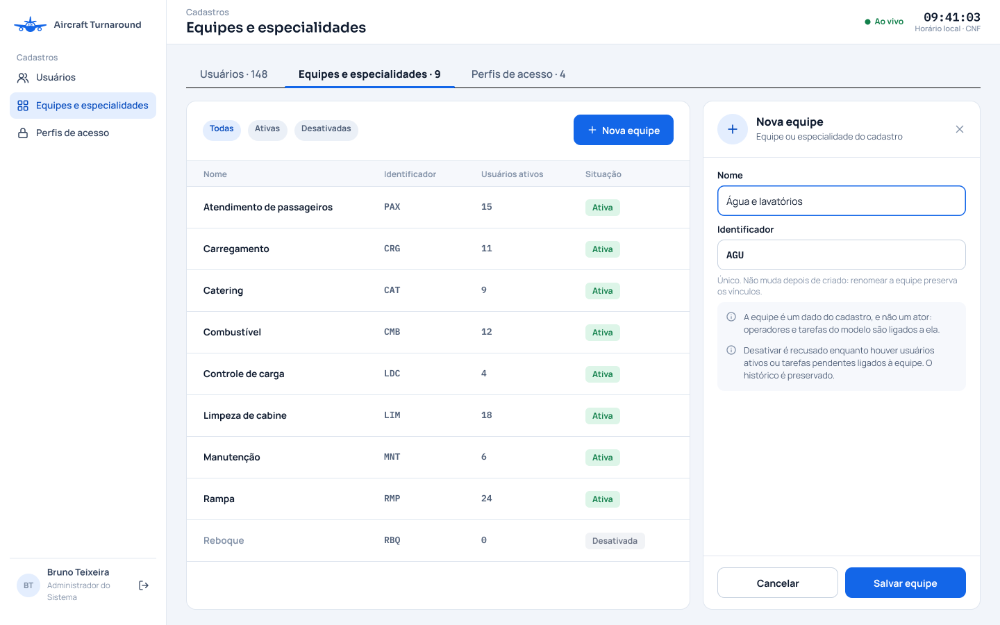 |

### Fluxo básico

| Ações do ator | Ações do sistema |
|---|---|
| 1. O Administrador do Sistema abre Equipes e seleciona Nova equipe. |  |
|  | 2. O sistema apresenta Nome e Identificador. |
| 3. O administrador preenche e seleciona Salvar equipe. |  |
|  | 4. O sistema verifica autorização, campos e unicidade (**E1**). |
|  | 5. O sistema cria a equipe ativa e a auditoria e apresenta a lista (**E3**). O caso de uso termina. |

### Fluxo alternativo A1 – Alterar (passo 1)

| Ações do ator | Ações do sistema |
|---|---|
| A1.1. O administrador abre uma equipe, altera o nome e salva. |  |
|  | A1.2. O sistema preserva identificador e vínculos e audita a alteração. |

### Fluxo alternativo A2 – Desativar (passo 1)

| Ações do ator | Ações do sistema |
|---|---|
| A2.1. O administrador escolhe Desativar e confirma. |  |
|  | A2.2. O sistema verifica os impedimentos, desativa e grava auditoria sem apagar histórico. |

### Fluxo alternativo A3 – Cancelar (passo 3 ou A2)

| Ações do ator | Ações do sistema |
|---|---|
|  | A3.1. Cadastro anterior preservado. |

### Fluxo de exceção E1 – Dado inválido (passo 4)

| Ações do ator | Ações do sistema |
|---|---|
|  | E1.1. Nome vazio ou identificador duplicado é indicado e não há gravação. |

### Fluxo de exceção E2 – Vínculos impeditivos (A2)

| Ações do ator | Ações do sistema |
|---|---|
|  | E2.1. O sistema lista usuários ativos ou tarefas pendentes e recusa a desativação. |

### Fluxo de exceção E3 – Falha de gravação (passo 5)

| Ações do ator | Ações do sistema |
|---|---|
|  | E3.1. Cadastro e auditoria não são confirmados parcialmente. |

## UC-A10 – Atualizar referências de previsão

| Campo | |
|---|---|
| **Nome do caso de uso** | UC-A10 – Atualizar referências de previsão |
| **Ator(es)** | Coordenador de Turnaround |
| **Descrição** | O coordenador atualiza dados de chegada estimada e tempo mínimo até o registro da chegada real (RF-A12). Atende ao RF-A10 e à US-A10. |
| **Pré-condições** | 1. O Coordenador de Turnaround está autenticado e ativo. 2. O turnaround existe e não tem chegada registrada. |
| **Pós-condições** | Sucesso: referências atualizadas e auditadas, disponíveis para o Motor de Eventos. Recusa ou cancelamento: referências anteriores preservadas. |
| **Regras de negócio** | **RN1.** RF-A10 permite alterar horário estimado de chegada à posição (EIBT) com data e fuso e tempo mínimo de turnaround (MTTT) em minutos positivos [3][7]. **RN2.** A edição não muda o horário-alvo de prontidão (TOBT) planejado fixo ou o vigente; atualização do vigente fica no UC-D6. **RN3.** Ao salvar, o sistema confere novamente se a chegada ainda não foi registrada. A checagem de viabilidade e os alertas ficam no UC-C4; este caso fornece os dados. **RN4.** Editar a previsão não registra a chegada nem altera os estados operacionais. |
| **Protótipo(s) de tela** | Atualização do EIBT e do MTTT antes do registro da chegada, com horários-alvo somente para consulta. 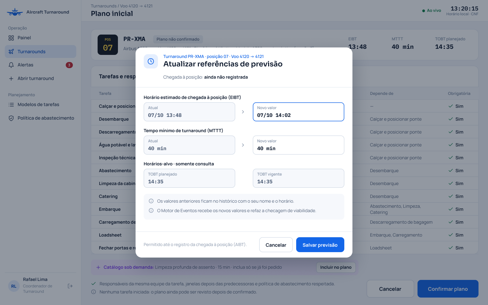 |

### Fluxo básico

| Ações do ator | Ações do sistema |
|---|---|
| 1. O Coordenador de Turnaround abre as referências de previsão do turnaround. |  |
|  | 2. O sistema exibe EIBT e MTTT atuais e os horários-alvo somente para consulta. |
| 3. O coordenador altera um ou ambos os campos e seleciona Salvar previsão. |  |
|  | 4. O sistema verifica autorização, formatos, MTTT positivo e ausência de chegada registrada (**E1**, **E2**). |
|  | 5. O sistema grava valores anteriores e novos e auditoria e disponibiliza o evento ao Motor de Eventos (**E3**). |
|  | 6. O sistema apresenta os novos valores e preserva os horários-alvo. O caso de uso termina. |

### Fluxo alternativo A1 – Um único campo (passo 3)

| Ações do ator | Ações do sistema |
|---|---|
|  | A1.1. Somente o campo alterado é atualizado. |
|  | A1.2. O outro permanece igual. |

### Fluxo alternativo A2 – Cancelar (passo 3)

| Ações do ator | Ações do sistema |
|---|---|
|  | A2.1. Nenhum valor é atualizado. |

### Fluxo de exceção E1 – Dados inválidos (passo 4)

| Ações do ator | Ações do sistema |
|---|---|
|  | E1.1. O sistema indica o campo e retorna ao passo 3 sem gravar. |

### Fluxo de exceção E2 – Chegada registrada durante a edição (passo 4)

| Ações do ator | Ações do sistema |
|---|---|
|  | E2.1. Atualização recusada sem alterar valores. |

### Fluxo de exceção E3 – Falha de gravação (passo 5)

| Ações do ator | Ações do sistema |
|---|---|
|  | E3.1. Não há sucesso nem alteração parcial. |

## UC-A11 – Configurar política de abastecimento

| Campo | |
|---|---|
| **Nome do caso de uso** | UC-A11 – Configurar política de abastecimento |
| **Ator(es)** | Coordenador de Turnaround |
| **Descrição** | O coordenador registra a política da companhia que determina se o abastecimento pode coincidir com o fluxo de passageiros. Atende ao RF-A11 e à US-A11. |
| **Pré-condições** | 1. O Coordenador de Turnaround está autenticado e ativo. 2. A companhia operadora está identificada; para habilitar a regra, o coordenador dispõe da política operacional autorizada da companhia. |
| **Pós-condições** | Sucesso: política versionada com autor e horário para novos turnarounds. Recusa ou cancelamento: política anterior preservada; turnarounds iniciados não mudam. |
| **Regras de negócio** | **RN1.** RF-A11 usa padrão "não permitido" para abastecimento com passageiros a bordo; desabilitada, a regra exige desembarque antes do abastecimento e abastecimento antes do embarque (ADR-0005) [24][26][27]. **RN2.** Habilitar representa uma política previamente autorizada pela companhia, não uma autorização regulatória concedida pelo sistema. Permitir paralelismo não remove automaticamente outras dependências. **RN3.** A configuração é copiada com versão ao turnaround e fica fixa após o início. Alterar a política geral vale para novos turnarounds, sem mudar cópias existentes. **RN4.** A política e o plano não podem se contradizer. Antes de confirmar o plano, devem existir as tarefas e relações necessárias à sequência exigida; o sistema recusa a configuração incompatível. **RN5.** A permissão pressupõe as condições da ADR-0005 e do Regulamento Brasileiro da Aviação Civil (RBAC) nº 91 da Agência Nacional de Aviação Civil (ANAC), seção 91.102(g) [27]: • Procedimento aprovado e tripulante de voo supervisionando na cabine. • Pelo menos 50% dos comissários requeridos e/ou pessoas treinadas para evacuação, com meios de evacuação disponíveis. • Motores desligados, exceto a unidade auxiliar de energia (APU), e sistemas desnecessários desligados. • Comunicação entre solo e cabine. Essas condições são verificadas na operação real, não automaticamente pelo sistema. |
| **Protótipo(s) de tela** | Configuração da permissão de abastecimento com passageiros por companhia, com versão e histórico.  |

### Fluxo básico

| Ações do ator | Ações do sistema |
|---|---|
| 1. O Coordenador de Turnaround abre a política de abastecimento de uma companhia (**E3**). |  |
|  | 2. O sistema exibe a permissão atual e sua versão; se não existir configuração, exibe "Não permitido". |
| 3. O coordenador escolhe manter desabilitada ou habilitar conforme a política autorizada da companhia. |  |
|  | 4. O sistema apresenta a consequência da escolha e pede confirmação. |
| 5. O coordenador confirma. |  |
|  | 6. O sistema verifica autorização, salva nova versão com auditoria e informa que cópias existentes permanecem iguais (**E1**, **E2**). O caso de uso termina. |

### Fluxo alternativo A1 – Manter padrão (passo 3)

| Ações do ator | Ações do sistema |
|---|---|
| A1.1. O coordenador confirma "Não permitido". |  |
|  | A1.2. A configuração é salva com a sequência obrigatória. |

### Fluxo alternativo A2 – Cancelar (passo 5)

| Ações do ator | Ações do sistema |
|---|---|
|  | A2.1. Política anterior preservada. |

### Fluxo de exceção E1 – Acesso revogado (passo 6)

| Ações do ator | Ações do sistema |
|---|---|
|  | E1.1. A mudança é recusada sem gravar. |

### Fluxo de exceção E2 – Falha de gravação (passo 6)

| Ações do ator | Ações do sistema |
|---|---|
|  | E2.1. Política anterior e cópias operacionais permanecem inalteradas. |

### Fluxo de exceção E3 – Tentar alterar a cópia de um turnaround iniciado (passo 1)

| Ações do ator | Ações do sistema |
|---|---|
|  | E3.1. O sistema informa que a regra está fixa e recusa a alteração. |

## UC-A12 – Registrar chegada à posição

| Campo | |
|---|---|
| **Nome do caso de uso** | UC-A12 – Registrar chegada à posição |
| **Ator(es)** | Operador de Solo/Rampa |
| **Descrição** | O operador registra diretamente a chegada observada, colocando o turnaround em "Em solo". Inclui o UC-B8 (propagação). Atende ao RF-A12 e à US-A12. |
| **Pré-condições** | 1. O Operador de Solo/Rampa está autenticado e ativo, com tarefa atribuída no turnaround. 2. O turnaround está aberto, tem plano inicial confirmado e ainda não tem chegada registrada. |
| **Pós-condições** | Sucesso: AIBT registrado, com operador, horário do registro e auditoria; turnaround em "Em solo" e evento disponível para a propagação do UC-B8. Recusa ou cancelamento: nenhum registro novo ou alteração dos dados e estados existentes. |
| **Regras de negócio** | **RN1.** RF-A12 exige horário real de chegada à posição (AIBT), com data e fuso, sem horário futuro [2][4]. O AIBT e o horário do registro são campos distintos. **RN2.** O registro exige operador com tarefa atribuída nesse turnaround e plano inicial confirmado. A chegada só pode ser registrada uma vez, inclusive em requisições simultâneas. **RN3.** O registro é direto, sem aprovação do coordenador: coloca o turnaround em "Em solo" e dispara UC-B8, que coloca as tarefas sem predecessora em "Pronta"; não inicia a execução (ADR-0013). **RN4.** Corrigir uma chegada já registrada exige Coordenador de Turnaround, pelo RF-A13. Repetir uma requisição não sobrescreve o AIBT nem duplica a propagação. |
| **Protótipo(s) de tela** | Registro direto da chegada pelo operador no celular, com plano confirmado e horário real informado.  |

### Fluxo básico

| Ações do ator | Ações do sistema |
|---|---|
| 1. O Operador de Solo/Rampa abre o turnaround associado a uma tarefa sua e seleciona Registrar chegada. |  |
|  | 2. O sistema apresenta aeronave, posição, voos e campo de horário real com data e fuso. |
| 3. O operador informa o horário observado e seleciona Registrar. |  |
|  | 4. O sistema verifica autorização, vínculo com tarefa, plano confirmado, horário válido e não futuro e ausência de chegada registrada (**E1**, **E2**, **E3**). |
|  | 5. O sistema grava o AIBT, o operador, o horário do registro e a auditoria e coloca o turnaround em "Em solo" (**E4**). |
|  | 6. O sistema disponibiliza o evento para a propagação do UC-B8 e exibe o horário real e o do registro separadamente (**E5**). O caso de uso termina. |

### Fluxo alternativo A1 – Cancelar (passo 3)

| Ações do ator | Ações do sistema |
|---|---|
| A1.1. O operador cancela sem gravar a chegada. |  |

### Fluxo de exceção E1 – Horário inválido ou futuro (passo 4)

| Ações do ator | Ações do sistema |
|---|---|
|  | E1.1. O sistema indica o campo e volta ao passo 3 sem gravar. |

### Fluxo de exceção E2 – Chegada já registrada (passo 4)

| Ações do ator | Ações do sistema |
|---|---|
|  | E2.1. O sistema apresenta o registro existente e não cria outro nem repete a propagação. |

### Fluxo de exceção E3 – Sem vínculo, plano não confirmado ou acesso revogado (passo 4)

| Ações do ator | Ações do sistema |
|---|---|
|  | E3.1. A ação é recusada sem alterar dados ou estados. |

### Fluxo de exceção E4 – Falha ou resposta perdida (passo 5)

| Ações do ator | Ações do sistema |
|---|---|
|  | E4.1. O sistema não anuncia sucesso sem confirmação de gravação. |
|  | E4.2. A nova tentativa consulta o registro existente para evitar duplicidade. |

### Fluxo de exceção E5 – Falha na entrega do evento (passo 6)

| Ações do ator | Ações do sistema |
|---|---|
|  | E5.1. O evento permanece para nova tentativa, sem criar outro registro nem repetir seus efeitos. |

## UC-A13 – Corrigir chegada à posição

| Campo | |
|---|---|
| **Nome do caso de uso** | UC-A13 – Corrigir chegada à posição |
| **Ator(es)** | Coordenador de Turnaround |
| **Descrição** | O coordenador corrige o AIBT registrado com motivo e histórico, mantendo os estados operacionais. Atende ao RF-A13 e à US-A13. |
| **Pré-condições** | 1. O Coordenador de Turnaround está autenticado e ativo. 2. Existe AIBT registrado e o turnaround não está "Fora de bloco". |
| **Pós-condições** | Sucesso: AIBT corrigido, valor anterior, motivo, autor e horário da correção preservados; recálculo da projeção solicitado ao UC-C3. Cancelamento ou erro: AIBT e histórico anteriores preservados. Em todos os casos, os estados do turnaround e das tarefas não são alterados pela correção. |
| **Regras de negócio** | **RN1.** RF-A13 permite corrigir o horário real de chegada à posição (AIBT), com data e fuso, enquanto o turnaround não estiver "Fora de bloco" (ADR-0013) [2][4]. **RN2.** A correção exige motivo escrito e horário válido, não futuro. O sistema guarda valor anterior, novo valor, motivo, autor e horário da correção (RNF-A2). **RN3.** Corrigir não confirma nem registra outra chegada e não altera estados: enquanto o turnaround não estiver "Liberado", dispara o recálculo da projeção de prontidão do UC-C3, sem repetir a propagação de entrada em "Em solo". Em "Liberado", o UC-C3 não recalcula, e a correção só fica no histórico. **RN4.** O horário da correção não substitui o AIBT. O sistema confere as condições novamente ao salvar; repetir a mesma requisição não cria correção ou evento duplicados. |
| **Protótipo(s) de tela** | Correção do AIBT pelo coordenador, com valor registrado, novo horário e motivo. 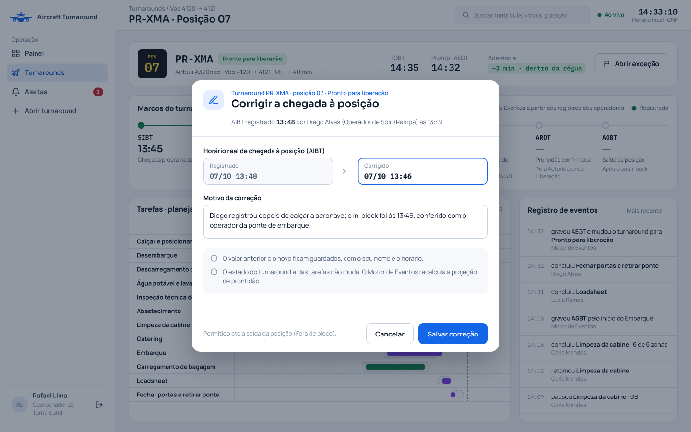 |

### Fluxo básico

| Ações do ator | Ações do sistema |
|---|---|
| 1. O Coordenador de Turnaround abre a chegada registrada e seleciona Corrigir horário. |  |
|  | 2. O sistema apresenta turnaround, AIBT atual e histórico de correções. |
| 3. O coordenador informa o horário corrigido com data, fuso e motivo e seleciona Salvar correção. |  |
|  | 4. O sistema verifica autorização, existência do AIBT, ausência do estado "Fora de bloco", motivo e horário válido e não futuro (**E1**, **E2**, **E3**). |
|  | 5. O sistema grava o novo AIBT e a auditoria com valor anterior, novo valor, motivo, autor e horário da correção, sem mudar os estados (**E4**). |
|  | 6. Se o turnaround não está "Liberado", o sistema disponibiliza o evento para o recálculo da projeção do UC-C3 (**E5**). |
|  | 7. O sistema exibe o AIBT atualizado e o histórico com horários real e da correção separados. O caso de uso termina. |

### Fluxo alternativo A1 – Cancelar (passo 3)

| Ações do ator | Ações do sistema |
|---|---|
| A1.1. O coordenador cancela e mantém o AIBT e o histórico anteriores. |  |

### Fluxo de exceção E1 – Sem chegada ou encerramento durante a edição (passo 4)

| Ações do ator | Ações do sistema |
|---|---|
|  | E1.1. O sistema informa o impedimento e não salva. |

### Fluxo de exceção E2 – Motivo vazio ou horário inválido ou futuro (passo 4)

| Ações do ator | Ações do sistema |
|---|---|
|  | E2.1. O sistema indica o campo e retorna ao passo 3 sem gravar. |

### Fluxo de exceção E3 – Acesso revogado (passo 4)

| Ações do ator | Ações do sistema |
|---|---|
|  | E3.1. A ação é recusada sem alterar dados. |

### Fluxo de exceção E4 – Falha ao salvar ou resposta perdida (passo 5)

| Ações do ator | Ações do sistema |
|---|---|
|  | E4.1. O sistema não anuncia sucesso sem confirmação de gravação. |
|  | E4.2. A nova tentativa consulta a correção para evitar duplicidade. |

### Fluxo de exceção E5 – Falha na entrega do evento (passo 6)

| Ações do ator | Ações do sistema |
|---|---|
|  | E5.1. O evento permanece para nova tentativa, sem repetir a correção nem seus efeitos. |

Fontes citadas: [2], [3], [4], [7], [22], [24], [26], [27], [45], [69], [70] e [71], conforme `pesquisa/fontes.md`.
