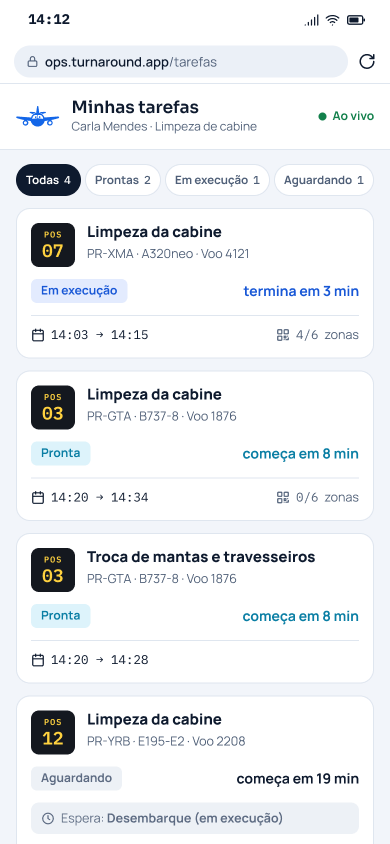
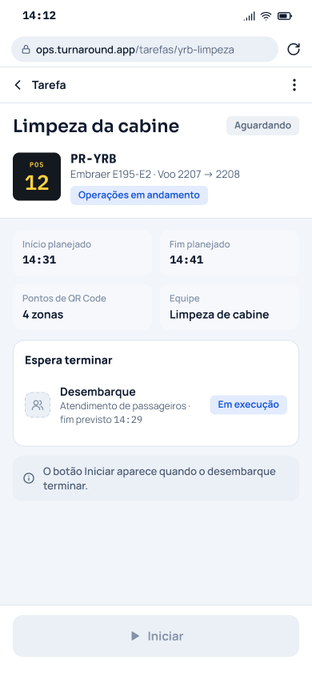
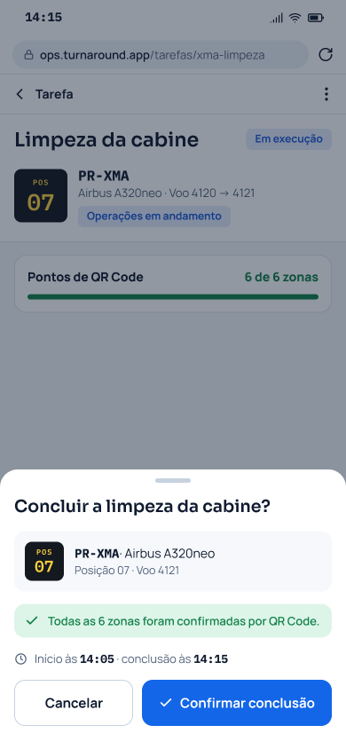
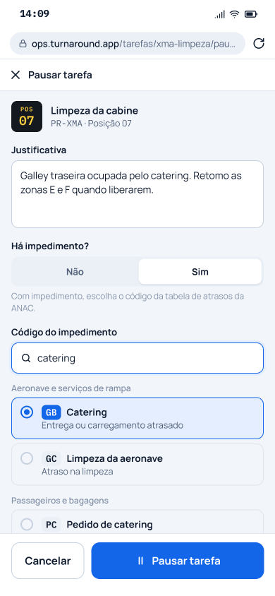
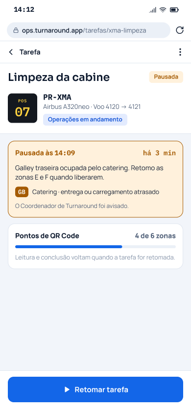
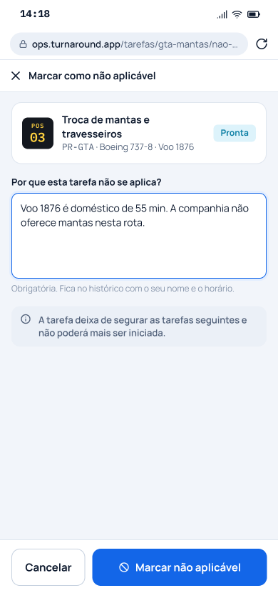
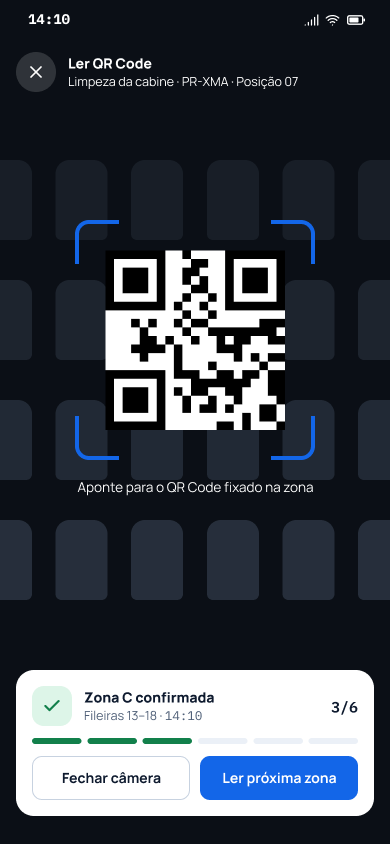
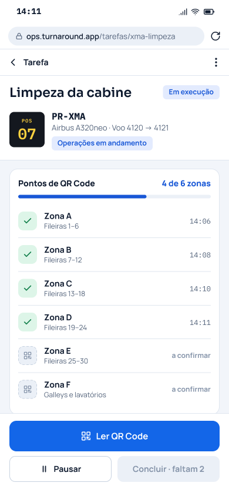
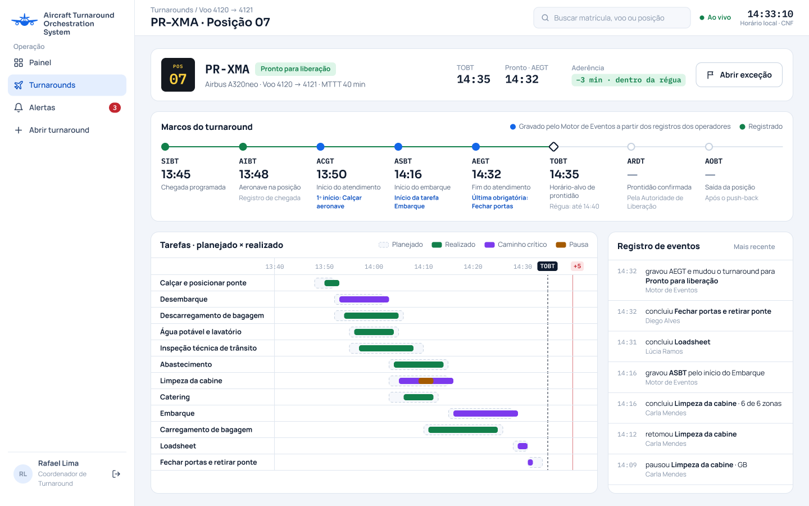
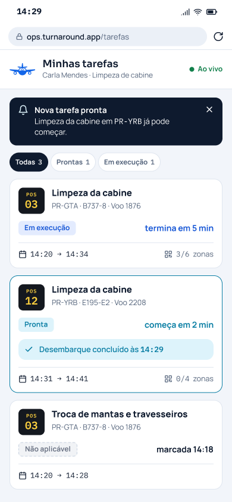

**Casos de uso da área B no diagrama geral (item 9).** Os nomes e os atores abaixo são os que o diagrama deve usar (critério C10.8).

| UC | Nome | Ator | Relacionamentos | RF e estória |
|---|---|---|---|---|
| UC14 | Consultar as tarefas da equipe atribuídas ao operador | Operador de Solo/Rampa | — | RF-14, US014 |
| UC15 | Iniciar tarefa | Operador de Solo/Rampa | «include» UC20 e UC21 | RF-15, US015 |
| UC16 | Concluir tarefa | Operador de Solo/Rampa | «include» UC20 e UC21 | RF-16, US016 |
| UC17 | Pausar e retomar tarefa | Operador de Solo/Rampa | — | RF-17, US017 |
| UC18 | Marcar tarefa como "Não aplicável" | Operador de Solo/Rampa | «include» UC20 e UC21 | RF-18, US018 |
| UC19 | Confirmar a execução da tarefa por QR Code | Operador de Solo/Rampa | — | RF-19, US019 |
| UC20 | Registrar os marcos do atendimento em solo | Motor de Eventos | incluído por UC15, UC16 e UC18 | RF-20, US020 |
| UC21 | Propagar o estado das tarefas e do turnaround | Motor de Eventos | incluído por UC12, UC15, UC16, UC18 e UC35 | RF-21, US021 |

## UC14 – Consultar as tarefas da equipe atribuídas ao operador

| Campo | |
|---|---|
| **Nome do caso de uso** | UC14 – Consultar as tarefas da equipe atribuídas ao operador |
| **Ator(es)** | Operador de Solo/Rampa |
| **Descrição** | O Operador de Solo/Rampa consulta, no celular, a lista das tarefas da sua equipe atribuídas a ele nos turnarounds abertos e abre o detalhe de uma tarefa para saber o que deve executar, em qual aeronave e a partir de quando pode começar. Atende ao RF-14 e à US014. |
| **Pré-condições** | 1. O Operador de Solo/Rampa está autenticado com o perfil de operador. 2. O cadastro do operador tem uma equipe ou especialidade, mantida pelo Administrador do Sistema (ADR-0010). |
| **Pós-condições** | A lista e o detalhe exibidos contêm só tarefas da equipe do operador atribuídas a ele. A consulta não altera o estado de nenhuma tarefa nem do turnaround. |
| **Regras de negócio** | **RN1.** Só aparecem as tarefas da equipe do operador atribuídas a ele; a tarefa de outra equipe, ou da mesma equipe atribuída a outro operador, não aparece, mesmo no mesmo turnaround (ADR-0010). **RN2.** Cada tarefa mostra o turnaround (aeronave e posição), o estado da tarefa, a janela planejada de início e de fim e as tarefas predecessoras ainda não concluídas (RF-14). **RN3.** O detalhe só oferece as ações que o estado da tarefa permite: "Iniciar" em tarefa "Pronta" (UC15); "Concluir" e "Pausar" em tarefa "Em execução" (UC16, UC17), mais "Ler QR Code" quando a tarefa tem pontos de QR Code (UC19); "Retomar" em tarefa "Pausada" (UC17); "Não aplicável" em tarefa "Aguardando" ou "Pronta" quando o modelo de tarefas do turnaround permite (UC18). **RN4.** Em tarefa "Aguardando", o detalhe mostra o nome de cada predecessora pendente e não permite acionar "Iniciar"; a opção fica ausente ou desabilitada (US014, critério 2). **RN5.** A lista é ordenada pelo início planejado das tarefas. **RN6.** Turnaround aberto é o que ainda não chegou ao estado "Fora de bloco". |
| **Protótipo(s) de tela** | Lista de tarefas e detalhe da tarefa.   |

### Fluxo básico

| Ações do ator | Ações do sistema |
|---|---|
| 1. O Operador de Solo/Rampa abre a lista de tarefas no navegador do celular (**E1**, **E2**). |  |
|  | 2. O sistema exibe as tarefas da equipe do operador atribuídas a ele nos turnarounds abertos, ordenadas pelo início planejado, cada uma com o turnaround (aeronave e posição), o estado, a janela planejada de início e de fim e as predecessoras ainda não concluídas (**E1**). |
| 3. O Operador de Solo/Rampa seleciona uma tarefa no estado "Pronta" (**E3**). |  |
|  | 4. O sistema exibe o detalhe da tarefa, com os dados da lista e a opção "Iniciar". O caso de uso termina. |

### Fluxo alternativo A1 – Tarefa à espera de predecessora (passo 3)

| Ações do ator | Ações do sistema |
|---|---|
| A1.1. O Operador de Solo/Rampa seleciona uma tarefa no estado "Aguardando". |  |
|  | A1.2. O sistema exibe o detalhe com o nome de cada predecessora ainda não concluída e sem a opção "Iniciar" habilitada. |
|  | A1.3. O caso de uso volta ao passo 3 ou termina. |

### Fluxo alternativo A2 – Tarefa em outro estado (passo 3)

| Ações do ator | Ações do sistema |
|---|---|
| A2.1. O Operador de Solo/Rampa seleciona uma tarefa "Em execução", "Pausada", "Concluída" ou "Não aplicável". |  |
|  | A2.2. O sistema exibe o detalhe com as ações que o estado permite (RN3); em tarefa "Concluída" ou "Não aplicável", sem nenhuma ação de registro. |
|  | A2.3. O caso de uso volta ao passo 3 ou termina. |

### Fluxo alternativo A3 – Nenhuma tarefa atribuída (passo 2)

*Condição:* o operador não tem tarefa atribuída em turnaround aberto.

| Ações do ator | Ações do sistema |
|---|---|
|  | A3.1. O sistema exibe a mensagem "Nenhuma tarefa atribuída a você" e a lista vazia. O caso de uso termina. |

### Fluxo alternativo A4 – Mudança de estado com a lista aberta (depois do passo 2)

*Condição:* uma tarefa da lista muda de estado por outro registro, por exemplo passa de "Aguardando" para "Pronta" pela propagação (UC21).

| Ações do ator | Ações do sistema |
|---|---|
|  | A4.1. O sistema atualiza o estado da tarefa na lista em até 5 segundos, o mesmo prazo do painel no objetivo 2, sem que o operador recarregue a página. |
|  | A4.2. O caso de uso continua no passo em que estava. |

### Fluxo de exceção E1 – Sem conexão com a internet (passo 1 ou 2)

| Ações do ator | Ações do sistema |
|---|---|
|  | E1.1. O sistema exibe a última lista recebida, com o horário da última atualização e o aviso "Sem conexão". |
|  | E1.2. Os registros feitos a partir dela seguem o fluxo sem conexão de cada caso de uso (RNF-8). |

### Fluxo de exceção E2 – Sessão expirada (passo 1)

| Ações do ator | Ações do sistema |
|---|---|
|  | E2.1. O sistema leva o operador à tela de autenticação. |
|  | E2.2. Os registros pendentes de envio continuam guardados no celular e só são enviados depois que o mesmo operador se autentica de novo (RNF-8). |
|  | E2.3. Depois da autenticação, o caso de uso volta ao passo 2. |

### Fluxo de exceção E3 – Tarefa reatribuída a outro operador (passo 3)

*Condição:* a tarefa selecionada foi atribuída a outro operador depois que a lista foi carregada.

| Ações do ator | Ações do sistema |
|---|---|
|  | E3.1. O sistema informa que a tarefa não está mais atribuída a ele e a retira da lista. |
|  | E3.2. O caso de uso volta ao passo 2. |

## UC15 – Iniciar tarefa

| Campo | |
|---|---|
| **Nome do caso de uso** | UC15 – Iniciar tarefa |
| **Ator(es)** | Operador de Solo/Rampa |
| **Descrição** | O Operador de Solo/Rampa registra o início de uma tarefa da sua equipe atribuída a ele, no estado "Pronta". A tarefa passa para "Em execução" e o registro grava o autor e o horário. Inclui os casos de uso UC20 (marcos) e UC21 (propagação), que o Motor de Eventos executa a cada início aceito. Atende ao RF-15 e à US015. |
| **Pré-condições** | 1. O Operador de Solo/Rampa está autenticado com o perfil de operador. 2. A tarefa é da equipe do operador, está atribuída a ele e está no estado "Pronta". |
| **Pós-condições** | **Sucesso:** a tarefa está no estado "Em execução", com o usuário e o horário do início gravados, e o Motor de Eventos processou o registro (UC20 e UC21). **Recusa:** a tarefa mantém o estado anterior e nenhum registro é gravado. |
| **Regras de negócio** | **RN1.** Só a tarefa no estado "Pronta" pode ser iniciada. A tarefa só fica "Pronta" quando todas as predecessoras estão "Concluída" ou "Não aplicável" (RF-15, RF-21), o que respeita as dependências entre as atividades, como a limpeza da cabine, que só começa depois do desembarque [22]. **RN2.** Só o operador a quem a tarefa da sua equipe está atribuída pode iniciá-la (ADR-0010). **RN3.** O registro grava o usuário e o horário da ação. Sem conexão, o horário é o do celular no momento da ação, com precisão de minuto completo, e não o do envio (RNF-8). **RN4.** O Motor de Eventos processa todo início aceito: o primeiro início do turnaround grava o início real do atendimento em solo (ACGT) e leva o turnaround de "Em solo" para "Operações em andamento"; o início da tarefa de embarque grava o início real do embarque (ASBT) [2] (UC20, UC21). |
| **Protótipo(s) de tela** | Detalhe da tarefa com a opção "Iniciar" e a confirmação do início.  |

### Fluxo básico

| Ações do ator | Ações do sistema |
|---|---|
| 1. O Operador de Solo/Rampa abre uma tarefa no estado "Pronta" na lista de tarefas (UC14). |  |
|  | 2. O sistema exibe o detalhe da tarefa com a opção "Iniciar". |
| 3. O Operador de Solo/Rampa seleciona "Iniciar". |  |
|  | 4. O sistema pede a confirmação, mostrando o nome da tarefa, a aeronave e a posição. |
| 5. O Operador de Solo/Rampa confirma. |  |
|  | 6. O sistema verifica que a tarefa continua no estado "Pronta" e atribuída ao operador (**E1**, **E2**, **E3**). |
|  | 7. O sistema grava o início com o usuário e o horário, muda a tarefa para "Em execução" e exibe no detalhe o novo estado e o horário de início. |
|  | 8. O sistema entrega o registro ao Motor de Eventos, que executa o UC20 e o UC21. O caso de uso termina. |

### Fluxo alternativo A1 – Desistência (passo 5)

| Ações do ator | Ações do sistema |
|---|---|
| A1.1. O Operador de Solo/Rampa cancela a confirmação. |  |
|  | A1.2. O sistema fecha a confirmação sem gravar nada, e a tarefa continua "Pronta". O caso de uso termina. |

### Fluxo alternativo A2 – Primeiro início do turnaround (passo 8)

*Condição:* o turnaround está em "Em solo" e nenhuma tarefa dele foi iniciada.

| Ações do ator | Ações do sistema |
|---|---|
|  | A2.1. O Motor de Eventos grava o horário do início como ACGT (UC20) e muda o turnaround para "Operações em andamento" (UC21). |
|  | A2.2. O sistema exibe o turnaround no estado "Operações em andamento" no detalhe da tarefa. O caso de uso termina. |

### Fluxo alternativo A3 – Início do embarque (passo 8)

*Condição:* a tarefa iniciada é a de embarque.

| Ações do ator | Ações do sistema |
|---|---|
|  | A3.1. O Motor de Eventos grava o horário do início como ASBT no turnaround (UC20). O caso de uso termina. |

### Fluxo de exceção E1 – Tarefa fora do estado "Pronta" (passo 6)

*Condição:* a tarefa está em outro estado ("Aguardando", "Em execução", "Pausada", "Concluída" ou "Não aplicável"), por exemplo porque a tela estava desatualizada.

| Ações do ator | Ações do sistema |
|---|---|
|  | E1.1. O sistema recusa o registro e informa que só uma tarefa no estado "Pronta" pode ser iniciada. |
|  | E1.2. A tarefa mantém o estado, e o sistema exibe o estado atual no detalhe. |

### Fluxo de exceção E2 – Tarefa reatribuída (passo 6)

*Condição:* a tarefa foi atribuída a outro operador.

| Ações do ator | Ações do sistema |
|---|---|
|  | E2.1. O sistema recusa o registro, informa que a tarefa não está mais atribuída a ele e a retira da lista. |

### Fluxo de exceção E3 – Sem conexão com a internet (passo 6)

| Ações do ator | Ações do sistema |
|---|---|
|  | E3.1. O sistema guarda o registro no celular com o horário da ação e exibe a tarefa como "Em execução", com a marca "pendente de envio" (RNF-8). |
|  | E3.2. Quando a conexão volta, o sistema envia os registros pendentes ao servidor em até 5 segundos, na ordem em que foram feitos, e retira a marca. |
|  | E3.3. Se o registro já não for válido no servidor no envio, por exemplo porque a tarefa foi reatribuída, o servidor o recusa sem alterar o estado da tarefa, e o sistema exibe no celular, em até 5 segundos depois que a conexão voltou, o aviso da recusa com o motivo e o estado atual da tarefa. |
|  | E3.4. Se a sessão expirou por inatividade enquanto o celular estava sem conexão, o sistema leva o operador à autenticação e só envia os registros pendentes, que continuam guardados no celular, depois que o mesmo operador se autentica de novo; os prazos de 5 segundos dos passos 2 e 3 contam dessa autenticação, e o servidor confere as permissões atuais do operador antes de aceitar os registros (RNF-8). |

## UC16 – Concluir tarefa

| Campo | |
|---|---|
| **Nome do caso de uso** | UC16 – Concluir tarefa |
| **Ator(es)** | Operador de Solo/Rampa |
| **Descrição** | O Operador de Solo/Rampa registra a conclusão de uma tarefa da sua equipe atribuída a ele, no estado "Em execução". Se a tarefa tiver pontos de confirmação por QR Code, a conclusão só é aceita com todos os pontos confirmados (UC19). A tarefa passa para "Concluída" e o registro grava o autor e o horário. Inclui os casos de uso UC20 (marcos) e UC21 (propagação). Atende ao RF-16 e à US016. |
| **Pré-condições** | 1. O Operador de Solo/Rampa está autenticado com o perfil de operador. 2. A tarefa é da equipe do operador, está atribuída a ele e está no estado "Em execução". |
| **Pós-condições** | **Sucesso:** a tarefa está no estado "Concluída", com o usuário e o horário da conclusão gravados, e o Motor de Eventos processou o registro (UC20 e UC21). **Recusa:** a tarefa mantém o estado anterior e nenhum registro é gravado. |
| **Regras de negócio** | **RN1.** Só a tarefa no estado "Em execução" pode ser concluída, o que impede conclusão sem registro de início, como pede a métrica do objetivo 2 (RF-16). A tarefa "Pausada" precisa ser retomada antes (UC17). **RN2.** Se a tarefa tiver pontos de confirmação por QR Code, a conclusão só é aceita quando todos os pontos estão confirmados (RF-16, RF-19, ADR-0007). **RN3.** Só o operador a quem a tarefa da sua equipe está atribuída pode concluí-la (ADR-0010). **RN4.** O registro grava o usuário e o horário da ação; sem conexão, vale o horário da ação, e não o do envio (RNF-8). **RN5.** O Motor de Eventos processa toda conclusão aceita: as sucessoras cujas predecessoras terminaram passam para "Pronta"; a conclusão da última tarefa obrigatória grava o fim real do atendimento em solo (AEGT) [2][4] e leva o turnaround para "Pronto para liberação" (UC20, UC21). |
| **Protótipo(s) de tela** | Detalhe da tarefa com a opção "Concluir", os pontos de QR Code confirmados e a confirmação da conclusão.  |

### Fluxo básico

| Ações do ator | Ações do sistema |
|---|---|
| 1. O Operador de Solo/Rampa abre uma tarefa no estado "Em execução", sem pontos de QR Code, na lista de tarefas (UC14). |  |
|  | 2. O sistema exibe o detalhe da tarefa com a opção "Concluir". |
| 3. O Operador de Solo/Rampa seleciona "Concluir". |  |
|  | 4. O sistema pede a confirmação, mostrando o nome da tarefa, a aeronave e a posição. |
| 5. O Operador de Solo/Rampa confirma. |  |
|  | 6. O sistema verifica que a tarefa continua no estado "Em execução" e atribuída ao operador (**E1**, **E2**, **E3**, **E4**, **E5**, **E6**). |
|  | 7. O sistema grava a conclusão com o usuário e o horário, muda a tarefa para "Concluída" e exibe no detalhe o novo estado e o horário de conclusão. |
|  | 8. O sistema entrega o registro ao Motor de Eventos, que executa o UC20 e o UC21. O caso de uso termina. |

### Fluxo alternativo A1 – Desistência (passo 5)

| Ações do ator | Ações do sistema |
|---|---|
| A1.1. O Operador de Solo/Rampa cancela a confirmação. |  |
|  | A1.2. O sistema fecha a confirmação sem gravar nada, e a tarefa continua "Em execução". O caso de uso termina. |

### Fluxo alternativo A2 – Tarefa com pontos de QR Code, todos confirmados (passo 1)

*Condição:* a tarefa tem pontos de confirmação por QR Code, por exemplo uma zona da cabine por QR Code na limpeza, e todos foram lidos (UC19).

| Ações do ator | Ações do sistema |
|---|---|
|  | A2.1. O sistema exibe no detalhe a contagem de pontos confirmados igual ao total, por exemplo "6 de 6 zonas confirmadas", e a opção "Concluir". |
|  | A2.2. O caso de uso continua no passo 3, e no passo 6 o sistema verifica também que todos os pontos estão confirmados. |

### Fluxo alternativo A3 – Conclusão que libera sucessoras (passo 8)

*Condição:* a tarefa concluída é a única predecessora pendente de outra tarefa, por exemplo o desembarque em relação à limpeza da cabine [22].

| Ações do ator | Ações do sistema |
|---|---|
|  | A3.1. O Motor de Eventos muda a sucessora de "Aguardando" para "Pronta" (UC21), e ela aparece como "Pronta" na lista do operador responsável (UC14). O caso de uso termina. |

### Fluxo alternativo A4 – Conclusão da última tarefa obrigatória (passo 8)

*Condição:* todas as outras tarefas obrigatórias do turnaround estão "Concluída" ou "Não aplicável".

| Ações do ator | Ações do sistema |
|---|---|
|  | A4.1. O Motor de Eventos grava o horário da conclusão como AEGT (UC20) e muda o turnaround para "Pronto para liberação" (UC21). O caso de uso termina. |

### Fluxo de exceção E1 – Tarefa não iniciada (passo 6)

*Condição:* a tarefa está "Aguardando" ou "Pronta", por exemplo porque a tela estava desatualizada.

| Ações do ator | Ações do sistema |
|---|---|
|  | E1.1. O sistema recusa o registro e informa que a tarefa precisa ser iniciada antes. |
|  | E1.2. A tarefa mantém o estado. |

### Fluxo de exceção E2 – Tarefa pausada (passo 6)

*Condição:* a tarefa está "Pausada".

| Ações do ator | Ações do sistema |
|---|---|
|  | E2.1. O sistema recusa o registro e informa que a tarefa precisa ser retomada antes (UC17). |
|  | E2.2. A tarefa mantém o estado "Pausada". |

### Fluxo de exceção E3 – Tarefa já terminada (passo 6)

*Condição:* a tarefa já está "Concluída" ou "Não aplicável".

| Ações do ator | Ações do sistema |
|---|---|
|  | E3.1. O sistema recusa o registro e informa que a tarefa já está terminada. |
|  | E3.2. A tarefa mantém o estado. |

### Fluxo de exceção E4 – Ponto de QR Code não confirmado (passo 6)

*Condição:* a tarefa tem pontos de QR Code e ao menos um não foi lido, por exemplo uma zona da cabine na limpeza.

| Ações do ator | Ações do sistema |
|---|---|
|  | E4.1. O sistema recusa o registro e mostra os pontos que faltam confirmar. |
|  | E4.2. A tarefa mantém o estado "Em execução". |

### Fluxo de exceção E5 – Tarefa reatribuída (passo 6)

*Condição:* a tarefa foi atribuída a outro operador.

| Ações do ator | Ações do sistema |
|---|---|
|  | E5.1. O sistema recusa o registro, informa que a tarefa não está mais atribuída a ele e a retira da lista. |

### Fluxo de exceção E6 – Sem conexão com a internet (passo 6)

| Ações do ator | Ações do sistema |
|---|---|
|  | E6.1. O sistema guarda o registro no celular com o horário da ação e exibe a tarefa como "Concluída", com a marca "pendente de envio" (RNF-8). |
|  | E6.2. Quando a conexão volta, o sistema envia os registros pendentes em até 5 segundos, na ordem em que foram feitos; o registro que já não for válido no servidor é recusado sem alterar o estado da tarefa, e o sistema exibe no celular o aviso da recusa, com o motivo, em até 5 segundos depois que a conexão voltou. |
|  | E6.3. Se a sessão expirou por inatividade enquanto o celular estava sem conexão, o sistema leva o operador à autenticação e só envia os registros pendentes, que continuam guardados no celular, depois que o mesmo operador se autentica de novo; os prazos de 5 segundos do passo 2 contam dessa autenticação, e o servidor confere as permissões atuais do operador antes de aceitar os registros (RNF-8). |

## UC17 – Pausar e retomar tarefa

| Campo | |
|---|---|
| **Nome do caso de uso** | UC17 – Pausar e retomar tarefa |
| **Ator(es)** | Operador de Solo/Rampa |
| **Descrição** | O Operador de Solo/Rampa pausa uma tarefa da sua equipe atribuída a ele, no estado "Em execução", com justificativa escrita e, quando houver impedimento, com o código do motivo da tabela de códigos de atraso da Agência Nacional de Aviação Civil (ANAC) [62]. Depois, retoma a tarefa, que volta para "Em execução". Pausar e retomar ficam no mesmo caso de uso porque um não existe sem o outro. Atende ao RF-17 e à US017. |
| **Pré-condições** | 1. O Operador de Solo/Rampa está autenticado com o perfil de operador. 2. A tarefa é da equipe do operador e está atribuída a ele; para pausar, está no estado "Em execução"; para retomar, no estado "Pausada". |
| **Pós-condições** | **Pausa aceita:** a tarefa está no estado "Pausada", com a justificativa, o código da ANAC (quando houver impedimento), o usuário e o horário gravados. **Retomada aceita:** a tarefa está no estado "Em execução", com o usuário e o horário da retomada gravados. **Recusa:** a tarefa mantém o estado anterior e nenhum registro é gravado. |
| **Regras de negócio** | **RN1.** Só a tarefa "Em execução" pode ser pausada, e só a tarefa "Pausada" pode ser retomada (RF-17). **RN2.** Toda pausa exige justificativa escrita (RF-17). **RN3.** Quando o operador indica impedimento, a pausa exige um código da tabela de códigos de atraso da ANAC, com os 72 códigos em 12 categorias, cada um com sigla de duas letras e descrição em português [62] (ADR-0006). Sem impedimento, o código não é pedido. **RN4.** A pausa e a retomada gravam o usuário e o horário da ação; sem conexão, vale o horário da ação, e não o do envio (RNF-8). **RN5.** A tarefa "Pausada" não conta como terminada para a propagação: as sucessoras continuam "Aguardando" (RF-21). **RN6.** Com a tarefa "Pausada", a leitura de QR Code e a conclusão são recusadas (UC19, UC16). **RN7.** A justificativa e o código gravados ficam disponíveis para o Coordenador de Turnaround, que pode agir antes que o horário-alvo de prontidão (TOBT) [2] fique em risco (US017); a exibição ao coordenador e o tratamento do risco ficam nos casos de uso UC25 e UC31. |
| **Protótipo(s) de tela** | Formulário de pausa, com a justificativa e a escolha do código da ANAC, e detalhe da tarefa pausada com a opção "Retomar".   |

### Fluxo básico

| Ações do ator | Ações do sistema |
|---|---|
| 1. O Operador de Solo/Rampa abre uma tarefa no estado "Em execução" na lista de tarefas (UC14). |  |
|  | 2. O sistema exibe o detalhe da tarefa com a opção "Pausar". |
| 3. O Operador de Solo/Rampa seleciona "Pausar". |  |
|  | 4. O sistema exibe o formulário de pausa, com o campo de justificativa e a pergunta "Há impedimento?", respondida "Não" por padrão. |
| 5. O Operador de Solo/Rampa escreve a justificativa, mantém "Não" e confirma. |  |
|  | 6. O sistema verifica que a tarefa continua "Em execução" e atribuída ao operador e que a justificativa foi preenchida (**E1**, **E2**, **E3**, **E4**). |
|  | 7. O sistema grava a pausa com a justificativa, o usuário e o horário, muda a tarefa para "Pausada" e exibe no detalhe o novo estado, a justificativa e a opção "Retomar". |
| 8. Mais tarde, o Operador de Solo/Rampa seleciona "Retomar" no detalhe da tarefa "Pausada". |  |
|  | 9. O sistema pede a confirmação da retomada. |
| 10. O Operador de Solo/Rampa confirma. |  |
|  | 11. O sistema verifica que a tarefa continua "Pausada" e atribuída ao operador, grava a retomada com o usuário e o horário, muda a tarefa para "Em execução" e exibe o novo estado no detalhe (**E3**, **E4**). O caso de uso termina. |

### Fluxo alternativo A1 – Pausa com impedimento (passo 5)

| Ações do ator | Ações do sistema |
|---|---|
| A1.1. O Operador de Solo/Rampa responde "Sim" a "Há impedimento?". |  |
|  | A1.2. O sistema exibe a tabela de códigos da ANAC, agrupada pelas 12 categorias, com busca por sigla ou descrição [62]. |
| A1.3. O Operador de Solo/Rampa escreve a justificativa, escolhe um código e confirma. |  |
|  | A1.4. No passo 7, o sistema grava também o código escolhido e o exibe no detalhe, com a sigla e a descrição. |

### Fluxo alternativo A2 – Desistência da pausa (passo 5)

| Ações do ator | Ações do sistema |
|---|---|
| A2.1. O Operador de Solo/Rampa cancela o formulário. |  |
|  | A2.2. O sistema fecha o formulário sem gravar nada, e a tarefa continua "Em execução". O caso de uso termina. |

### Fluxo alternativo A3 – Pausa sem retomada no momento (passo 8)

| Ações do ator | Ações do sistema |
|---|---|
| A3.1. O Operador de Solo/Rampa não retoma a tarefa. |  |
|  | A3.2. A tarefa continua "Pausada" e aparece assim na lista de tarefas (UC14). |
|  | A3.3. O caso de uso termina no passo 7 e recomeça no passo 8 quando o operador retomar. |

### Fluxo de exceção E1 – Pausa sem justificativa (passo 6)

| Ações do ator | Ações do sistema |
|---|---|
|  | E1.1. O sistema recusa o registro e pede a justificativa. |
|  | E1.2. A tarefa mantém o estado "Em execução", e o caso de uso volta ao passo 5. |

### Fluxo de exceção E2 – Impedimento sem código (passo 6, vindo do A1)

*Condição:* o operador indicou impedimento e não escolheu o código.

| Ações do ator | Ações do sistema |
|---|---|
|  | E2.1. O sistema recusa o registro e pede o código do impedimento. |
|  | E2.2. A tarefa mantém o estado "Em execução", e o caso de uso volta ao passo A1.3. |

### Fluxo de exceção E3 – Estado não permite a ação (passo 6 ou 11)

*Condição:* a tarefa não está "Em execução" (pausa) ou não está "Pausada" (retomada), por exemplo porque a tela estava desatualizada.

| Ações do ator | Ações do sistema |
|---|---|
|  | E3.1. O sistema recusa o registro, informa o estado exigido e exibe o estado atual da tarefa. |

### Fluxo de exceção E4 – Sem conexão com a internet (passo 6 ou 11)

| Ações do ator | Ações do sistema |
|---|---|
|  | E4.1. O sistema guarda o registro no celular com o horário da ação e exibe o novo estado com a marca "pendente de envio" (RNF-8). |
|  | E4.2. Quando a conexão volta, o sistema envia os registros pendentes em até 5 segundos, na ordem em que foram feitos; o registro que já não for válido no servidor é recusado sem alterar o estado da tarefa, e o sistema exibe no celular o aviso da recusa, com o motivo, em até 5 segundos depois que a conexão voltou. |
|  | E4.3. Se a sessão expirou por inatividade enquanto o celular estava sem conexão, o sistema leva o operador à autenticação e só envia os registros pendentes, que continuam guardados no celular, depois que o mesmo operador se autentica de novo; os prazos de 5 segundos do passo 2 contam dessa autenticação, e o servidor confere as permissões atuais do operador antes de aceitar os registros (RNF-8). |

## UC18 – Marcar tarefa como "Não aplicável"

| Campo | |
|---|---|
| **Nome do caso de uso** | UC18 – Marcar tarefa como "Não aplicável" |
| **Ator(es)** | Operador de Solo/Rampa |
| **Descrição** | O Operador de Solo/Rampa marca como "Não aplicável", com justificativa escrita, uma tarefa da sua equipe atribuída a ele que ainda não foi iniciada e que o modelo de tarefas do turnaround permite marcar assim, por exemplo um serviço que aquela aeronave não vai receber. Inclui os casos de uso UC20 (marcos), porque a marcação da última tarefa obrigatória pendente grava o AEGT, e UC21 (propagação), porque a tarefa "Não aplicável" deixa de segurar as sucessoras. Atende ao RF-18 e à US018. |
| **Pré-condições** | 1. O Operador de Solo/Rampa está autenticado com o perfil de operador. 2. A tarefa é da equipe do operador, está atribuída a ele, está no estado "Aguardando" ou "Pronta", e o modelo de tarefas do turnaround permite marcá-la como "Não aplicável". |
| **Pós-condições** | **Sucesso:** a tarefa está no estado "Não aplicável", com a justificativa, o usuário e o horário gravados, e o Motor de Eventos processou o registro (UC20 e UC21). **Recusa:** a tarefa mantém o estado anterior e nenhum registro é gravado. |
| **Regras de negócio** | **RN1.** Só a tarefa ainda não iniciada ("Aguardando" ou "Pronta") pode ser marcada como "Não aplicável" (RF-18). **RN2.** Só a tarefa que o modelo de tarefas do turnaround permite marcar como "Não aplicável" pode ser marcada; o modelo é definido no UC04 ([Inferência], base: [22][45]). **RN3.** A marcação exige justificativa escrita (RF-18). **RN4.** A marcação grava o usuário e o horário da ação; sem conexão, vale o horário da ação, e não o do envio (RNF-8). **RN5.** Para a propagação, a tarefa "Não aplicável" conta como terminada, igual à "Concluída": as sucessoras sem outra predecessora pendente passam para "Pronta" (RF-21); se era a última tarefa obrigatória pendente, o horário da marcação é gravado como fim real do atendimento em solo (AEGT) [2][4] e o turnaround passa para "Pronto para liberação" (RF-20, RF-21). **RN6.** A tarefa "Não aplicável" é final: não aceita início, pausa, conclusão nem leitura de QR Code. |
| **Protótipo(s) de tela** | Formulário de marcação como "Não aplicável", com o campo de justificativa.  |

### Fluxo básico

| Ações do ator | Ações do sistema |
|---|---|
| 1. O Operador de Solo/Rampa abre, na lista de tarefas (UC14), uma tarefa "Aguardando" ou "Pronta" que o modelo permite marcar como "Não aplicável". |  |
|  | 2. O sistema exibe o detalhe da tarefa com a opção "Não aplicável". |
| 3. O Operador de Solo/Rampa seleciona "Não aplicável". |  |
|  | 4. O sistema exibe o formulário com o campo de justificativa. |
| 5. O Operador de Solo/Rampa escreve a justificativa e confirma. |  |
|  | 6. O sistema verifica que a tarefa continua não iniciada, atribuída ao operador e marcável como "Não aplicável" e que a justificativa foi preenchida (**E1**, **E2**, **E3**, **E4**). |
|  | 7. O sistema grava a marcação com a justificativa, o usuário e o horário, muda a tarefa para "Não aplicável" e exibe no detalhe o novo estado e a justificativa, sem nenhuma ação de registro. |
|  | 8. O sistema entrega o registro ao Motor de Eventos, que executa o UC20 e o UC21. O caso de uso termina. |

### Fluxo alternativo A1 – Desistência (passo 5)

| Ações do ator | Ações do sistema |
|---|---|
| A1.1. O Operador de Solo/Rampa cancela o formulário. |  |
|  | A1.2. O sistema fecha o formulário sem gravar nada, e a tarefa mantém o estado. O caso de uso termina. |

### Fluxo alternativo A2 – Última predecessora pendente (passo 8)

*Condição:* a tarefa marcada era a única predecessora pendente de outra tarefa "Aguardando".

| Ações do ator | Ações do sistema |
|---|---|
|  | A2.1. O Motor de Eventos muda a sucessora para "Pronta" (UC21), e ela aparece como "Pronta" na lista do operador responsável (UC14). O caso de uso termina. |

### Fluxo alternativo A3 – Última tarefa obrigatória pendente (passo 8)

*Condição:* todas as outras tarefas obrigatórias do turnaround estão "Concluída" ou "Não aplicável".

| Ações do ator | Ações do sistema |
|---|---|
|  | A3.1. O Motor de Eventos grava o horário da marcação como AEGT (UC20) e muda o turnaround para "Pronto para liberação" (UC21). O caso de uso termina. |

### Fluxo de exceção E1 – Sem justificativa (passo 6)

| Ações do ator | Ações do sistema |
|---|---|
|  | E1.1. O sistema recusa o registro e pede a justificativa. |
|  | E1.2. A tarefa mantém o estado, e o caso de uso volta ao passo 5. |

### Fluxo de exceção E2 – Tarefa já iniciada ou já marcada (passo 6)

*Condição:* a tarefa está "Em execução", "Pausada", "Concluída" ou já está "Não aplicável".

| Ações do ator | Ações do sistema |
|---|---|
|  | E2.1. O sistema recusa o registro e informa que só uma tarefa ainda não iniciada pode ser marcada como "Não aplicável". |
|  | E2.2. A tarefa mantém o estado. |

### Fluxo de exceção E3 – Modelo não permite a marcação (passo 6)

*Condição:* o modelo de tarefas do turnaround não permite marcar essa tarefa como "Não aplicável", por exemplo porque a tela estava desatualizada.

| Ações do ator | Ações do sistema |
|---|---|
|  | E3.1. O sistema recusa o registro e informa que essa tarefa não pode ser marcada como "Não aplicável". |
|  | E3.2. A tarefa mantém o estado. |

### Fluxo de exceção E4 – Sem conexão com a internet (passo 6)

| Ações do ator | Ações do sistema |
|---|---|
|  | E4.1. O sistema guarda o registro no celular com o horário da ação e exibe a tarefa como "Não aplicável", com a marca "pendente de envio" (RNF-8). |
|  | E4.2. Quando a conexão volta, o sistema envia os registros pendentes em até 5 segundos, na ordem em que foram feitos; o registro que já não for válido no servidor é recusado sem alterar o estado da tarefa, e o sistema exibe no celular o aviso da recusa, com o motivo, em até 5 segundos depois que a conexão voltou. |
|  | E4.3. Se a sessão expirou por inatividade enquanto o celular estava sem conexão, o sistema leva o operador à autenticação e só envia os registros pendentes, que continuam guardados no celular, depois que o mesmo operador se autentica de novo; os prazos de 5 segundos do passo 2 contam dessa autenticação, e o servidor confere as permissões atuais do operador antes de aceitar os registros (RNF-8). |

## UC19 – Confirmar a execução da tarefa por QR Code

| Campo | |
|---|---|
| **Nome do caso de uso** | UC19 – Confirmar a execução da tarefa por QR Code |
| **Ator(es)** | Operador de Solo/Rampa |
| **Descrição** | Durante a execução de uma tarefa da sua equipe atribuída a ele, o Operador de Solo/Rampa lê, com a câmera do celular, o QR Code fixado em cada ponto da aeronave ligado à tarefa, por exemplo cada zona, fileira ou assento da cabine na limpeza. Cada leitura confirma um ponto, com autor e horário. A conclusão da tarefa continua sendo registrada no UC16, que só a aceita com todos os pontos confirmados. Atende ao RF-19 e à US019. |
| **Pré-condições** | 1. O Operador de Solo/Rampa está autenticado com o perfil de operador. 2. A tarefa é da equipe do operador, está atribuída a ele, está no estado "Em execução" e tem pontos de confirmação por QR Code no modelo de tarefas do turnaround. 3. Os QR Codes estão fixados nos pontos correspondentes da aeronave. |
| **Pós-condições** | **Sucesso:** cada ponto lido está confirmado na tarefa, com o usuário e o horário da leitura gravados. **Recusa:** nenhuma leitura é gravada, e os pontos da tarefa mantêm a situação anterior. |
| **Regras de negócio** | **RN1.** A leitura só é aceita com a tarefa no estado "Em execução" (RF-19). **RN2.** O sistema recusa o QR Code que não pertença a uma tarefa da equipe do operador atribuída a ele no turnaround, e o QR Code que não corresponda a nenhum ponto cadastrado no turnaround, sem gravar nenhum registro (RF-19, ADR-0010). **RN3.** Cada leitura aceita grava o usuário e o horário e marca o ponto como confirmado (RF-19). **RN4.** A leitura não conclui a tarefa: a conclusão é registrada no UC16, e só é aceita quando todos os pontos da tarefa estão confirmados (RF-16). **RN5.** Os pontos são definidos por tarefa no modelo de tarefas, por zona, fileira ou assento. [Inferência] Ler assento por assento pode atrasar a limpeza; por isso a zona ou a fileira são as opções preferidas, e o assento fica como opção (ADR-0007). **RN6.** [Fato] Há leitura de QR Code para comprovar limpeza em aeroporto [63] e checklist digital de limpeza da cabine por zona [64]; [Inferência] ligar a leitura por ponto ao andamento do turnaround é regra do projeto (ADR-0007). **RN7.** A leitura usa a câmera do celular pelo navegador, sem aplicativo instalado (RNF-9, RNF-10). |
| **Protótipo(s) de tela** | Leitura do QR Code pela câmera e lista de pontos da tarefa, com os confirmados e os que faltam.   |

### Fluxo básico

| Ações do ator | Ações do sistema |
|---|---|
| 1. O Operador de Solo/Rampa abre, na lista de tarefas (UC14), uma tarefa "Em execução" com pontos de QR Code, por exemplo a limpeza da cabine com um QR Code por zona. |  |
|  | 2. O sistema exibe o detalhe com a lista de pontos, cada um marcado como "confirmado" ou "a confirmar", a contagem de confirmados, por exemplo "0 de 6 zonas", e a opção "Ler QR Code". |
| 3. O Operador de Solo/Rampa seleciona "Ler QR Code". |  |
|  | 4. O sistema abre a câmera do celular (**E4**). |
| 5. O Operador de Solo/Rampa aponta a câmera para o QR Code de um ponto. |  |
|  | 6. O sistema reconhece o QR Code e verifica que ele pertence a um ponto dessa tarefa e que a tarefa continua "Em execução" e atribuída ao operador (**E1**, **E2**, **E3**, **E5**). |
|  | 7. O sistema grava a leitura com o usuário e o horário, marca o ponto como "confirmado" e atualiza a contagem, por exemplo "1 de 6 zonas". |
| 8. O Operador de Solo/Rampa repete os passos 5 a 7 para cada ponto que falta. |  |
|  | 9. Com todos os pontos confirmados, o sistema exibe "Todos os pontos confirmados" e a opção "Concluir" (UC16). O caso de uso termina. |

### Fluxo alternativo A1 – Interrupção das leituras (passo 8)

| Ações do ator | Ações do sistema |
|---|---|
| A1.1. O Operador de Solo/Rampa fecha a câmera antes de ler todos os pontos. |  |
|  | A1.2. O sistema mantém gravadas as leituras feitas e exibe os pontos que faltam confirmar. |
|  | A1.3. Quando o operador volta à tarefa, o caso de uso continua no passo 2. |

### Fluxo alternativo A2 – Ponto já confirmado (passo 6)

*Condição:* o QR Code lido é de um ponto da tarefa que já foi confirmado.

| Ações do ator | Ações do sistema |
|---|---|
|  | A2.1. O sistema informa que o ponto já estava confirmado, mantém o registro da primeira leitura e não grava outro. |
|  | A2.2. O caso de uso volta ao passo 5. |

### Fluxo alternativo A3 – QR Code de outra tarefa dele em execução (passo 6)

*Condição:* o QR Code é de um ponto de outra tarefa atribuída ao operador, também "Em execução".

| Ações do ator | Ações do sistema |
|---|---|
|  | A3.1. O sistema grava a leitura na tarefa a que o QR Code pertence, com o usuário e o horário, marca o ponto como "confirmado" nessa tarefa e informa em qual tarefa a leitura foi registrada (RF-19). |
|  | A3.2. O caso de uso volta ao passo 5. |

### Fluxo de exceção E1 – QR Code de tarefa não atribuída ao operador (passo 6)

*Condição:* o QR Code pertence a uma tarefa de outra equipe, ou da mesma equipe atribuída a outro operador.

| Ações do ator | Ações do sistema |
|---|---|
|  | E1.1. O sistema recusa a leitura, informa que o QR Code não pertence a uma tarefa atribuída a ele e não grava nenhum registro. |
|  | E1.2. O caso de uso volta ao passo 5. |

### Fluxo de exceção E2 – QR Code não reconhecido (passo 6)

*Condição:* o QR Code não corresponde a nenhum ponto cadastrado no turnaround.

| Ações do ator | Ações do sistema |
|---|---|
|  | E2.1. O sistema informa que o QR Code não foi reconhecido e não grava nenhum registro. |
|  | E2.2. O caso de uso volta ao passo 5. |

### Fluxo de exceção E3 – QR Code de tarefa atribuída a ele fora de execução (passo 6)

*Condição:* o QR Code é de uma tarefa atribuída ao operador que está "Pronta" ou "Pausada", por exemplo porque a tarefa foi pausada com a câmera aberta ou o QR Code lido é de outra tarefa dele.

| Ações do ator | Ações do sistema |
|---|---|
|  | E3.1. O sistema recusa a leitura, informa que a tarefa precisa estar em execução e não grava nenhum registro. |

### Fluxo de exceção E4 – Câmera indisponível (passo 4)

*Condição:* o navegador não tem permissão de usar a câmera, ou o celular não tem câmera disponível.

| Ações do ator | Ações do sistema |
|---|---|
|  | E4.1. O sistema informa que a leitura precisa da câmera e como permitir o acesso no navegador, e não grava nenhum registro. |

### Fluxo de exceção E5 – Sem conexão com a internet (passo 6)

| Ações do ator | Ações do sistema |
|---|---|
|  | E5.1. O sistema guarda a leitura no celular com o horário da ação e exibe o ponto como "confirmado", com a marca "pendente de envio" (RNF-8). |
|  | E5.2. Quando a conexão volta, o sistema envia os registros pendentes em até 5 segundos, na ordem em que foram feitos; a leitura que já não for válida no servidor é recusada sem alterar a tarefa, e o sistema exibe no celular o aviso da recusa, com o motivo, em até 5 segundos depois que a conexão voltou, e o ponto volta para "a confirmar". |
|  | E5.3. Se a sessão expirou por inatividade enquanto o celular estava sem conexão, o sistema leva o operador à autenticação e só envia os registros pendentes, que continuam guardados no celular, depois que o mesmo operador se autentica de novo; os prazos de 5 segundos do passo 2 contam dessa autenticação, e o servidor confere as permissões atuais do operador antes de aceitar os registros (RNF-8). |

## UC20 – Registrar os marcos do atendimento em solo

| Campo | |
|---|---|
| **Nome do caso de uso** | UC20 – Registrar os marcos do atendimento em solo |
| **Ator(es)** | Motor de Eventos |
| **Descrição** | A cada início, conclusão ou marcação de "Não aplicável" aceito, o Motor de Eventos grava no turnaround os marcos do atendimento em solo, a partir do horário do registro do operador, sem que ninguém precise digitá-los: o início real do atendimento em solo (ACGT), o início real do embarque (ASBT) e o fim real do atendimento em solo (AEGT) [2][4]. É incluído pelos casos de uso UC15, UC16 e UC18. Atende ao RF-20 e à US020. |
| **Pré-condições** | 1. Um registro de início (UC15), de conclusão (UC16) ou de "Não aplicável" (UC18) de tarefa chegou ao servidor. 2. O turnaround tem, no modelo de tarefas, a tarefa de embarque e as tarefas obrigatórias identificadas. |
| **Pós-condições** | os marcos que o registro determina estão gravados no turnaround, cada um com o horário e o registro de origem; os marcos que o registro não determina ficam como estavam. |
| **Regras de negócio** | **RN1.** ACGT é o horário do primeiro início de tarefa registrado no turnaround [2]. **RN2.** ASBT é o horário do início da tarefa de embarque [2]. **RN3.** AEGT é o horário do registro que leva a última tarefa obrigatória pendente do turnaround a "Concluída" ou "Não aplicável" [4] (RF-20). **RN4.** O horário de cada marco é o horário da ação do operador, inclusive no registro feito sem conexão, e não o horário de chegada ao servidor (RNF-8). [Inferência] É o que a régua do TOBT planejado + 5 minutos [2][3] (ADR-0001) precisa para medir a aderência. **RN5.** O início de uma tarefa que não é a de embarque, com o ACGT já gravado, não grava nenhum marco (US020, critério 4). **RN6.** [Fato] Os marcos e as siglas são os da tomada de decisão colaborativa em aeroportos (A-CDM) [2][4]; [Inferência] derivá-los dos registros de início, de conclusão e de "Não aplicável" é regra do projeto (RF-20). |
| **Protótipo(s) de tela** | Marcos do turnaround (ACGT, ASBT e AEGT) com os horários gravados, no detalhe do turnaround.  |

### Fluxo básico

| Ações do ator | Ações do sistema |
|---|---|
| 1. O Motor de Eventos recebe um registro de início de tarefa aceito no servidor (UC15) (**E1**, **E2**). |  |
| 2. O Motor de Eventos verifica que o turnaround ainda não tem ACGT. |  |
| 3. O Motor de Eventos grava o horário da ação desse registro como ACGT, com a referência ao registro. |  |
| 4. O Motor de Eventos verifica que a tarefa iniciada não é a de embarque. |  |
|  | 5. O sistema exibe o ACGT com o horário gravado nos marcos do turnaround. O caso de uso termina. |

### Fluxo alternativo A1 – Início do embarque (passo 4)

*Condição:* a tarefa iniciada é a de embarque.

| Ações do ator | Ações do sistema |
|---|---|
| A1.1. O Motor de Eventos grava o horário da ação como ASBT, com a referência ao registro. |  |
|  | A1.2. O sistema exibe o ASBT nos marcos do turnaround, e o caso de uso termina. |

### Fluxo alternativo A2 – Início com ACGT já gravado (passo 2)

*Condição:* o turnaround já tem ACGT.

| Ações do ator | Ações do sistema |
|---|---|
| A2.1. O Motor de Eventos mantém o ACGT gravado e segue para o passo 4. |  |

### Fluxo alternativo A3 – Conclusão da última tarefa obrigatória (passo 1)

*Condição:* o registro recebido é uma conclusão (UC16), e todas as outras tarefas obrigatórias estão "Concluída" ou "Não aplicável".

| Ações do ator | Ações do sistema |
|---|---|
| A3.1. O Motor de Eventos grava o horário da ação como AEGT, com a referência ao registro. |  |
|  | A3.2. O sistema exibe o AEGT nos marcos do turnaround, e o caso de uso termina. |

### Fluxo alternativo A4 – Última tarefa obrigatória marcada como "Não aplicável" (passo 1)

*Condição:* o registro recebido é uma marcação de "Não aplicável" (UC18), e todas as outras tarefas obrigatórias estão "Concluída" ou "Não aplicável".

| Ações do ator | Ações do sistema |
|---|---|
| A4.1. O Motor de Eventos grava o horário da marcação como AEGT, com a referência ao registro. |  |
|  | A4.2. O sistema exibe o AEGT nos marcos do turnaround, e o caso de uso termina. |

### Fluxo alternativo A5 – Conclusão ou "Não aplicável" que não é a última obrigatória (passo 1)

*Condição:* o registro recebido é uma conclusão ou uma marcação de "Não aplicável", e ainda há tarefa obrigatória pendente.

| Ações do ator | Ações do sistema |
|---|---|
| A5.1. O Motor de Eventos não grava nenhum marco, e o caso de uso termina. |  |

### Fluxo de exceção E1 – Registro feito sem conexão (passo 1)

*Condição:* o registro aceito foi feito sem conexão e chegou ao servidor depois que a conexão voltou (RNF-8).

| Ações do ator | Ações do sistema |
|---|---|
| E1.1. O Motor de Eventos aplica o fluxo básico ou o alternativo correspondente ao registro aceito (A1 a A5). Quando esse fluxo gera marco, grava-o com o horário da ação guardado no celular, e não com o horário de chegada ao servidor (RN4); nos demais casos, não grava marco. |  |
|  | E1.2. O sistema exibe somente os marcos efetivamente gravados, com o horário da ação. O caso de uso termina. |

### Fluxo de exceção E2 – Registro recusado no servidor (passo 1)

*Condição:* o registro feito sem conexão chega e é recusado por já não ser válido (RNF-8).

| Ações do ator | Ações do sistema |
|---|---|
| E2.1. O Motor de Eventos não grava nem altera nenhum marco. |  |

## UC21 – Propagar o estado das tarefas e do turnaround

| Campo | |
|---|---|
| **Nome do caso de uso** | UC21 – Propagar o estado das tarefas e do turnaround |
| **Ator(es)** | Motor de Eventos |
| **Descrição** | A cada registro aceito, o Motor de Eventos propaga o estado para as tarefas e para o turnaround: a entrada do turnaround em "Em solo" deixa "Pronta" cada tarefa sem predecessora; o primeiro início leva o turnaround de "Em solo" para "Operações em andamento"; a tarefa que termina ("Concluída" ou "Não aplicável") libera as sucessoras sem outra predecessora pendente, que passam de "Aguardando" para "Pronta"; e, quando todas as tarefas obrigatórias terminam, o turnaround passa para "Pronto para liberação". Também ajusta as tarefas não iniciadas quando o Coordenador de Turnaround inclui tarefa ou altera dependências no replanejamento (UC35). É incluído pelos casos de uso UC12, UC15, UC16, UC18 e UC35. Atende ao RF-21 e à US021. |
| **Pré-condições** | 1. Um registro de início (UC15), de conclusão (UC16) ou de "Não aplicável" (UC18) chegou ao servidor, ou o turnaround entrou no estado "Em solo" com o registro do horário real de chegada à posição (AIBT) [2], ou o Coordenador de Turnaround incluiu tarefa ou alterou dependências no replanejamento (UC35). 2. O turnaround tem modelo de tarefas com as dependências entre as tarefas e as tarefas obrigatórias identificadas (UC04, UC06 e UC08). |
| **Pós-condições** | as tarefas e o turnaround estão nos estados que as regras determinam, e cada mudança feita pela propagação está gravada com o horário e com o registro que a causou. |
| **Regras de negócio** | **RN1.** Uma tarefa sucessora passa de "Aguardando" para "Pronta" quando todas as suas predecessoras estão "Concluída" ou "Não aplicável" (RF-21). Predecessora "Aguardando", "Pronta", "Em execução" ou "Pausada" mantém a sucessora em "Aguardando". No replanejamento (UC35), a tarefa não iniciada que ganha predecessora pendente volta de "Pronta" para "Aguardando" (RF-21; US021, critério 7). **RN2.** Quando o turnaround entra no estado "Em solo", com o registro do AIBT, cada tarefa sem predecessora passa de "Aguardando" para "Pronta" (RF-21). O primeiro início de tarefa registrado leva o turnaround de "Em solo" para "Operações em andamento" (RF-21). **RN3.** Quando todas as tarefas obrigatórias estão "Concluída" ou "Não aplicável", o turnaround passa de "Operações em andamento" para "Pronto para liberação" (RF-21). As tarefas não obrigatórias não seguram essa passagem. **RN4.** "Pronto para liberação" não é a liberação: o turnaround só passa para "Liberado" pela confirmação da Autoridade de Liberação (UC32). **RN5.** Cada mudança de estado feita pela propagação grava o horário e o registro que a causou (RF-21). **RN6.** As dependências vêm do modelo de tarefas do turnaround. [Fato] Exemplos do setor: a limpeza da cabine e o catering só começam depois do desembarque [22][29], e o embarque espera o fim da limpeza [24][29]. **RN7.** Abastecimento com passageiros a bordo (ADR-0005): a regra é configurável por operador aéreo (companhia aérea), com padrão "não permitido", o caso mais conservador [24]. Não permitido: o abastecimento tem o desembarque como predecessora, e o embarque tem o abastecimento como predecessora. Permitido: essas duas dependências não existem, e o abastecimento corre em paralelo ao fluxo de passageiros. [Fato] O operador aéreo só pode habilitar a regra quando cumpre as condições do Regulamento Brasileiro da Aviação Civil (RBAC) nº 91, seção 91.102(g) [27]: (1) procedimento aprovado e um tripulante de voo na cabine de pilotagem supervisionando; (2) no mínimo 50% dos comissários requeridos e/ou pessoas treinadas para dirigir uma evacuação de emergência, com os meios de evacuação disponíveis; (3) motores desligados, exceto a unidade auxiliar de energia (APU); e (4) comunicação entre o pessoal de solo e o tripulante na cabine dos pilotos. **RN8.** A mudança de estado aparece na lista do operador (UC14) e no painel em até 5 segundos, como pede o objetivo 2. **RN9.** Com o turnaround no estado lateral "Em exceção", a propagação entre as tarefas segue as RN1 e RN5; a entrada e a saída de "Em exceção" são tratadas no UC29 e no UC33. |
| **Protótipo(s) de tela** | Lista de tarefas do operador com a sucessora liberada ("Pronta") e o estado do turnaround atualizado.  |

### Fluxo básico

| Ações do ator | Ações do sistema |
|---|---|
| 1. O Motor de Eventos recebe um registro de conclusão de tarefa aceito no servidor (UC16), por exemplo a conclusão do desembarque (**E1**, **E2**). |  |
| 2. O Motor de Eventos identifica, no modelo de tarefas, as sucessoras da tarefa concluída, por exemplo a limpeza da cabine. |  |
|  | 3. Para cada sucessora no estado "Aguardando", o Motor de Eventos verifica que todas as predecessoras estão "Concluída" ou "Não aplicável" (**E3**). |
| 4. O Motor de Eventos muda essas sucessoras para "Pronta" e grava, para cada uma, o horário da mudança e o registro que a causou. |  |
| 5. O Motor de Eventos verifica que ainda há tarefa obrigatória do turnaround fora dos estados "Concluída" e "Não aplicável", e o turnaround continua "Operações em andamento". |  |
|  | 6. O sistema exibe as sucessoras como "Pronta" na lista dos operadores responsáveis (UC14) em até 5 segundos. O caso de uso termina. |

### Fluxo alternativo A1 – Primeiro início do turnaround (passo 1)

*Condição:* o registro recebido é o primeiro início de tarefa (UC15), com o turnaround em "Em solo".

| Ações do ator | Ações do sistema |
|---|---|
| A1.1. O Motor de Eventos muda o turnaround para "Operações em andamento" e grava o horário da mudança e o registro que a causou. |  |
|  | A1.2. O sistema exibe o novo estado do turnaround em até 5 segundos, e o caso de uso termina. |

### Fluxo alternativo A2 – Sucessora com predecessora pendente (passo 3)

*Condição:* a sucessora tem outra predecessora ainda "Aguardando", "Pronta", "Em execução" ou "Pausada".

| Ações do ator | Ações do sistema |
|---|---|
| A2.1. O Motor de Eventos mantém a sucessora em "Aguardando", e o caso de uso segue para o passo 5. |  |

### Fluxo alternativo A3 – Predecessora marcada como "Não aplicável" (passo 1)

*Condição:* o registro recebido é uma marcação de "Não aplicável" (UC18).

| Ações do ator | Ações do sistema |
|---|---|
| A3.1. O Motor de Eventos trata a tarefa marcada como terminada, e o caso de uso segue do passo 2. |  |

### Fluxo alternativo A4 – Última tarefa obrigatória terminada (passo 5)

*Condição:* todas as tarefas obrigatórias estão "Concluída" ou "Não aplicável".

| Ações do ator | Ações do sistema |
|---|---|
| A4.1. O Motor de Eventos muda o turnaround para "Pronto para liberação" e grava o horário da mudança e o registro que a causou. |  |
|  | A4.2. O sistema exibe o novo estado do turnaround em até 5 segundos, e o caso de uso termina. |

### Fluxo alternativo A5 – Abastecimento com passageiros a bordo não permitido (passo 2)

*Condição:* o operador aéreo do turnaround não habilitou a regra (padrão).

| Ações do ator | Ações do sistema |
|---|---|
|  | A5.1. Na conclusão do desembarque, o abastecimento está entre as sucessoras e passa para "Pronta" se não tiver outra predecessora pendente. |
|  | A5.2. O embarque só passa para "Pronta" depois da conclusão do abastecimento, além das suas outras predecessoras. |

### Fluxo alternativo A6 – Abastecimento com passageiros a bordo permitido (passo 2)

*Condição:* o operador aéreo do turnaround habilitou a regra.

| Ações do ator | Ações do sistema |
|---|---|
|  | A6.1. O abastecimento não é sucessora do desembarque, e o embarque não é sucessora do abastecimento; o caso de uso segue do passo 3 com as demais dependências. |

### Fluxo alternativo A7 – Chegada da aeronave à posição (passo 1)

*Condição:* o turnaround entra no estado "Em solo", com o registro do AIBT.

| Ações do ator | Ações do sistema |
|---|---|
| A7.1. O Motor de Eventos muda para "Pronta" cada tarefa do turnaround sem predecessora, por exemplo calçar a aeronave [22], e grava, para cada uma, o horário da mudança e o registro que a causou. |  |
|  | A7.2. O sistema exibe essas tarefas como "Pronta" na lista dos operadores responsáveis (UC14) em até 5 segundos, e o caso de uso termina. |

### Fluxo alternativo A8 – Inclusão de tarefa ou alteração de dependências (passo 1)

*Condição:* o Coordenador de Turnaround incluiu tarefa ou alterou dependências no replanejamento (UC35).

| Ações do ator | Ações do sistema |
|---|---|
| A8.1. O Motor de Eventos reavalia as tarefas afetadas ainda não iniciadas: deixa "Pronta" a tarefa sem predecessora ou com todas as predecessoras "Concluída" ou "Não aplicável"; mantém ou devolve a "Aguardando" a tarefa com predecessora pendente (RN1). |  |
| A8.2. O Motor de Eventos grava cada mudança de estado com o horário e a alteração do plano que a causou (RN5). |  |
|  | A8.3. O sistema exibe os estados atualizados na lista dos operadores responsáveis e no painel em até 5 segundos (RN8). O caso de uso termina. |

### Fluxo de exceção E1 – Registro recusado no servidor (passo 1)

*Condição:* o registro feito sem conexão chega e é recusado por já não ser válido (RNF-8).

| Ações do ator | Ações do sistema |
|---|---|
| E1.1. O Motor de Eventos não muda o estado de nenhuma tarefa nem do turnaround. |  |

### Fluxo de exceção E2 – Registro feito sem conexão chega depois (passo 1)

*Condição:* o registro aceito foi feito sem conexão e chega ao servidor depois de outros registros.

| Ações do ator | Ações do sistema |
|---|---|
| E2.1. O Motor de Eventos aplica a propagação quando o registro chega e grava o horário da mudança e o registro que a causou, que guarda o horário da ação (RNF-8). |  |

### Fluxo de exceção E3 – Sucessora não está "Aguardando" (passo 3)

*Condição:* a sucessora já está "Não aplicável", por exemplo porque foi marcada antes de a predecessora terminar.

| Ações do ator | Ações do sistema |
|---|---|
| E3.1. O Motor de Eventos não muda o estado dessa sucessora e segue para a próxima. |  |

Fontes citadas: [2], [3], [4], [22], [24], [27], [29], [45], [62], [63] e [64], conforme a numeração de `pesquisa/fontes.md`.
