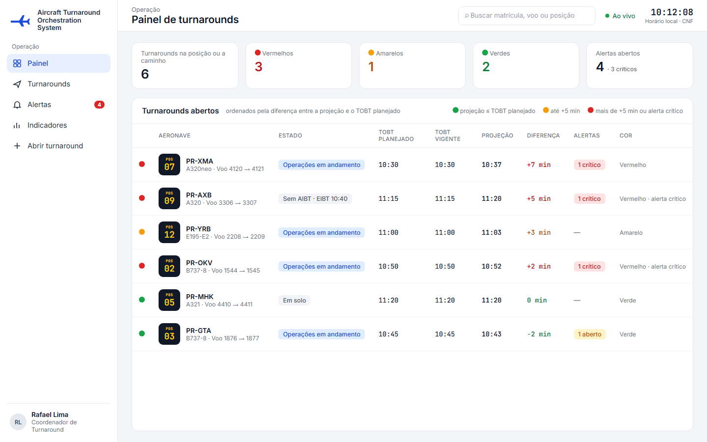
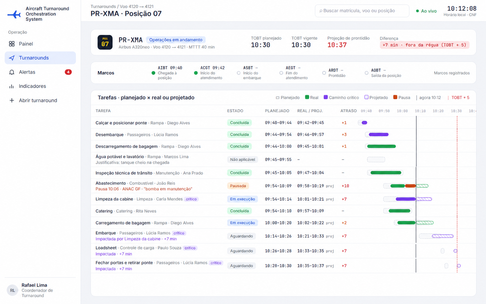
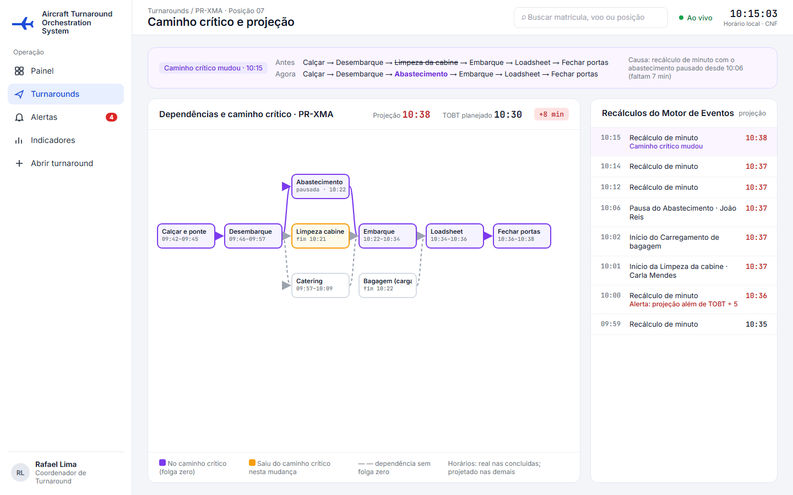
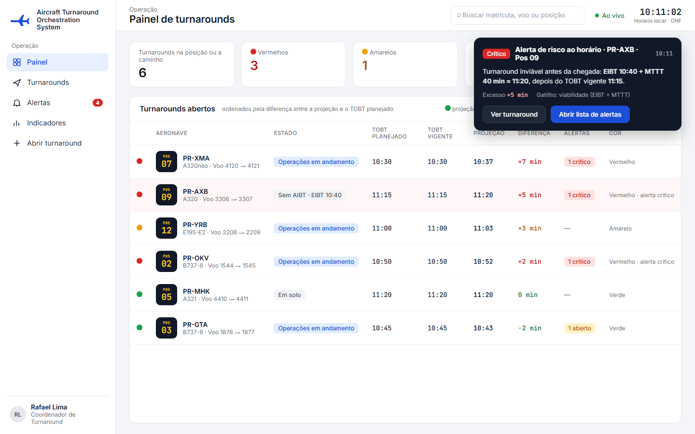
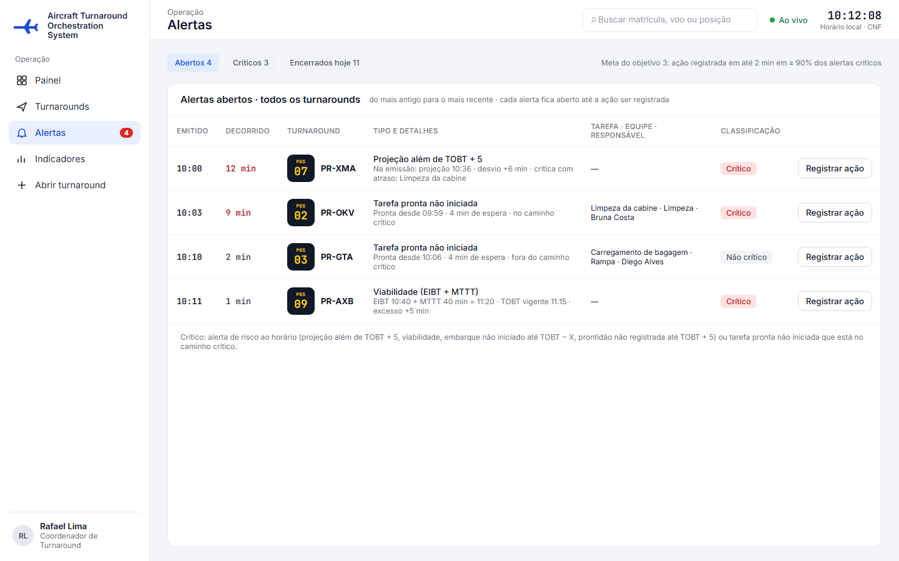
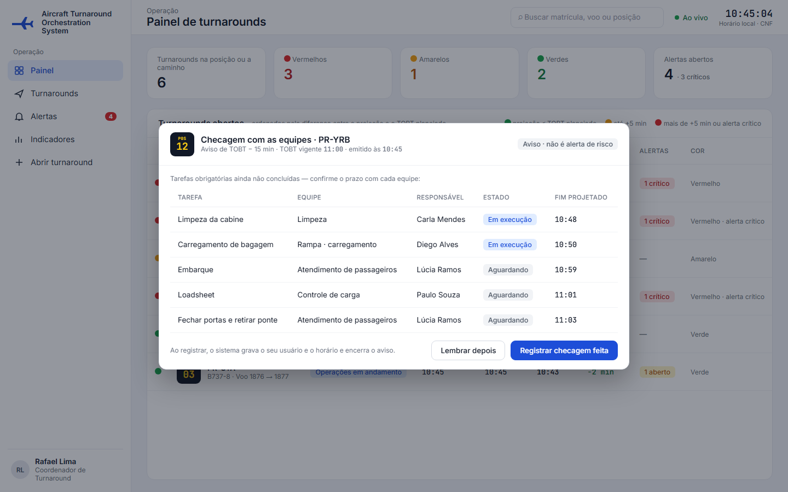
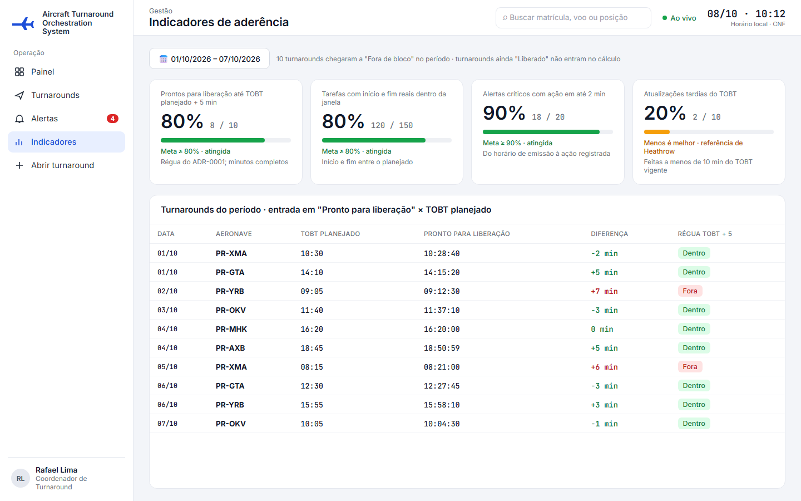

**Casos de uso da área C no diagrama geral (item 9).** Os nomes e os atores abaixo são os que o diagrama deve usar (critério C10.8). No nome do UC-C6, TOBT é o horário-alvo de prontidão [2].

| UC | Nome | Ator | Relacionamentos | RF e estória |
|---|---|---|---|---|
| UC-C1 | Acompanhar os turnarounds no painel | Coordenador de Turnaround | estendido por UC-C2 | RF-C4, US-C4 |
| UC-C2 | Consultar a linha do tempo do turnaround | Coordenador de Turnaround | «extend» UC-C1 | RF-C5, US-C5 |
| UC-C3 | Recalcular a projeção, o atraso e o caminho crítico | Motor de Eventos | «include» UC-C4 | RF-C1, RF-C2, RF-C3, US-C1 a US-C3 |
| UC-C4 | Emitir alertas de risco ao horário | Motor de Eventos | incluído por UC-C3 | RF-C6 a RF-C10, US-C6 a US-C10 |
| UC-C5 | Consultar a lista de alertas abertos | Coordenador de Turnaround | registro da ação no UC-D3 | RF-C12, US-C12 |
| UC-C6 | Registrar a checagem com as equipes em TOBT − 15 | Motor de Eventos, Coordenador de Turnaround | — | RF-C11, RF-C14, US-C11, US-C14 |
| UC-C7 | Consultar os indicadores de aderência | Coordenador de Turnaround | — | RF-C13, US-C13 |

## UC-C1 – Acompanhar os turnarounds no painel

| Campo | |
|---|---|
| **Nome do caso de uso** | UC-C1 – Acompanhar os turnarounds no painel |
| **Ator(es)** | Coordenador de Turnaround |
| **Descrição** | O Coordenador de Turnaround acompanha, em um painel no computador, todos os turnarounds que ainda não saíram da posição, com o estado, os horários-alvo de prontidão (TOBT) [2] planejado e vigente, a projeção de prontidão, a diferença em minutos e uma cor de risco, para atender primeiro os que estão mais longe do horário planejado. Pode ser estendido pelo UC-C2 (linha do tempo). Atende ao RF-C4 e à US-C4. |
| **Pré-condições** | 1. O Coordenador de Turnaround está autenticado com o perfil de coordenador. |
| **Pós-condições** | o painel exibe os turnarounds abertos com os valores do último recálculo (UC-C3). A consulta não altera o estado de nenhuma tarefa, de nenhum turnaround nem de nenhum alerta. |
| **Regras de negócio** | **RN1.** O painel mostra todo turnaround que não está no estado "Fora de bloco", inclusive o turnaround aberto cuja aeronave ainda não chegou à posição, que aparece sem estado e com o horário estimado de chegada à posição (EIBT) no lugar do estado (RF-C4). **RN2.** Cada turnaround mostra a aeronave (matrícula, modelo e voo), a posição, o estado, o TOBT planejado, o TOBT vigente, a projeção de prontidão, a diferença em minutos entre a projeção e o TOBT planejado e a quantidade de alertas abertos (RF-C4). **RN3.** A cor segue a régua da ADR-0001: verde quando a projeção é igual ou anterior ao TOBT planejado; amarela quando fica até 5 minutos depois dele; vermelha quando fica mais de 5 minutos depois ou quando há alerta crítico aberto no turnaround (RF-C4, RF-C12). A diferença é contada em minutos completos [3]. **RN4.** A lista é ordenada da maior para a menor diferença; em empate, vem primeiro o turnaround com o TOBT planejado mais cedo. **RN5.** O painel se atualiza a cada mudança de estado, de projeção ou de alerta, sem que o Coordenador de Turnaround recarregue a página, em até 5 segundos depois do registro, como pede o objetivo 2. **RN6.** A projeção, a diferença e o caminho crítico vêm do UC-C3; os alertas, do UC-C4. O painel só exibe esses valores e não os calcula. **RN7.** Acima da lista, o painel resume a quantidade de turnarounds por cor e a quantidade de alertas abertos, com quantos são críticos. |
| **Protótipo(s) de tela** | Painel de turnarounds, com o resumo por cor, a lista ordenada pela diferença e a legenda das cores.  |

### Fluxo básico

| Ações do ator | Ações do sistema |
|---|---|
| 1. O Coordenador de Turnaround seleciona "Painel" no menu (**E2**). |  |
|  | 2. O sistema exibe o resumo por cor e a lista dos turnarounds abertos, ordenada pela diferença: por exemplo, PR-XMA em vermelho (projeção 10:37, TOBT planejado 10:30, +7 min), PR-YRB em amarelo (11:03 × 11:00, +3 min) e PR-GTA em verde (10:43 × 10:45, −2 min). |
| 3. O Coordenador de Turnaround acompanha a lista. |  |
|  | 4. O Motor de Eventos recalcula a projeção de um dos turnarounds (UC-C3). |
|  | 5. O sistema atualiza a projeção, a diferença, a cor e a posição desse turnaround na lista em até 5 segundos, sem recarregar a página. |
|  | 6. O caso de uso termina quando o Coordenador de Turnaround sai do painel. |

### Fluxo alternativo A1 – Abrir a linha do tempo de um turnaround (passo 3)

| Ações do ator | Ações do sistema |
|---|---|
| A1.1. O Coordenador de Turnaround seleciona um turnaround da lista. |  |
|  | A1.2. O caso de uso UC-C2 é executado para esse turnaround. |
|  | A1.3. Ao voltar ao painel, o caso de uso segue do passo 3. |

### Fluxo alternativo A2 – Abrir os alertas de um turnaround (passo 3)

| Ações do ator | Ações do sistema |
|---|---|
| A2.1. O Coordenador de Turnaround seleciona a quantidade de alertas abertos de um turnaround. |  |
|  | A2.2. O sistema exibe a lista de alertas abertos (UC-C5). |

### Fluxo alternativo A3 – Alerta crítico em turnaround amarelo (depois do passo 2)

*Condição:* o Motor de Eventos emite um alerta crítico para um turnaround amarelo (UC-C4).

| Ações do ator | Ações do sistema |
|---|---|
|  | A3.1. O sistema passa o turnaround para vermelho e soma 1 à quantidade de alertas abertos dele, sem recarregar a página (US-C4, critério 2). |
|  | A3.2. O caso de uso continua no passo em que estava. |

### Fluxo alternativo A4 – Turnaround sai da posição (depois do passo 2)

*Condição:* o turnaround passa para "Fora de bloco".

| Ações do ator | Ações do sistema |
|---|---|
|  | A4.1. O sistema retira o turnaround da lista e atualiza o resumo, sem recarregar a página (US-C4, critério 3). |

### Fluxo alternativo A5 – Nenhum turnaround aberto (passo 2)

| Ações do ator | Ações do sistema |
|---|---|
|  | A5.1. O sistema exibe a mensagem "Nenhum turnaround aberto" e o resumo com zero em todas as cores. O caso de uso termina. |

### Fluxo de exceção E1 – Sem conexão com a internet (depois do passo 2)

| Ações do ator | Ações do sistema |
|---|---|
|  | E1.1. O sistema mantém a última lista recebida, com o aviso "Sem conexão" e o horário da última atualização, e deixa de atualizá-la. |
|  | E1.2. Quando a conexão volta, o sistema recarrega a lista com os valores do último recálculo de cada turnaround, e o caso de uso volta ao passo 3. |

### Fluxo de exceção E2 – Sessão expirada (passo 1)

| Ações do ator | Ações do sistema |
|---|---|
|  | E2.1. O sistema leva o Coordenador de Turnaround à tela de autenticação. |
|  | E2.2. Depois da autenticação, o caso de uso volta ao passo 2. |

## UC-C2 – Consultar a linha do tempo do turnaround

| Campo | |
|---|---|
| **Nome do caso de uso** | UC-C2 – Consultar a linha do tempo do turnaround |
| **Ator(es)** | Coordenador de Turnaround |
| **Descrição** | O Coordenador de Turnaround abre, a partir do painel, a linha do tempo de um turnaround, com as tarefas, os horários planejados e os reais ou projetados, os atrasos, o caminho crítico, as tarefas impactadas e os marcos já registrados, para entender onde está o atraso e quem é o responsável antes de decidir como agir. Estende o UC-C1. Atende ao RF-C5 e à US-C5. |
| **Pré-condições** | 1. O Coordenador de Turnaround está autenticado com o perfil de coordenador. 2. O turnaround foi aberto (UC-A3). |
| **Pós-condições** | a linha do tempo exibe os dados do último recálculo do turnaround (UC-C3). A consulta não altera nenhum registro. |
| **Regras de negócio** | **RN1.** Cada tarefa mostra a equipe, o Operador de Solo/Rampa responsável, o estado, o início e o fim planejados, o início e o fim reais (ou projetados, com a marca "proj") e o atraso calculado no UC-C3, em minutos completos [3] (RF-C5, RF-C2). **RN2.** Tarefa "Pausada" mostra também a justificativa e o código da tabela de códigos de atraso da Agência Nacional de Aviação Civil (ANAC) [62] informados na pausa (UC-B4), por exemplo o código GF, de combustível (RF-C5). **RN3.** Tarefa "Não aplicável" mostra a justificativa e não tem atraso calculado (RF-C5, US-C5 critério 3). **RN4.** As tarefas do caminho crítico (RF-C3) e as marcadas como "impactadas" (RF-C2), com a tarefa de origem e os minutos de impacto, ficam destacadas. **RN5.** A faixa de marcos mostra, com o horário, só os marcos já registrados: horário real de chegada à posição (AIBT), início real do atendimento em solo (ACGT), início real do embarque (ASBT), fim real do atendimento em solo (AEGT), horário real de prontidão (ARDT) e horário real de saída da posição (AOBT) [2]. Os marcos são gravados pelo UC-A12 (AIBT), pelo UC-B7 (ACGT, ASBT e AEGT), pelo UC-D4 (ARDT) e pelo UC-D9 (AOBT); a linha do tempo só os exibe. **RN6.** O cabeçalho mostra o estado do turnaround, o TOBT planejado, o TOBT vigente, a projeção de prontidão e a diferença em relação ao TOBT planejado, com a indicação "dentro" ou "fora da régua" (TOBT + 5, ADR-0001). **RN7.** O gráfico mostra, para cada tarefa, a janela planejada e a barra real ou projetada, com as linhas do horário atual e do TOBT planejado + 5. **RN8.** A linha do tempo se atualiza em até 5 segundos a cada novo registro ou recálculo do turnaround, sem recarregar a página. **RN9.** Enquanto houver aviso de checagem em TOBT − 15 aberto para o turnaround (UC-C6), o cabeçalho mostra esse aviso, até a checagem ser registrada. |
| **Protótipo(s) de tela** | Linha do tempo do turnaround, com o cabeçalho, a faixa de marcos e as tarefas no gráfico de planejado × real ou projetado.  |

### Fluxo básico

| Ações do ator | Ações do sistema |
|---|---|
| 1. No painel (UC-C1), o Coordenador de Turnaround seleciona um turnaround, por exemplo PR-XMA, na posição 07. |  |
|  | 2. O sistema exibe o cabeçalho: estado "Operações em andamento", TOBT planejado 10:30, TOBT vigente 10:30, projeção 10:37 e "+7 min · fora da régua". |
|  | 3. O sistema exibe a faixa de marcos com os marcos já registrados (AIBT 09:40 e ACGT 09:42) e os demais sem horário. |
|  | 4. O sistema exibe as tarefas com os dados da RN1, destacando o caminho crítico e as tarefas impactadas (por exemplo, o embarque "impactado por Limpeza da cabine · +7 min"). |
| 5. O Coordenador de Turnaround consulta a linha do tempo (**E2**). |  |
|  | 6. O caso de uso termina quando o Coordenador de Turnaround volta ao painel. |

### Fluxo alternativo A1 – Abrir pela busca (passo 1)

| Ações do ator | Ações do sistema |
|---|---|
| A1.1. O Coordenador de Turnaround busca o turnaround pela matrícula, pelo voo ou pela posição. |  |
|  | A1.2. O sistema exibe os turnarounds encontrados; o Coordenador de Turnaround seleciona um, e o caso de uso segue do passo 2. |

### Fluxo alternativo A2 – Consultar o caminho crítico e os recálculos (passo 5)

| Ações do ator | Ações do sistema |
|---|---|
| A2.1. O Coordenador de Turnaround seleciona "Caminho crítico". |  |
|  | A2.2. O sistema exibe o grafo de dependências com o caminho crítico destacado e a lista dos recálculos do Motor de Eventos, com o horário, a causa e a projeção de cada um (protótipo do UC-C3). |
|  | A2.3. O caso de uso volta ao passo 5. |

### Fluxo alternativo A3 – Novo registro com a linha do tempo aberta (passo 5)

| Ações do ator | Ações do sistema |
|---|---|
| A3.1. Um operador registra o início, a pausa ou a conclusão de uma tarefa do turnaround. |  |
|  | A3.2. O sistema atualiza a tarefa, os atrasos, o caminho crítico e o cabeçalho em até 5 segundos, sem recarregar a página. |
|  | A3.3. O caso de uso volta ao passo 5. |

### Fluxo alternativo A4 – Turnaround ainda sem AIBT (passo 2)

*Condição:* a aeronave ainda não chegou à posição.

| Ações do ator | Ações do sistema |
|---|---|
|  | A4.1. O sistema exibe o EIBT no lugar do estado, todas as tarefas com os horários planejados e projetados e a faixa de marcos sem nenhum horário. |

### Fluxo de exceção E1 – Turnaround já encerrado (passo 2 do A1)

*Condição:* o turnaround encontrado na busca está no estado "Fora de bloco".

| Ações do ator | Ações do sistema |
|---|---|
|  | E1.1. O sistema exibe a linha do tempo completa só para consulta, com todos os marcos e horários reais, sem atualização (US-D9). |

### Fluxo de exceção E2 – Sem conexão com a internet (passo 5)

| Ações do ator | Ações do sistema |
|---|---|
|  | E2.1. O sistema mantém a última linha do tempo recebida, com o aviso "Sem conexão" e o horário da última atualização. |
|  | E2.2. Quando a conexão volta, o sistema recarrega a linha do tempo, e o caso de uso volta ao passo 5. |

## UC-C3 – Recalcular a projeção, o atraso e o caminho crítico

| Campo | |
|---|---|
| **Nome do caso de uso** | UC-C3 – Recalcular a projeção, o atraso e o caminho crítico |
| **Ator(es)** | Motor de Eventos |
| **Descrição** | A cada registro aceito, a cada alteração do plano e a cada minuto, o Motor de Eventos recalcula o fim projetado de cada tarefa obrigatória, a projeção de prontidão do turnaround, o atraso de cada tarefa, as tarefas impactadas e o caminho crítico, grava o resultado com a causa e compara a projeção com o TOBT planejado + 5 minutos e com o TOBT vigente. Inclui o UC-C4 (alertas). Atende aos RF-C1, RF-C2 e RF-C3 e às US-C1, US-C2 e US-C3. |
| **Pré-condições** | 1. O turnaround foi aberto e não está nos estados "Liberado" nem "Fora de bloco". 2. O modelo de tarefas do turnaround tem, para cada tarefa, a janela planejada (início e fim), a duração planejada, as predecessoras e a indicação de obrigatória (UC-A4, UC-A6 e UC-A8). |
| **Pós-condições** | a projeção de prontidão, o atraso de cada tarefa, as tarefas impactadas e o caminho crítico estão gravados com o horário do recálculo e o registro que o causou; o UC-C4 foi executado com o resultado. |
| **Regras de negócio** | **RN1.** O recálculo acontece a cada registro aceito de tarefa (UC-B2 a UC-B5, depois da propagação do UC-B8), a cada alteração do plano (US-D7), a cada atualização do TOBT vigente (US-D6), a cada correção da chegada à posição (US-A13) e a cada minuto, enquanto o turnaround não estiver em "Liberado" ou "Fora de bloco" (RF-C1). **RN2.** Fim projetado de cada tarefa obrigatória (RF-C1): "Concluída" → o fim real; "Em execução" → o maior valor entre o início real somado à duração planejada e o horário atual; "Pausada" → o horário atual somado à duração planejada que falta executar; "Aguardando" ou "Pronta" → o maior valor entre o início planejado, o fim projetado das predecessoras e o horário atual, somado à duração planejada. Tarefa "Não aplicável" não entra no cálculo. **RN3.** A projeção de prontidão é o maior fim projetado entre as tarefas obrigatórias (RF-C1). Ela é comparada com o TOBT planejado + 5 minutos, que é a régua do objetivo 1 (ADR-0001), e com o TOBT vigente. Quando ela se afasta 5 minutos ou mais do TOBT vigente, o sistema pede ao Coordenador de Turnaround a atualização do TOBT (US-D6); na antecipação, o pedido é aviso, e não alerta de risco (ADR-0003). **RN4.** O atraso de início é o início real menos o início planejado (ou o horário atual menos o início planejado, se a tarefa não começou e o início planejado já passou); o atraso de fim é o fim real ou projetado menos o fim planejado. Os dois são contados em minutos completos [3], e valor igual ou menor que zero conta como sem atraso (RF-C2). **RN5.** Uma sucessora é marcada como "impactada" quando o atraso de uma predecessora faz o fim projetado dela passar do fim planejado, com a tarefa de origem e os minutos de impacto (RF-C2). **RN6.** O caminho crítico é a sequência de tarefas obrigatórias ligadas por dependência que termina na tarefa de maior fim projetado, em que cada tarefa é a predecessora cujo fim projetado determinou o início projetado da seguinte (RF-C3). [Fato] Na literatura, são as atividades em que "any delay in them would increase the total time of the project" [24], e o embarque costuma estar nesse caminho [20][21]. Em empate entre predecessoras, as duas ficam no caminho crítico. **RN7.** [Inferência] O caminho crítico muda durante o turnaround: tarefa marcada "Não aplicável", tarefa atrasada ou pausada e a regra de abastecimento com passageiros a bordo (ADR-0005) alteram a cadeia mais longa. Por isso ele é recalculado a cada evento, e não fixado no planejamento. **RN8.** Quando o caminho crítico muda, o Motor de Eventos grava o caminho anterior, o novo caminho, o horário e o registro que causou a mudança (RF-C3); quando não muda, não grava mudança. **RN9.** O horário de início ou de fim usado no cálculo é o horário da ação do operador, inclusive no registro feito sem conexão (RNF-B2). **RN10.** O resultado aparece no painel (UC-C1) e na linha do tempo (UC-C2) em até 5 segundos, como pede o objetivo 2. |
| **Protótipo(s) de tela** | Dependências e caminho crítico do turnaround, com a mudança do caminho destacada e a lista dos recálculos do Motor de Eventos.  |

### Fluxo básico

| Ações do ator | Ações do sistema |
|---|---|
| 1. O Motor de Eventos recebe o registro aceito do início da limpeza da cabine do PR-XMA às 10:01 (UC-B2) (**E1**, **E2**, **E3**). |  |
| 2. O Motor de Eventos calcula o fim projetado de cada tarefa obrigatória pela RN2: limpeza 10:21 (10:01 mais 20 minutos), embarque 10:21–10:33, loadsheet 10:33–10:35 e fechar portas 10:35–10:37. |  |
| 3. O Motor de Eventos grava a projeção de prontidão 10:37, com o horário 10:01 e o registro de início da limpeza como causa. |  |
| 4. O Motor de Eventos compara a projeção com o TOBT planejado (10:30): +7 minutos, fora da régua de TOBT + 5; e com o TOBT vigente (10:30): +7 minutos. |  |
| 5. O Motor de Eventos grava o atraso de início da limpeza (+7 minutos) e marca o embarque, o loadsheet e o fechamento de portas como "impactados" pela limpeza, com 7 minutos de impacto. |  |
| 6. O Motor de Eventos identifica o caminho crítico (calçar → desembarque → limpeza → embarque → loadsheet → fechar portas), verifica que ele é igual ao anterior e não grava mudança. |  |
| 7. O Motor de Eventos executa o UC-C4 com o resultado do recálculo. |  |
|  | 8. O sistema exibe a nova projeção, os atrasos e o caminho crítico no painel (UC-C1) e na linha do tempo (UC-C2) em até 5 segundos. O caso de uso termina. |

### Fluxo alternativo A1 – Recálculo de minuto que muda o caminho crítico (passo 1)

*Condição:* às 10:15, sem novo registro, o abastecimento está pausado desde 10:06 e faltam 7 minutos de execução.

| Ações do ator | Ações do sistema |
|---|---|
| A1.1. O Motor de Eventos calcula o fim projetado do abastecimento em 10:22, depois do fim projetado da limpeza (10:21). |  |
| A1.2. O Motor de Eventos identifica o novo caminho crítico (calçar → desembarque → abastecimento → embarque → loadsheet → fechar portas) e grava o caminho anterior, o novo, o horário 10:15 e o recálculo de minuto como causa (US-C3, critério 2). |  |
|  | A1.3. A projeção passa a 10:38, e o caso de uso segue do passo 4. |

### Fluxo alternativo A2 – Tarefa marcada como "Não aplicável" (passo 1)

*Condição:* o registro recebido é uma marcação de "Não aplicável" (UC-B5).

| Ações do ator | Ações do sistema |
|---|---|
| A2.1. O Motor de Eventos retira a tarefa do cálculo e segue do passo 2; se a tarefa estava no caminho crítico, o caminho é recalculado sem ela. |  |

### Fluxo alternativo A3 – Alteração do plano ou do TOBT (passo 1)

| Ações do ator | Ações do sistema |
|---|---|
| A3.1. O Coordenador de Turnaround altera a janela ou as dependências de tarefas não iniciadas, aciona um serviço sob demanda (US-D7) ou atualiza o TOBT vigente (US-D6). |  |
| A3.2. O Motor de Eventos recalcula com o plano ou o TOBT novo e segue do passo 2. |  |

### Fluxo alternativo A4 – Aeronave ainda não chegou à posição (passo 1)

*Condição:* o turnaround está aberto e sem AIBT.

| Ações do ator | Ações do sistema |
|---|---|
| A4.1. O Motor de Eventos aplica a RN2 às tarefas ainda não iniciadas, usando o maior valor entre o início planejado, o fim projetado das predecessoras e o horário atual, somado à duração planejada, e segue do passo 3; a viabilidade é verificada no UC-C4 (RF-C8). |  |

### Fluxo de exceção E1 – Turnaround liberado ou fora de bloco (passo 1)

*Condição:* o turnaround está em "Liberado" ou "Fora de bloco".

| Ações do ator | Ações do sistema |
|---|---|
| E1.1. O Motor de Eventos não recalcula, e a última projeção gravada continua a mesma (US-C1, critério 4). |  |

### Fluxo de exceção E2 – Registro recusado no servidor (passo 1)

*Condição:* um registro feito sem conexão chega e é recusado por já não ser válido (RNF-B2).

| Ações do ator | Ações do sistema |
|---|---|
| E2.1. O Motor de Eventos não recalcula por esse registro. |  |

### Fluxo de exceção E3 – Registro feito sem conexão chega depois (passo 1)

*Condição:* o registro aceito foi feito sem conexão e chega depois de outros registros.

| Ações do ator | Ações do sistema |
|---|---|
| E3.1. O Motor de Eventos recalcula com o horário da ação guardado no celular (RN9) e grava o recálculo com o horário de chegada e o registro como causa. |  |

## UC-C4 – Emitir alertas de risco ao horário

| Campo | |
|---|---|
| **Nome do caso de uso** | UC-C4 – Emitir alertas de risco ao horário |
| **Ator(es)** | Motor de Eventos |
| **Descrição** | Depois de cada recálculo (UC-C3), a cada minuto e a cada alteração do EIBT, do tempo mínimo de turnaround (MTTT) ou do TOBT vigente, o Motor de Eventos verifica os gatilhos de alerta e emite ao Coordenador de Turnaround os alertas de tarefa pronta não iniciada, de projeção além de TOBT + 5, de viabilidade, de embarque não iniciado e de prontidão não registrada, classificados como críticos ou não. É incluído pelo UC-C3. Atende aos RF-C6 a RF-C10 e às US-C6 a US-C10. |
| **Pré-condições** | 1. O turnaround foi aberto e não está em "Liberado" nem em "Fora de bloco". 2. Os parâmetros dos gatilhos estão configurados (RNF-D3). |
| **Pós-condições** | cada gatilho atendido gerou um alerta aberto, gravado com o tipo, o turnaround, a tarefa (quando houver), os dados do gatilho, o horário de emissão e a classificação; nenhum gatilho não atendido gerou alerta. |
| **Regras de negócio** | **RN1.** **Tarefa pronta não iniciada (RF-C6):** a tarefa fica "Pronta" sem registro de início por mais de Y minutos, contados a partir do mais tarde entre o momento em que passou a "Pronta" e o seu início planejado; Y é parâmetro de configuração (RNF-D3) (por exemplo, limpeza não iniciada 3 minutos depois do fim do desembarque [42]). **RN2.** **Projeção além de TOBT + 5 (RF-C7):** um recálculo leva a projeção para mais de 5 minutos depois do TOBT planejado (ADR-0001). Para o mesmo turnaround, o alerta só é emitido de novo se a projeção voltar para até 5 minutos depois do TOBT planejado e passar outra vez desse limite. **RN3.** **Viabilidade (RF-C8):** em turnaround sem AIBT, na abertura e a cada alteração do EIBT, do MTTT ou do TOBT vigente, o EIBT somado ao MTTT fica depois do TOBT vigente [3][7]. EIBT e MTTT vêm da abertura (UC-A3) e da atualização das previsões (UC-A10); o TOBT vigente vem da abertura (UC-A3) e da atualização da previsão de saída (UC-D6). **RN4.** **Embarque não iniciado (RF-C9):** o ASBT não foi registrado até X minutos antes do TOBT vigente; X é parâmetro de configuração (RNF-D3) [2]. **RN5.** **Prontidão não registrada (RF-C10):** o ARDT não foi registrado até 5 minutos depois do TOBT vigente [2]. Os minutos são completos [3]: às 10:35:59 ainda não há alerta para TOBT 10:30; às 10:36:00, há. **RN6.** [Fato] Os gatilhos das RN3, RN4 e RN5 são os da tomada de decisão colaborativa em aeroportos (A-CDM) [2][3][7]. [Inferência] Os das RN1 e RN2 são regras do projeto; o da RN1 se apoia na regra observada em [42]. **RN7.** São "críticos" os alertas das RN2 a RN5 e os da RN1 cuja tarefa está no caminho crítico (UC-C3); os demais alertas da RN1 são "não críticos" (RF-C12). **RN8.** Cada alerta aparece ao Coordenador de Turnaround como aviso sobre a tela, na lista de alertas (UC-C5) e na contagem do painel (UC-C1) em até 5 segundos depois da atualização que o causou, como pede o objetivo 3. **RN9.** Cada alerta fica aberto até o Coordenador de Turnaround registrar a ação tomada (US-D3). Não é emitido um segundo alerta do mesmo tipo para o mesmo turnaround e a mesma tarefa enquanto o primeiro estiver aberto. **RN10.** O pedido de atualização do TOBT na antecipação (ADR-0003, US-D6) e o aviso de checagem em TOBT − 15 (UC-C6) não são alertas de risco e não entram neste caso de uso. |
| **Protótipo(s) de tela** | Aviso de alerta crítico sobre o painel, com os dados do gatilho, e o turnaround destacado na lista.  |

### Fluxo básico

| Ações do ator | Ações do sistema |
|---|---|
|  | 1. Às 10:11, o EIBT do PR-AXB, ainda sem AIBT, é alterado de 10:30 para 10:40 (UC-A10). |
| 2. O Motor de Eventos verifica a viabilidade pela RN3: EIBT 10:40 somado ao MTTT de 40 minutos dá 11:20, depois do TOBT vigente 11:15 (**E2**). |  |
| 3. O Motor de Eventos verifica que não há alerta de viabilidade aberto para o PR-AXB (**E1**). |  |
| 4. O Motor de Eventos grava o alerta com o tipo "viabilidade", o turnaround, o EIBT, o MTTT, o TOBT vigente, o excesso de 5 minutos, o horário de emissão 10:11 e a classificação "crítico" (RN7). |  |
|  | 5. O sistema exibe ao Coordenador de Turnaround o aviso do alerta sobre a tela, inclui o alerta na lista de alertas (UC-C5) e passa o PR-AXB para vermelho no painel (UC-C1), em até 5 segundos (**E3**). O caso de uso termina. |

### Fluxo alternativo A1 – Projeção além de TOBT + 5 (passo 1)

*Condição:* às 10:00, o recálculo de minuto (UC-C3) leva a projeção do PR-XMA de 10:35 para 10:36, com TOBT planejado 10:30.

| Ações do ator | Ações do sistema |
|---|---|
| A1.1. O Motor de Eventos verifica a ausência de alerta duplicado (RN9, E1) e o rearme do gatilho (RN2, E1), grava o alerta crítico com a projeção 10:36, o desvio de 6 minutos e as tarefas do caminho crítico com atraso (limpeza da cabine), e o caso de uso segue do passo 5. |  |

### Fluxo alternativo A2 – Tarefa pronta não iniciada (passo 1)

*Condição:* com Y = 3, a limpeza da cabine do PR-OKV tem início planejado 09:58, está "Pronta" desde 09:59 e, às 10:03, continua sem início.

| Ações do ator | Ações do sistema |
|---|---|
| A2.1. O Motor de Eventos verifica a ausência de alerta duplicado (RN9, E1) e grava o alerta com a tarefa, a equipe, o operador responsável e 4 minutos de espera. |  |
|  | A2.2. Como a limpeza está no caminho crítico, o alerta é "crítico"; o mesmo gatilho no carregamento de bagagem do PR-GTA, fora do caminho crítico, gera alerta "não crítico". O caso de uso segue do passo 5. |

### Fluxo alternativo A3 – Embarque não iniciado (passo 1)

*Condição:* com X = 20 e TOBT vigente 10:30, às 10:10 o ASBT não foi registrado.

| Ações do ator | Ações do sistema |
|---|---|
| A3.1. O Motor de Eventos verifica a ausência de alerta duplicado (RN9, E1) e grava o alerta crítico com o TOBT vigente e o estado do embarque e das predecessoras dele, e o caso de uso segue do passo 5. |  |

### Fluxo alternativo A4 – Prontidão não registrada (passo 1)

*Condição:* com TOBT vigente 10:30, às 10:36:00 o ARDT não foi registrado.

| Ações do ator | Ações do sistema |
|---|---|
| A4.1. O Motor de Eventos verifica a ausência de alerta duplicado (RN9, E1) e grava o alerta crítico com o TOBT vigente, o estado do turnaround e as tarefas obrigatórias não concluídas, e o caso de uso segue do passo 5. |  |

### Fluxo alternativo A5 – Nenhum gatilho atendido (passo 2)

*Condição:* por exemplo, EIBT 09:40 somado ao MTTT de 45 minutos dá 10:25, antes do TOBT vigente 10:30.

| Ações do ator | Ações do sistema |
|---|---|
| A5.1. O Motor de Eventos não emite alerta, e o caso de uso termina. |  |

### Fluxo de exceção E1 – Alerta do mesmo tipo já aberto (passo 3)

*Condição:* já existe alerta aberto do mesmo tipo para o turnaround e a tarefa, ou a projeção continua além de TOBT + 5 desde o último alerta (US-C7, critério 2).

| Ações do ator | Ações do sistema |
|---|---|
| E1.1. O Motor de Eventos não emite outro alerta, e o caso de uso termina. |  |

### Fluxo de exceção E2 – Condição desfeita antes da verificação (passo 2)

*Condição:* o registro que desfaz o gatilho chega antes do horário-limite, por exemplo o ASBT registrado às 10:08 com limite às 10:10.

| Ações do ator | Ações do sistema |
|---|---|
| E2.1. O Motor de Eventos não emite o alerta (US-C9, critério 2). |  |

### Fluxo de exceção E3 – Coordenador de Turnaround sem conexão (passo 5)

| Ações do ator | Ações do sistema |
|---|---|
|  | E3.1. O alerta fica gravado e aberto, e o tempo decorrido conta a partir do horário de emissão. |
|  | E3.2. O sistema exibe o alerta na lista e no painel quando a conexão volta. |

## UC-C5 – Consultar a lista de alertas abertos

| Campo | |
|---|---|
| **Nome do caso de uso** | UC-C5 – Consultar a lista de alertas abertos |
| **Ator(es)** | Coordenador de Turnaround |
| **Descrição** | O Coordenador de Turnaround consulta a lista dos alertas abertos de todos os turnarounds, do mais antigo para o mais recente, com o tipo, os dados do gatilho, a tarefa, o horário de emissão, o tempo decorrido e a classificação, e a partir dela registra a ação tomada para cada alerta. O registro da ação é o UC-D3. Atende ao RF-C12 e à US-C12. |
| **Pré-condições** | 1. O Coordenador de Turnaround está autenticado com o perfil de coordenador. |
| **Pós-condições** | a lista exibe todos os alertas abertos. A consulta não encerra nenhum alerta; o encerramento é feito pelo registro da ação (US-D3). |
| **Regras de negócio** | **RN1.** A lista mostra os alertas abertos de todos os turnarounds, do mais antigo para o mais recente (RF-C12). **RN2.** Cada alerta mostra o horário de emissão, o tempo decorrido desde a emissão em minutos completos [3], o turnaround (matrícula e posição), o tipo e os dados do gatilho (UC-C4), a tarefa, a equipe e o operador responsável, quando houver, e a classificação "crítico" ou "não crítico" (RF-C12). **RN3.** A classificação segue a RN7 do UC-C4. **RN4.** O tempo decorrido de um alerta crítico fica em destaque a partir de 2 minutos, que é o prazo da meta do objetivo 3 (pelo menos 90% dos alertas críticos com ação registrada em até 2 minutos). **RN5.** O alerta fica na lista até o Coordenador de Turnaround registrar a ação tomada (US-D3); depois disso, sai da lista em até 5 segundos. **RN6.** A lista se atualiza, sem recarregar a página, a cada alerta emitido (UC-C4) ou encerrado. |
| **Protótipo(s) de tela** | Lista de alertas abertos, com a classificação, o tempo decorrido e a opção "Registrar ação".  |

### Fluxo básico

| Ações do ator | Ações do sistema |
|---|---|
| 1. O Coordenador de Turnaround seleciona "Alertas" no menu. |  |
|  | 2. O sistema exibe os alertas abertos do mais antigo para o mais recente: por exemplo, às 10:12, o alerta de projeção do PR-XMA emitido às 10:00 (12 minutos, crítico), o de tarefa pronta não iniciada do PR-OKV às 10:03 (9 minutos, crítico), o do PR-GTA às 10:10 (2 minutos, não crítico) e o de viabilidade do PR-AXB às 10:11 (1 minuto, crítico) (**E2**). |
| 3. O Coordenador de Turnaround seleciona "Registrar ação" no alerta mais antigo (**E1**). |  |
|  | 4. O sistema abre o registro da ação do alerta (UC-D3). |
|  | 5. Depois do registro, o sistema retira o alerta da lista em até 5 segundos e mantém os demais. O caso de uso termina. |

### Fluxo alternativo A1 – Abrir a lista pelo aviso do alerta (passo 1)

| Ações do ator | Ações do sistema |
|---|---|
| A1.1. O Coordenador de Turnaround seleciona "Abrir lista de alertas" no aviso exibido pelo UC-C4. |  |
|  | A1.2. O caso de uso segue do passo 2. |

### Fluxo alternativo A2 – Abrir o turnaround do alerta (passo 3)

| Ações do ator | Ações do sistema |
|---|---|
| A2.1. O Coordenador de Turnaround seleciona o turnaround de um alerta. |  |
|  | A2.2. O sistema exibe a linha do tempo do turnaround (UC-C2). |

### Fluxo alternativo A3 – Nenhum alerta aberto (passo 2)

| Ações do ator | Ações do sistema |
|---|---|
|  | A3.1. O sistema exibe a mensagem "Nenhum alerta aberto", e o caso de uso termina. |

### Fluxo alternativo A4 – Novo alerta com a lista aberta (depois do passo 2)

*Condição:* o Motor de Eventos emite um alerta (UC-C4).

| Ações do ator | Ações do sistema |
|---|---|
|  | A4.1. O sistema inclui o alerta no fim da lista em até 5 segundos, sem recarregar a página. |

### Fluxo de exceção E1 – Alerta já encerrado (passo 3)

*Condição:* outro Coordenador de Turnaround registrou a ação do mesmo alerta depois que a lista foi carregada.

| Ações do ator | Ações do sistema |
|---|---|
|  | E1.1. O sistema informa que o alerta já foi tratado, com o autor e o horário da ação, e o retira da lista. |
|  | E1.2. O caso de uso volta ao passo 2. |

### Fluxo de exceção E2 – Sem conexão com a internet (passo 2)

| Ações do ator | Ações do sistema |
|---|---|
|  | E2.1. O sistema mantém a última lista recebida, com o aviso "Sem conexão" e o horário da última atualização, e não permite registrar ação até a conexão voltar. |

## UC-C6 – Registrar a checagem com as equipes em TOBT − 15

| Campo | |
|---|---|
| **Nome do caso de uso** | UC-C6 – Registrar a checagem com as equipes em TOBT − 15 |
| **Ator(es)** | Motor de Eventos, Coordenador de Turnaround |
| **Descrição** | Quinze minutos antes do TOBT vigente, o Motor de Eventos exibe ao Coordenador de Turnaround um aviso de checagem com as tarefas obrigatórias não concluídas e as equipes responsáveis. O coordenador confere o prazo com essas equipes e registra a checagem, o que encerra o aviso. Atende aos RF-C11 e RF-C14 e às US-C11 e US-C14. |
| **Pré-condições** | 1. O turnaround foi aberto e ainda não está em "Pronto para liberação", "Liberado" nem "Fora de bloco". 2. Para registrar a checagem, o Coordenador de Turnaround está autenticado com o perfil de coordenador. |
| **Pós-condições** | o aviso de checagem foi exibido e, se o coordenador registrou a checagem, está encerrado com o usuário e o horário gravados. |
| **Regras de negócio** | **RN1.** O aviso é emitido 15 minutos antes do TOBT vigente; o valor de 15 minutos é parâmetro de configuração (RNF-D3) (RF-C11). **RN2.** [Fato] O cartão de rampa dos aeroportos alemães manda, no TOBT − 15, conferir com tripulação, embarque, carregamento, abastecimento, limpeza e catering se todos estão no prazo [13]. [Inferência] O sistema leva essa conferência para dentro do turnaround como aviso com a lista das tarefas pendentes. **RN3.** O aviso não é emitido para turnaround que já está em "Pronto para liberação" ou em estado posterior (US-C11, critério 2). **RN4.** O aviso lista as tarefas obrigatórias que ainda não estão "Concluída" ou "Não aplicável", cada uma com a equipe, o operador responsável, o estado e o fim projetado (UC-C3). **RN5.** O aviso não é alerta de risco: não entra na lista de alertas (UC-C5), não muda a cor do painel e não conta para a meta de 2 minutos do objetivo 3 (RF-C11). **RN6.** O aviso é encerrado quando o Coordenador de Turnaround registra a checagem, com o usuário e o horário gravados; o registro é recusado quando o aviso já foi encerrado (RF-C14). **RN7.** A conversa com as equipes acontece fora do sistema (rádio ou telefone); o sistema registra só que a checagem foi feita. |
| **Protótipo(s) de tela** | Aviso de checagem sobre o painel, com as tarefas pendentes, as equipes e a opção "Registrar checagem feita".  |

### Fluxo básico

| Motor de Eventos | Coordenador de Turnaround | Sistema |
|---|---|---|
|  |  | 1. O relógio chega a 10:45, 15 minutos antes do TOBT vigente 11:00 do PR-YRB (**E2**). |
| 2. O Motor de Eventos verifica que o PR-YRB está em "Operações em andamento". |  |  |
| 3. O Motor de Eventos monta a lista das tarefas obrigatórias não concluídas: limpeza da cabine, carregamento de bagagem, embarque, loadsheet e fechar portas, com as equipes, os responsáveis, os estados e os fins projetados. |  |  |
|  |  | 4. O sistema exibe ao Coordenador de Turnaround o aviso de checagem, identificado como aviso, e não como alerta de risco (**E1**). |
|  | 5. O Coordenador de Turnaround confere o prazo com cada equipe listada. |  |
|  | 6. O Coordenador de Turnaround seleciona "Registrar checagem feita" (**E3**). |  |
|  |  | 7. O sistema grava o usuário e o horário da checagem e encerra o aviso. O caso de uso termina. |

### Fluxo alternativo A1 – Lembrar depois (passo 6)

| Motor de Eventos | Coordenador de Turnaround | Sistema |
|---|---|---|
|  | A1.1. O Coordenador de Turnaround seleciona "Lembrar depois". |  |
|  |  | A1.2. O sistema fecha o aviso, que continua aberto e aparece na linha do tempo do turnaround (UC-C2) até a checagem ser registrada. |

### Fluxo alternativo A2 – Checagem mostra atraso (passo 5)

*Condição:* uma equipe informa que não termina no prazo.

| Motor de Eventos | Coordenador de Turnaround | Sistema |
|---|---|---|
|  | A2.1. O Coordenador de Turnaround registra a checagem (passos 6 e 7) e trata o atraso, por exemplo atualizando o TOBT (UC-D6) ou reatribuindo a tarefa (UC-D2). |  |

### Fluxo alternativo A3 – Turnaround já pronto (passo 2)

*Condição:* o turnaround está em "Pronto para liberação" ou em estado posterior.

| Motor de Eventos | Coordenador de Turnaround | Sistema |
|---|---|---|
| A3.1. O Motor de Eventos não emite o aviso, e o caso de uso termina. |  |  |

### Fluxo de exceção E1 – Coordenador de Turnaround sem conexão (passo 4)

| Motor de Eventos | Coordenador de Turnaround | Sistema |
|---|---|---|
|  |  | E1.1. O aviso fica gravado e aberto e é exibido quando a conexão volta. |

### Fluxo de exceção E2 – TOBT vigente atualizado antes do aviso (passo 1)

*Condição:* o Coordenador de Turnaround atualiza o TOBT vigente do PR-YRB para 11:10 antes das 10:45.

| Motor de Eventos | Coordenador de Turnaround | Sistema |
|---|---|---|
| E2.1. O Motor de Eventos passa o horário do aviso para 10:55, e o caso de uso volta ao passo 1. |  |  |

### Fluxo de exceção E3 – Aviso já encerrado (passo 6)

*Condição:* outro Coordenador de Turnaround já registrou a checagem do mesmo aviso.

| Motor de Eventos | Coordenador de Turnaround | Sistema |
|---|---|---|
|  |  | E3.1. O sistema recusa o registro, informa que o aviso já foi encerrado e mantém o autor e o horário do primeiro registro (RF-C14; US-C14, critério 2). O caso de uso termina. |

## UC-C7 – Consultar os indicadores de aderência

| Campo | |
|---|---|
| **Nome do caso de uso** | UC-C7 – Consultar os indicadores de aderência |
| **Ator(es)** | Coordenador de Turnaround |
| **Descrição** | O Coordenador de Turnaround escolhe um período e consulta os indicadores de aderência dos turnarounds encerrados nele, com numerador e denominador, para acompanhar as metas do item 1 e as atualizações tardias do TOBT. Atende ao RF-C13 e à US-C13. |
| **Pré-condições** | 1. O Coordenador de Turnaround está autenticado com o perfil de coordenador. |
| **Pós-condições** | os indicadores do período estão exibidos. A consulta não altera nenhum registro. |
| **Regras de negócio** | **RN1.** Entram no cálculo só os turnarounds que chegaram ao estado "Fora de bloco" (AOBT registrado) entre a data de início e a data de fim do período, as duas inclusive; turnaround ainda em "Liberado" ou em estado anterior não entra (RF-C13, US-C13 critério 2). **RN2.** **Prontidão:** percentual de turnarounds que entraram em "Pronto para liberação" (AEGT) até 5 minutos depois do TOBT planejado (ADR-0001), contados em minutos completos [3]: 10:35:59 conta como dentro para TOBT 10:30; 10:36:00, como fora. **RN3.** **Janela das tarefas:** percentual de tarefas com início real e fim real entre o início e o fim planejados. Tarefas "Não aplicável" não entram. **RN4.** **Alertas críticos:** percentual de alertas críticos com ação registrada (US-D3) em até 2 minutos da emissão. **RN5.** **Atualizações tardias do TOBT:** percentual de atualizações do TOBT feitas a menos de 10 minutos do TOBT vigente, como no indicador "Late Updaters" de Heathrow [7]. Neste indicador, menor é melhor. **RN6.** Cada indicador mostra o percentual, o numerador e o denominador, e os três primeiros mostram também a meta do objetivo 1 ou 3 (80%, 80% e 90%; ADR-0002). [Fato] Não há meta pública oficial de percentual para o TOBT, e o quarto indicador não tem meta no projeto. **RN7.** A tela lista os turnarounds do período, com o TOBT planejado, o horário de entrada em "Pronto para liberação", a diferença e a indicação "dentro" ou "fora" da régua TOBT + 5. **RN8.** Indicador com denominador zero mostra "sem dados", e não 0%. |
| **Protótipo(s) de tela** | Indicadores do período, com percentual, numerador, denominador e meta, e a lista dos turnarounds do período.  |

### Fluxo básico

| Ações do ator | Ações do sistema |
|---|---|
| 1. O Coordenador de Turnaround seleciona "Indicadores" no menu. |  |
|  | 2. O sistema pede o período, com a data de início e a de fim. |
| 3. O Coordenador de Turnaround informa de 01/10/2026 a 07/10/2026 (**E1**). |  |
|  | 4. O sistema seleciona os 10 turnarounds que chegaram a "Fora de bloco" no período (RN1) (**E2**). |
|  | 5. O sistema exibe os quatro indicadores: prontidão 80% (8/10), janela das tarefas 80% (120/150), alertas críticos 90% (18/20) e atualizações tardias 20% (2/10), com as metas dos três primeiros (RN6). |
|  | 6. O sistema exibe a lista dos 10 turnarounds com a régua TOBT + 5. O caso de uso termina. |

### Fluxo alternativo A1 – Trocar o período (depois do passo 6)

| Ações do ator | Ações do sistema |
|---|---|
| A1.1. O Coordenador de Turnaround informa outro período. |  |
|  | A1.2. O caso de uso volta ao passo 4 com o novo período. |

### Fluxo alternativo A2 – Período sem turnarounds encerrados (passo 4)

*Condição:* nenhum turnaround chegou a "Fora de bloco" no período, por exemplo de 08/10 a 09/10.

| Ações do ator | Ações do sistema |
|---|---|
|  | A2.1. O sistema informa que não há turnarounds encerrados no período e não exibe percentuais (US-C13, critério 4). O caso de uso termina. |

### Fluxo de exceção E1 – Período inválido (passo 3)

*Condição:* a data de fim é anterior à data de início.

| Ações do ator | Ações do sistema |
|---|---|
|  | E1.1. O sistema recusa o período, informa que a data de fim deve ser igual ou posterior à de início e não calcula os indicadores. |
|  | E1.2. O caso de uso volta ao passo 3. |

### Fluxo de exceção E2 – Sem conexão com a internet (passo 4)

| Ações do ator | Ações do sistema |
|---|---|
|  | E2.1. O sistema informa que não foi possível calcular os indicadores e mantém o período informado para nova tentativa. |

Fontes citadas: [2], [3], [7], [13], [20], [21], [24], [42] e [62], conforme a numeração de `pesquisa/fontes.md`.
