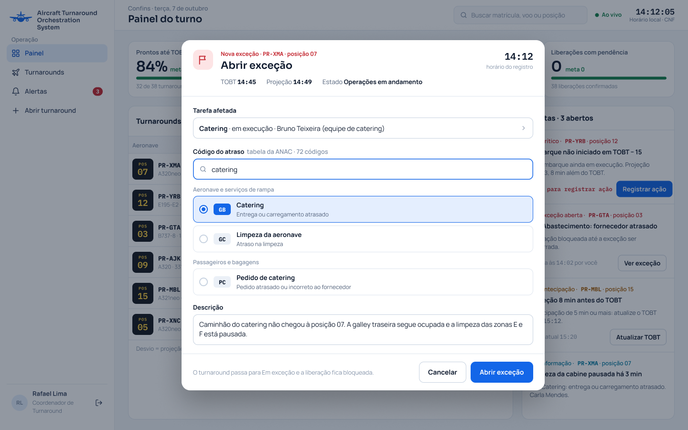
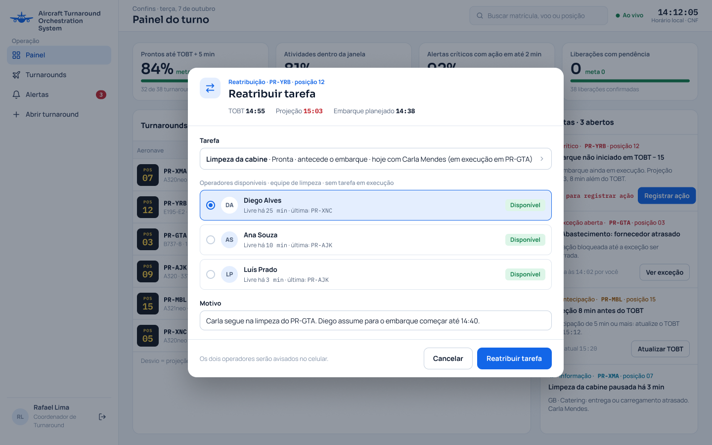
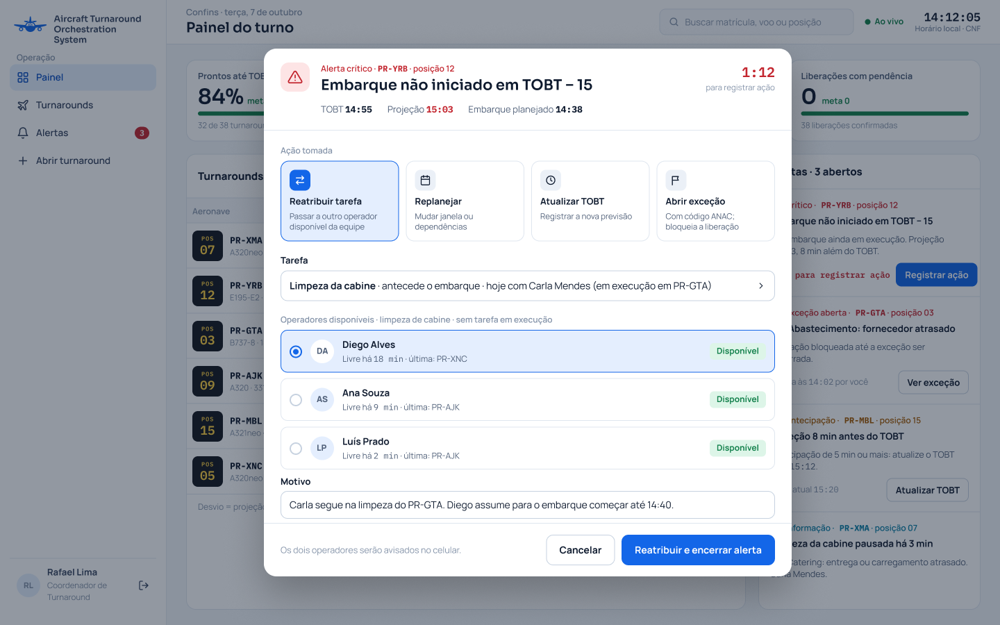
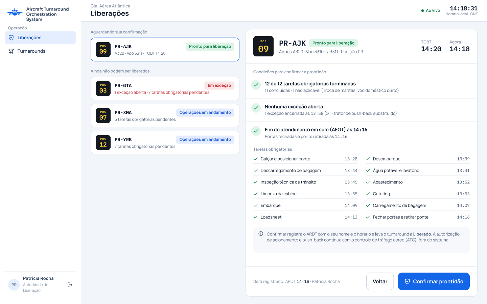
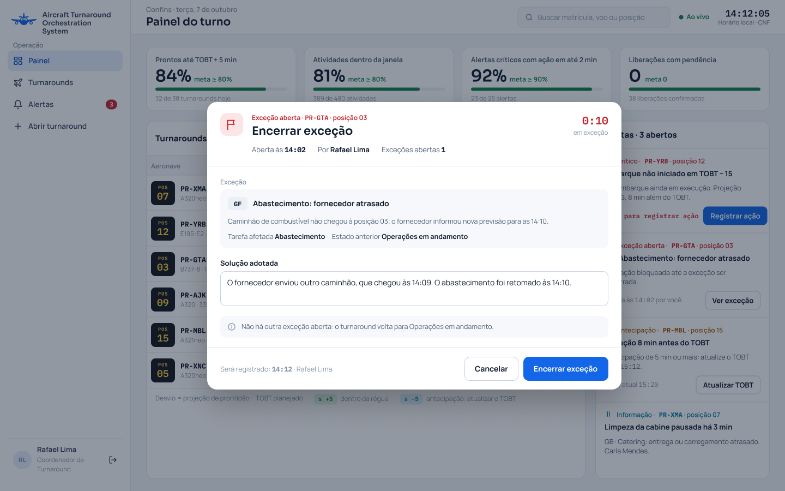
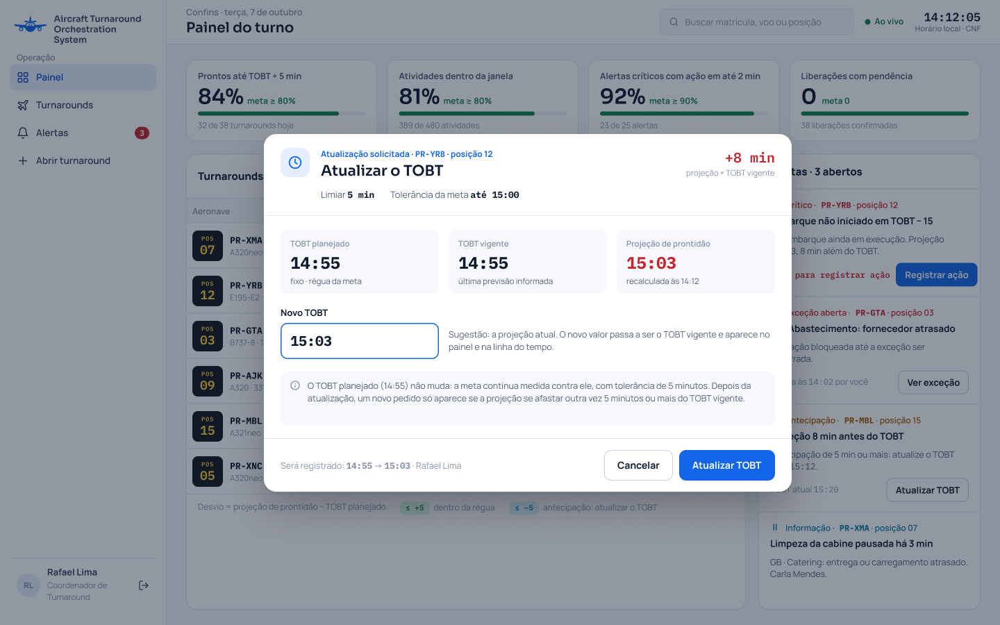
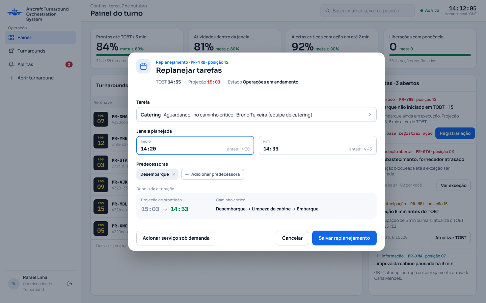
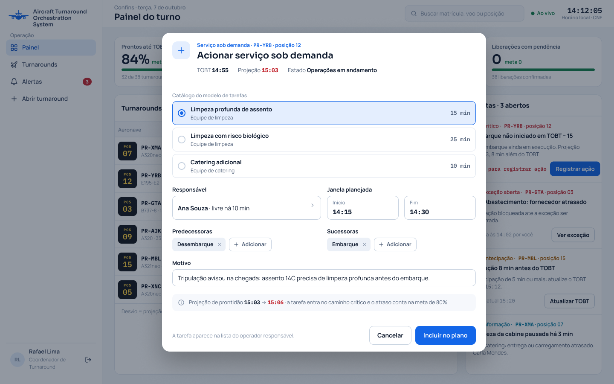
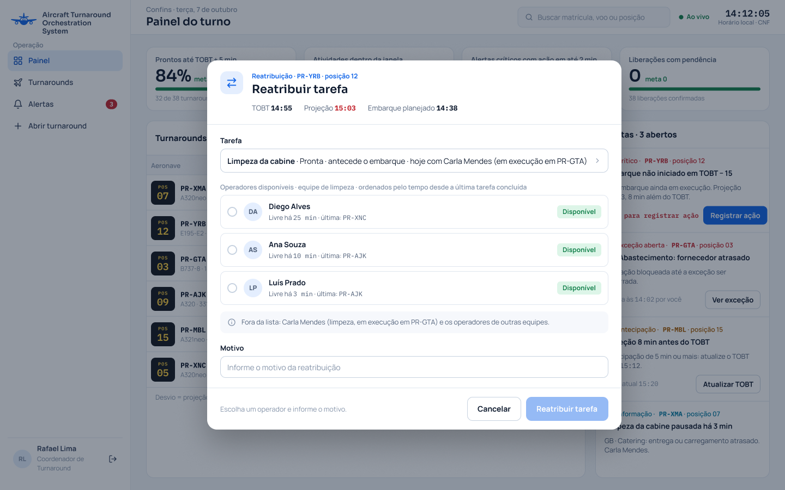
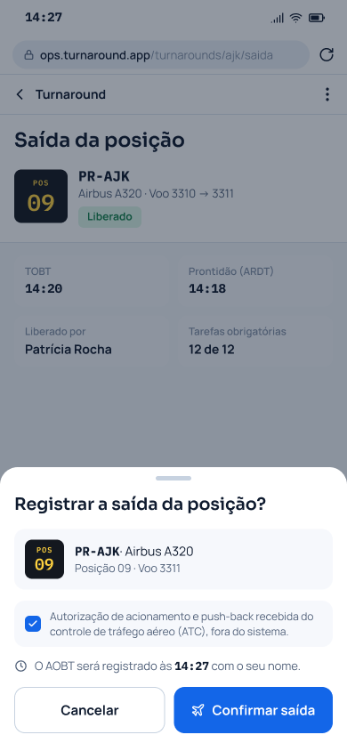

**Casos de uso da área D no diagrama geral (item 9).** Os nomes e os atores abaixo são os que o diagrama deve usar (critério C10.8). No nome do UC-D6, TOBT é o horário-alvo de prontidão [2].

| UC | Nome | Ator | Relacionamentos | RF e estória |
|---|---|---|---|---|
| UC-D1 | Abrir exceção | Coordenador de Turnaround | «extend» UC-D3 | RF-D1, US-D1 |
| UC-D2 | Reatribuir tarefa | Coordenador de Turnaround | «include» UC-D8; «extend» UC-D3 | RF-D2, US-D2 |
| UC-D3 | Registrar a ação tomada para o alerta | Coordenador de Turnaround | aberto a partir do UC-C5; estendido por UC-D1, UC-D2, UC-D6 e UC-D7 | RF-D3, US-D3 |
| UC-D4 | Confirmar a prontidão e liberar a aeronave | Autoridade de Liberação | — | RF-D4, US-D4 |
| UC-D5 | Encerrar exceção | Coordenador de Turnaround | — | RF-D5, US-D5 |
| UC-D6 | Atualizar o TOBT | Motor de Eventos, Coordenador de Turnaround | «extend» UC-D3 | RF-D6, US-D6 |
| UC-D7 | Replanejar tarefas ainda não iniciadas | Coordenador de Turnaround | «extend» UC-D3 | RF-D7, US-D7 |
| UC-D8 | Consultar os operadores disponíveis da equipe | Coordenador de Turnaround | incluído por UC-D2 | RF-D8, US-D8 |
| UC-D9 | Registrar a saída da posição e encerrar o turnaround | Operador de Solo/Rampa | — | RF-D9, US-D9 |

## UC-D1 – Abrir exceção

| Campo | |
|---|---|
| **Nome do caso de uso** | UC-D1 – Abrir exceção |
| **Ator(es)** | Coordenador de Turnaround |
| **Descrição** | O Coordenador de Turnaround abre uma exceção em um turnaround, informando a tarefa afetada, a causa pelo código da tabela de códigos de atraso da Agência Nacional de Aviação Civil (ANAC) [62] e uma descrição. O turnaround passa para o estado "Em exceção" e não pode ser liberado enquanto a exceção não for encerrada (UC-D5). Pode ser executado a partir do registro da ação de um alerta (UC-D3). Atende ao RF-D1 e à US-D1. |
| **Pré-condições** | 1. O Coordenador de Turnaround está autenticado com o perfil de coordenador. 2. O turnaround está no estado "Em solo", "Operações em andamento", "Pronto para liberação" ou "Em exceção". |
| **Pós-condições** | **Sucesso:** a exceção está aberta, com a tarefa afetada, o código da ANAC, a descrição, o usuário e o horário gravados, e o turnaround está no estado "Em exceção". **Recusa:** nenhuma exceção é gravada e o turnaround mantém o estado. |
| **Regras de negócio** | **RN1.** Toda exceção tem a tarefa afetada, um código da tabela de códigos de atraso da ANAC e uma descrição; sem o código, a abertura é recusada (RF-D1; US-D1, critério 2). **RN2.** O código vem da tabela completa da ANAC, com 72 códigos em 12 categorias, cada um com sigla de duas letras e descrição em português [62] (ADR-0006). A exceção guarda o código, a descrição e a versão da tabela vigente no momento do registro (RNF-D4). **RN3.** A abertura grava o usuário e o horário e leva o turnaround ao estado lateral "Em exceção" (RF-D1). O sistema guarda o estado em que o turnaround estava, para o retorno no encerramento (UC-D5). **RN4.** Um turnaround pode ter mais de uma exceção aberta ao mesmo tempo; ele continua "Em exceção" enquanto houver ao menos uma (US-D1, critério 3). **RN5.** Com exceção aberta, a confirmação da prontidão é recusada (UC-D4), o que atende à meta de zero liberações com exceção não resolvida do objetivo 3. **RN6.** A exceção não muda o estado das tarefas: os operadores continuam registrando, e a propagação entre as tarefas segue valendo (UC-B8, regra 9). **RN7.** [Inferência] Só se abre exceção antes da liberação: no turnaround "Liberado" ou "Fora de bloco" a abertura não é oferecida, porque a prontidão só é confirmada sem exceção aberta (UC-D4). |
| **Protótipo(s) de tela** | Formulário de abertura da exceção, com a tarefa afetada, a busca do código na tabela da ANAC e a descrição.  |

### Fluxo básico

| Ações do ator | Ações do sistema |
|---|---|
| 1. O Coordenador de Turnaround seleciona "Abrir exceção" em um turnaround no estado "Operações em andamento". |  |
|  | 2. O sistema exibe o formulário com a aeronave, a posição, o estado do turnaround, a lista das tarefas do turnaround, a busca do código da ANAC e o campo de descrição. |
| 3. O Coordenador de Turnaround escolhe a tarefa afetada, por exemplo o catering. |  |
| 4. O Coordenador de Turnaround busca o código pela sigla ou pela descrição e escolhe um, por exemplo "GB". |  |
| 5. O Coordenador de Turnaround escreve a descrição do problema e confirma. |  |
|  | 6. O sistema verifica que a tarefa, o código e a descrição foram informados e que o turnaround continua em um estado que admite exceção (**E1**, **E2**, **E3**). |
|  | 7. O sistema grava a exceção com a tarefa, o código, a descrição, o usuário e o horário, e muda o turnaround para "Em exceção". |
|  | 8. O sistema exibe o turnaround como "Em exceção" e a exceção na lista de exceções abertas. O caso de uso termina. |

### Fluxo alternativo A1 – Segunda exceção no mesmo turnaround (passo 1)

*Condição:* o turnaround já está "Em exceção".

| Ações do ator | Ações do sistema |
|---|---|
|  | A1.1. O caso de uso segue do passo 2; no passo 7, o sistema grava a nova exceção e o turnaround continua "Em exceção". |
|  | A1.2. O sistema exibe as duas exceções como abertas, e o caso de uso termina. |

### Fluxo alternativo A2 – Abertura a partir de um alerta (passo 1)

| Ações do ator | Ações do sistema |
|---|---|
| A2.1. O Coordenador de Turnaround escolhe "Abrir exceção" como ação de um alerta (UC-D3). |  |
|  | A2.2. O sistema exibe o formulário com a tarefa do alerta já escolhida, e o caso de uso segue do passo 4. |
|  | A2.3. Depois do passo 7, o sistema grava a ação no alerta e o encerra (UC-D3). |

### Fluxo alternativo A3 – Desistência (passo 5)

| Ações do ator | Ações do sistema |
|---|---|
| A3.1. O Coordenador de Turnaround cancela o formulário. |  |
|  | A3.2. O sistema fecha o formulário sem gravar nada, e o turnaround mantém o estado. |

### Fluxo de exceção E1 – Código não informado (passo 6)

| Ações do ator | Ações do sistema |
|---|---|
|  | E1.1. O sistema recusa a abertura e informa que o código da tabela da ANAC é obrigatório. |
|  | E1.2. O turnaround mantém o estado, e o caso de uso volta ao passo 4. |

### Fluxo de exceção E2 – Tarefa ou descrição não informada (passo 6)

| Ações do ator | Ações do sistema |
|---|---|
|  | E2.1. O sistema recusa a abertura e indica o campo que falta. |
|  | E2.2. O turnaround mantém o estado, e o caso de uso volta ao passo 3. |

### Fluxo de exceção E3 – Turnaround já liberado (passo 6)

*Condição:* o turnaround passou para "Liberado" ou "Fora de bloco" depois que o formulário foi aberto.

| Ações do ator | Ações do sistema |
|---|---|
|  | E3.1. O sistema recusa a abertura, informa o estado atual do turnaround e não grava nenhuma exceção. |

## UC-D2 – Reatribuir tarefa

| Campo | |
|---|---|
| **Nome do caso de uso** | UC-D2 – Reatribuir tarefa |
| **Ator(es)** | Coordenador de Turnaround |
| **Descrição** | O Coordenador de Turnaround passa uma tarefa ainda não concluída a outro Operador de Solo/Rampa da mesma equipe que esteja disponível, informando o motivo, para recuperar o prazo quando o operador original está ocupado ou impedido. Os dois operadores são avisados. Inclui o caso de uso UC-D8, que lista os operadores disponíveis. Pode ser executado a partir do registro da ação de um alerta (UC-D3). Atende ao RF-D2 e à US-D2. |
| **Pré-condições** | 1. O Coordenador de Turnaround está autenticado com o perfil de coordenador. 2. A tarefa pertence a um turnaround que ainda não está "Fora de bloco", está atribuída a um operador e está no estado "Aguardando", "Pronta", "Em execução" ou "Pausada". |
| **Pós-condições** | **Sucesso:** a tarefa está atribuída ao novo operador, com o motivo, o usuário e o horário gravados, e os dois operadores foram avisados. **Recusa:** a tarefa mantém o operador original e nenhum registro é gravado. |
| **Regras de negócio** | **RN1.** Só a tarefa ainda não concluída pode ser reatribuída; a tarefa "Concluída" ou "Não aplicável" é recusada (RF-D2; US-D2, critério 2). **RN2.** O novo operador é da mesma equipe da tarefa e está disponível, isto é, sem tarefa "Em execução" (RF-D2, ADR-0010). A lista de quem pode receber a tarefa vem do UC-D8. **RN3.** A reatribuição exige o motivo e grava o usuário e o horário (RF-D2). **RN4.** A reatribuição não muda o estado da tarefa. Ela deixa de aparecer na lista do operador original e passa a aparecer só na do novo operador (UC-B1). **RN5.** Os dois operadores recebem o aviso da reatribuição no celular (RF-D2). **RN6.** O registro que o operador original fez sem conexão, antes de saber da reatribuição, é recusado quando chega ao servidor, sem mudar o estado da tarefa, e o operador recebe o aviso da recusa com o motivo (RNF-B2; US-D2, critério 4). **RN7.** A reatribuição mantém a meta de 100% das tarefas com responsável, do objetivo 2: a tarefa nunca fica sem operador. |
| **Protótipo(s) de tela** | Formulário de reatribuição, com a tarefa, o operador escolhido na lista de disponíveis e o motivo.  |

### Fluxo básico

| Ações do ator | Ações do sistema |
|---|---|
| 1. O Coordenador de Turnaround seleciona "Reatribuir" em uma tarefa no estado "Pronta", por exemplo a limpeza da cabine. |  |
|  | 2. O sistema exibe o formulário com a tarefa, o operador atual e a lista dos operadores disponíveis da mesma equipe (UC-D8) (**E4**). |
| 3. O Coordenador de Turnaround escolhe um operador da lista. |  |
| 4. O Coordenador de Turnaround escreve o motivo e confirma. |  |
|  | 5. O sistema verifica que a tarefa continua não concluída, que o operador escolhido é da mesma equipe e continua sem tarefa em execução e que o motivo foi preenchido (**E1**, **E2**, **E3**). |
|  | 6. O sistema grava a reatribuição com o motivo, o usuário e o horário e atribui a tarefa ao novo operador. |
|  | 7. O sistema envia o aviso da reatribuição aos dois operadores, retira a tarefa da lista do operador original e a exibe na lista do novo operador. O caso de uso termina. |

### Fluxo alternativo A1 – Reatribuição a partir de um alerta (passo 1)

| Ações do ator | Ações do sistema |
|---|---|
| A1.1. O Coordenador de Turnaround escolhe "Reatribuir tarefa" como ação de um alerta (UC-D3). |  |
|  | A1.2. O sistema exibe o formulário com a tarefa do alerta já escolhida, e o caso de uso segue do passo 2. |
|  | A1.3. Depois do passo 7, o sistema grava a ação no alerta e o encerra (UC-D3). |

### Fluxo alternativo A2 – Tarefa em execução ou pausada (passo 1)

*Condição:* a tarefa está "Em execução" ou "Pausada".

| Ações do ator | Ações do sistema |
|---|---|
|  | A2.1. O caso de uso segue do passo 2; no passo 6, a tarefa mantém o estado, e o novo operador a recebe nesse estado. |

### Fluxo alternativo A3 – Desistência (passo 4)

| Ações do ator | Ações do sistema |
|---|---|
| A3.1. O Coordenador de Turnaround cancela o formulário. |  |
|  | A3.2. O sistema fecha o formulário sem gravar nada, e a tarefa mantém o operador original. |

### Fluxo de exceção E1 – Tarefa já terminada (passo 5)

*Condição:* a tarefa está "Concluída" ou "Não aplicável", por exemplo porque foi concluída com o formulário aberto.

| Ações do ator | Ações do sistema |
|---|---|
|  | E1.1. O sistema recusa a reatribuição e informa que tarefa concluída não pode ser reatribuída. |
|  | E1.2. A tarefa mantém o operador original. |

### Fluxo de exceção E2 – Operador de outra equipe ou indisponível (passo 5)

*Condição:* o operador escolhido não é da equipe da tarefa ou iniciou outra tarefa depois que a lista foi exibida.

| Ações do ator | Ações do sistema |
|---|---|
|  | E2.1. O sistema recusa a reatribuição e informa que o operador escolhido não é da mesma equipe ou não está disponível. |
|  | E2.2. A tarefa mantém o operador original, e o caso de uso volta ao passo 2, com a lista atualizada. |

### Fluxo de exceção E3 – Motivo não informado (passo 5)

| Ações do ator | Ações do sistema |
|---|---|
|  | E3.1. O sistema recusa a reatribuição e pede o motivo. |
|  | E3.2. A tarefa mantém o operador original, e o caso de uso volta ao passo 4. |

### Fluxo de exceção E4 – Nenhum operador disponível (passo 2)

*Condição:* todos os outros operadores da equipe têm tarefa em execução.

| Ações do ator | Ações do sistema |
|---|---|
|  | E4.1. O sistema informa que não há operador disponível na equipe (UC-D8), e a tarefa mantém o operador original. |

### Fluxo de exceção E5 – Registro do operador original feito sem conexão (depois do passo 7)

*Condição:* o operador original registrou, sem conexão, o início da tarefa reatribuída.

| Ações do ator | Ações do sistema |
|---|---|
|  | E5.1. Quando a conexão volta e o registro chega ao servidor, o sistema o recusa, e a tarefa não muda de estado. |
|  | E5.2. O operador original recebe o aviso da recusa com o motivo (RNF-B2). |

## UC-D3 – Registrar a ação tomada para o alerta

| Campo | |
|---|---|
| **Nome do caso de uso** | UC-D3 – Registrar a ação tomada para o alerta |
| **Ator(es)** | Coordenador de Turnaround |
| **Descrição** | O Coordenador de Turnaround registra, para um alerta aberto, a ação que tomou: reatribuir tarefa, replanejar, atualizar a previsão ou abrir exceção. O registro grava o autor e o horário e encerra o alerta, de modo que todo alerta tenha uma resposta e que se possa medir o tempo entre o alerta e a ação. É aberto a partir da lista de alertas (UC-C5). É estendido pelos casos de uso UC-D1, UC-D2, UC-D6 e UC-D7, que executam a ação escolhida. Atende ao RF-D3 e à US-D3. |
| **Pré-condições** | 1. O Coordenador de Turnaround está autenticado com o perfil de coordenador. 2. Há um alerta aberto, emitido pelo Motor de Eventos (UC-C4). |
| **Pós-condições** | **Sucesso:** o alerta está encerrado, com a ação, o usuário e o horário gravados, e não aparece mais na lista de alertas abertos. **Recusa:** o alerta continua aberto e nenhuma ação é gravada. |
| **Regras de negócio** | **RN1.** Todo alerta é encerrado por uma das quatro ações: "reatribuir tarefa", "replanejar", "atualizar a previsão" ou "abrir exceção"; sem a ação, o encerramento é recusado (RF-D3; US-D3, critério 2). **RN2.** O registro grava a ação, o usuário e o horário no alerta e o retira da lista de alertas abertos (RF-D3). **RN3.** O histórico do alerta mostra o horário do alerta, o horário da ação, a ação e o usuário, o que permite calcular o tempo de resposta (US-D3, critério 3). **RN4.** A meta do objetivo 3 é ter ação registrada em até 2 minutos para pelo menos 90% dos alertas críticos. O prazo de 2 minutos é parâmetro de configuração (RNF-D3), e o registro mostra o tempo que resta para o alerta crítico. **RN5.** A ação escolhida é executada pelo caso de uso correspondente: UC-D2 (reatribuir tarefa), UC-D7 (replanejar), UC-D6 (atualizar a previsão) ou UC-D1 (abrir exceção). O alerta só é encerrado quando a ação é aceita. **RN6.** Os alertas são os de risco ao horário-alvo de prontidão (TOBT) [2], emitidos pelo UC-C4. O aviso de antecipação de 5 minutos ou mais não é alerta de risco (ADR-0003) e é tratado no UC-D6. |
| **Protótipo(s) de tela** | Registro da ação do alerta, com os dados do alerta, o tempo restante, as quatro ações e os campos da ação escolhida.  |

### Fluxo básico

| Ações do ator | Ações do sistema |
|---|---|
| 1. O Coordenador de Turnaround seleciona "Registrar ação" em um alerta da lista de alertas abertos (UC-C5). |  |
|  | 2. O sistema exibe o alerta, com o tipo, a aeronave, a posição, os dados do gatilho e, no alerta crítico, o tempo que resta do prazo, e as quatro ações. |
| 3. O Coordenador de Turnaround escolhe "Reatribuir tarefa". |  |
|  | 4. O sistema exibe os campos da reatribuição, com a tarefa do alerta e os operadores disponíveis (UC-D2). |
| 5. O Coordenador de Turnaround escolhe o operador, escreve o motivo e confirma (**E1**). |  |
|  | 6. O sistema executa a reatribuição (UC-D2) (**E2**). |
|  | 7. O sistema grava no alerta a ação "reatribuir tarefa", o usuário e o horário, encerra o alerta e o retira da lista de alertas abertos (**E3**). O caso de uso termina. |

### Fluxo alternativo A1 – Replanejar (passo 3)

| Ações do ator | Ações do sistema |
|---|---|
| A1.1. O Coordenador de Turnaround escolhe "Replanejar". |  |
|  | A1.2. O sistema exibe os campos do replanejamento e executa o UC-D7 na confirmação. |
|  | A1.3. O caso de uso segue do passo 7, com a ação "replanejar". |

### Fluxo alternativo A2 – Atualizar a previsão (passo 3)

| Ações do ator | Ações do sistema |
|---|---|
| A2.1. O Coordenador de Turnaround escolhe "Atualizar TOBT". |  |
|  | A2.2. O sistema exibe o TOBT vigente, a projeção e o campo do novo TOBT e executa o UC-D6 na confirmação. |
|  | A2.3. O caso de uso segue do passo 7, com a ação "atualizar a previsão". |

### Fluxo alternativo A3 – Abrir exceção (passo 3)

| Ações do ator | Ações do sistema |
|---|---|
| A3.1. O Coordenador de Turnaround escolhe "Abrir exceção". |  |
|  | A3.2. O sistema exibe os campos da exceção e executa o UC-D1 na confirmação. |
|  | A3.3. O caso de uso segue do passo 7, com a ação "abrir exceção". |

### Fluxo alternativo A4 – Consulta do histórico (depois do passo 7)

| Ações do ator | Ações do sistema |
|---|---|
| A4.1. O Coordenador de Turnaround abre o histórico do alerta encerrado. |  |
|  | A4.2. O sistema exibe o horário do alerta, o horário da ação, a ação e o usuário. |

### Fluxo alternativo A5 – Desistência (passo 5)

| Ações do ator | Ações do sistema |
|---|---|
| A5.1. O Coordenador de Turnaround cancela o registro. |  |
|  | A5.2. O sistema fecha o registro sem gravar nada, e o alerta continua aberto. |

### Fluxo de exceção E1 – Nenhuma ação escolhida (passo 5)

*Condição:* o Coordenador de Turnaround confirma sem escolher uma das ações.

| Ações do ator | Ações do sistema |
|---|---|
|  | E1.1. O sistema recusa o encerramento e informa que a ação é obrigatória. |
|  | E1.2. O alerta continua aberto, e o caso de uso volta ao passo 3. |

### Fluxo de exceção E2 – Ação recusada (passo 6)

*Condição:* o caso de uso da ação recusa o registro, por exemplo porque o operador escolhido deixou de estar disponível (UC-D2, E2).

| Ações do ator | Ações do sistema |
|---|---|
|  | E2.1. O sistema exibe o motivo da recusa, não grava a ação e mantém o alerta aberto. |
|  | E2.2. O caso de uso volta ao passo 3. |

### Fluxo de exceção E3 – Alerta já encerrado (passo 7)

*Condição:* outro Coordenador de Turnaround registrou a ação do mesmo alerta antes.

| Ações do ator | Ações do sistema |
|---|---|
|  | E3.1. O sistema informa que o alerta já foi encerrado, mostra a ação, o usuário e o horário gravados e não grava outro registro no alerta. |

## UC-D4 – Confirmar a prontidão e liberar a aeronave

| Campo | |
|---|---|
| **Nome do caso de uso** | UC-D4 – Confirmar a prontidão e liberar a aeronave |
| **Ator(es)** | Autoridade de Liberação |
| **Descrição** | A Autoridade de Liberação consulta as condições de um turnaround no estado "Pronto para liberação" e confirma a prontidão da aeronave. O sistema grava o horário real de prontidão (ARDT) [2] e a decisão, com o autor e o horário, e o turnaround passa para "Liberado". A confirmação é recusada enquanto houver tarefa obrigatória pendente ou exceção aberta. Atende ao RF-D4 e à US-D4. |
| **Pré-condições** | 1. A Autoridade de Liberação está autenticada com o perfil de autoridade de liberação. 2. O turnaround é de uma aeronave da companhia aérea que ela representa (ADR-0004). |
| **Pós-condições** | **Sucesso:** o turnaround está no estado "Liberado", com o ARDT e a decisão gravados com o usuário e o horário. **Recusa:** o ARDT não é gravado e o turnaround mantém o estado. |
| **Regras de negócio** | **RN1.** A prontidão só é confirmada com o turnaround em "Pronto para liberação", isto é, com todas as tarefas obrigatórias nos estados "Concluída" ou "Não aplicável" e sem exceção aberta (RF-D4). É a regra que garante zero liberações com tarefa obrigatória pendente ou exceção não resolvida, do objetivo 3. **RN2.** Com exceção aberta, a confirmação é recusada e o sistema informa a exceção; com tarefa obrigatória pendente, é recusada e o sistema lista as tarefas pendentes (US-D4, critérios 2 e 3). **RN3.** O ARDT é o horário da confirmação (RF-D4). [Fato] É o marco *Aircraft Ready* da tomada de decisão colaborativa em aeroportos (A-CDM) [2]. **RN4.** A decisão é sempre da Autoridade de Liberação: o sistema não libera a aeronave sozinho, nem quando todas as condições estão cumpridas (ADR-0004). **RN5.** "Liberado" é ato interno do sistema. A autorização de acionamento e de push-back continua com o controle de tráfego aéreo (ATC), fora do sistema; a saída da posição é registrada no UC-D9. **RN6.** A decisão grava o usuário e o horário (RF-D4). **RN7.** A tela mostra, para cada turnaround, o que falta para a liberação: as tarefas obrigatórias pendentes e as exceções abertas. |
| **Protótipo(s) de tela** | Lista dos turnarounds da companhia e confirmação da prontidão, com as condições cumpridas, as tarefas obrigatórias e a opção "Confirmar prontidão".  |

### Fluxo básico

| Ações do ator | Ações do sistema |
|---|---|
| 1. A Autoridade de Liberação abre a lista de liberações. |  |
|  | 2. O sistema exibe os turnarounds da companhia: primeiro os que estão em "Pronto para liberação" e, em seguida, os que ainda não podem ser liberados, cada um com o estado e a quantidade de tarefas obrigatórias pendentes e de exceções abertas. |
| 3. A Autoridade de Liberação seleciona um turnaround no estado "Pronto para liberação". |  |
|  | 4. O sistema exibe as condições da liberação: as tarefas obrigatórias, todas "Concluída" ou "Não aplicável", com o horário de cada uma; a ausência de exceção aberta; e o fim real do atendimento em solo (AEGT) [2]. |
| 5. A Autoridade de Liberação seleciona "Confirmar prontidão". |  |
|  | 6. O sistema verifica que o turnaround continua em "Pronto para liberação", sem tarefa obrigatória pendente e sem exceção aberta (**E1**, **E2**, **E3**). |
|  | 7. O sistema grava o ARDT com o horário da confirmação, grava a decisão com o usuário e muda o turnaround para "Liberado". |
|  | 8. O sistema exibe o turnaround como "Liberado", com o ARDT e o nome de quem confirmou. O caso de uso termina. |

### Fluxo alternativo A1 – Consulta de turnaround que ainda não pode ser liberado (passo 3)

| Ações do ator | Ações do sistema |
|---|---|
| A1.1. A Autoridade de Liberação seleciona um turnaround em "Operações em andamento" ou "Em exceção". |  |
|  | A1.2. O sistema exibe as tarefas obrigatórias pendentes e as exceções abertas, sem a opção "Confirmar prontidão". |
|  | A1.3. O caso de uso volta ao passo 2 ou termina. |

### Fluxo alternativo A2 – Desistência (passo 5)

| Ações do ator | Ações do sistema |
|---|---|
| A2.1. A Autoridade de Liberação seleciona "Voltar". |  |
|  | A2.2. O sistema volta à lista sem gravar nada, e o turnaround continua "Pronto para liberação". |

### Fluxo de exceção E1 – Exceção aberta (passo 6)

*Condição:* uma exceção foi aberta depois que a tela foi carregada, e o turnaround está "Em exceção".

| Ações do ator | Ações do sistema |
|---|---|
|  | E1.1. O sistema recusa a confirmação, informa a exceção aberta e não grava o ARDT. |
|  | E1.2. O turnaround mantém o estado. |

### Fluxo de exceção E2 – Tarefa obrigatória pendente (passo 6)

*Condição:* o turnaround ainda não está em "Pronto para liberação", com tarefa obrigatória fora dos estados "Concluída" e "Não aplicável", por exemplo quando a confirmação é pedida para um turnaround em "Operações em andamento" (US-D4, critério 3).

| Ações do ator | Ações do sistema |
|---|---|
|  | E2.1. O sistema recusa a confirmação, lista as tarefas pendentes e não grava o ARDT. |
|  | E2.2. O turnaround mantém o estado. |

### Fluxo de exceção E3 – Turnaround já liberado (passo 6)

*Condição:* outro representante da companhia confirmou a prontidão antes.

| Ações do ator | Ações do sistema |
|---|---|
|  | E3.1. O sistema informa que o turnaround já está "Liberado", mostra o ARDT e quem confirmou e não grava outro registro. |

## UC-D5 – Encerrar exceção

| Campo | |
|---|---|
| **Nome do caso de uso** | UC-D5 – Encerrar exceção |
| **Ator(es)** | Coordenador de Turnaround |
| **Descrição** | O Coordenador de Turnaround encerra uma exceção aberta, registrando a solução adotada. Quando não há outra exceção aberta, o turnaround sai de "Em exceção" para o estado que corresponde ao andamento das tarefas e pode seguir para a liberação. Atende ao RF-D5 e à US-D5. |
| **Pré-condições** | 1. O Coordenador de Turnaround está autenticado com o perfil de coordenador. 2. O turnaround está no estado "Em exceção", com ao menos uma exceção aberta (UC-D1). |
| **Pós-condições** | **Sucesso:** a exceção está encerrada, com a solução, o usuário e o horário gravados; o turnaround saiu de "Em exceção" para "Em solo", "Operações em andamento" ou "Pronto para liberação", conforme o andamento das tarefas, se não havia outra exceção aberta, ou continua "Em exceção". **Recusa:** a exceção continua aberta e o turnaround continua "Em exceção". |
| **Regras de negócio** | **RN1.** O encerramento exige a solução adotada; sem ela, é recusado (RF-D5; US-D5, critério 3). **RN2.** O encerramento grava a solução, o usuário e o horário na exceção (RF-D5). **RN3.** O turnaround só sai de "Em exceção" quando não há outra exceção aberta; com outra aberta, continua "Em exceção" (RF-D5; US-D5, critério 2). **RN4.** Ao sair de "Em exceção", o turnaround vai para o estado que corresponde ao andamento das tarefas: "Em solo", se nenhuma tarefa foi iniciada; "Operações em andamento", se alguma foi iniciada e ainda há tarefa obrigatória pendente (RF-D5; US-D5, critérios 1 e 5). **RN5.** Se todas as tarefas obrigatórias estão "Concluída" ou "Não aplicável", o estado de saída é "Pronto para liberação", porque a propagação entre as tarefas continua valendo com o turnaround "Em exceção" (RF-D5; US-D5, critério 4; UC-B8, regra 9). **RN6.** A exceção encerrada continua no histórico do turnaround, com o código e a descrição originais (RNF-D4). |
| **Protótipo(s) de tela** | Encerramento da exceção, com o resumo da exceção, o campo da solução adotada e o estado para o qual o turnaround volta.  |

### Fluxo básico

| Ações do ator | Ações do sistema |
|---|---|
| 1. O Coordenador de Turnaround seleciona uma exceção aberta de um turnaround "Em exceção". |  |
|  | 2. O sistema exibe a exceção, com a tarefa afetada, o código da ANAC, a descrição, quem abriu e o horário, o tempo em exceção e o campo da solução. |
| 3. O Coordenador de Turnaround escreve a solução adotada e confirma. |  |
|  | 4. O sistema verifica que a solução foi preenchida e que a exceção continua aberta (**E1**, **E2**). |
|  | 5. O sistema grava a solução, o usuário e o horário e encerra a exceção. |
|  | 6. O sistema verifica que não há outra exceção aberta no turnaround e o leva ao estado que corresponde ao andamento das tarefas (RN4), por exemplo "Operações em andamento". |
|  | 7. O sistema exibe o turnaround no estado de retorno e a exceção como encerrada. O caso de uso termina. |

### Fluxo alternativo A1 – Outra exceção aberta (passo 6)

*Condição:* o turnaround tem outra exceção aberta.

| Ações do ator | Ações do sistema |
|---|---|
|  | A1.1. O sistema mantém o turnaround "Em exceção" e exibe a exceção restante como aberta. O caso de uso termina. |

### Fluxo alternativo A2 – Tarefas obrigatórias terminadas durante a exceção (passo 6)

*Condição:* não há outra exceção aberta, e todas as tarefas obrigatórias estão "Concluída" ou "Não aplicável".

| Ações do ator | Ações do sistema |
|---|---|
|  | A2.1. O sistema muda o turnaround para "Pronto para liberação", e ele passa a aparecer para a Autoridade de Liberação (UC-D4). O caso de uso termina. |

### Fluxo alternativo A3 – Desistência (passo 3)

| Ações do ator | Ações do sistema |
|---|---|
| A3.1. O Coordenador de Turnaround cancela o encerramento. |  |
|  | A3.2. O sistema fecha o formulário sem gravar nada, e a exceção continua aberta. |

### Fluxo de exceção E1 – Solução não informada (passo 4)

| Ações do ator | Ações do sistema |
|---|---|
|  | E1.1. O sistema recusa o encerramento e informa que a solução é obrigatória. |
|  | E1.2. A exceção continua aberta, e o caso de uso volta ao passo 3. |

### Fluxo de exceção E2 – Exceção já encerrada (passo 4)

*Condição:* outro Coordenador de Turnaround encerrou a exceção antes.

| Ações do ator | Ações do sistema |
|---|---|
|  | E2.1. O sistema informa que a exceção já foi encerrada, mostra a solução, o usuário e o horário gravados e não grava outro registro. |

## UC-D6 – Atualizar o TOBT

| Campo | |
|---|---|
| **Nome do caso de uso** | UC-D6 – Atualizar o TOBT |
| **Ator(es)** | Motor de Eventos, Coordenador de Turnaround |
| **Descrição** | Quando a projeção de prontidão se afasta 5 minutos ou mais do TOBT vigente, para mais ou para menos, o Motor de Eventos solicita ao Coordenador de Turnaround a atualização do TOBT. O Coordenador de Turnaround informa o novo valor, e o sistema grava o valor anterior, o novo, o autor e o horário. Assim a previsão de prontidão continua confiável para quem depende dela. Pode ser executado a partir do registro da ação de um alerta (UC-D3). Atende ao RF-D6 e à US-D6. |
| **Pré-condições** | 1. O turnaround está aberto e ainda não está "Liberado", com TOBT planejado e TOBT vigente. 2. O Motor de Eventos recalculou a projeção de prontidão (UC-C3). 3. O Coordenador de Turnaround está autenticado com o perfil de coordenador. |
| **Pós-condições** | **Sucesso:** o TOBT vigente é o novo valor, com o valor anterior, o novo, o usuário e o horário gravados; o TOBT planejado não mudou. **Recusa:** o TOBT vigente não muda e nenhum registro é gravado. |
| **Regras de negócio** | **RN1.** A solicitação aparece quando a diferença entre a projeção de prontidão e o TOBT vigente chega a 5 minutos ou mais, para mais ou para menos (RF-D6). [Fato] As regras do TOBT pedem a atualização quando a previsão muda 5 minutos ou mais [8][9]. **RN2.** Com diferença menor que 5 minutos, não há solicitação (US-D6, critério 4). O limiar de 5 minutos é parâmetro de configuração (RNF-D3). **RN3.** Quando a projeção fica 5 minutos ou mais antes do TOBT vigente, a solicitação aparece como aviso de antecipação, e não como alerta de risco (ADR-0003; US-D6, critério 2). **RN4.** O TOBT planejado é definido na abertura do turnaround e não muda. O TOBT vigente começa igual a ele e muda a cada atualização (ADR-0003). **RN5.** A meta do objetivo 1 continua medida contra o TOBT planejado, com tolerância de 5 minutos (ADR-0001); atualizar o TOBT vigente não muda essa medida. **RN6.** A atualização grava o valor anterior, o novo valor, o usuário e o horário (RF-D6). **RN7.** [Inferência] Depois da atualização, a solicitação só volta se a projeção se afastar de novo 5 minutos ou mais do TOBT vigente (ADR-0003). |
| **Protótipo(s) de tela** | Atualização do TOBT, com o TOBT planejado, o TOBT vigente, a projeção de prontidão, a diferença e o campo do novo TOBT.  |

### Fluxo básico

| Motor de Eventos | Coordenador de Turnaround | Sistema |
|---|---|---|
| 1. O Motor de Eventos recalcula a projeção de prontidão de um turnaround (UC-C3) e verifica que ela está 5 minutos ou mais depois do TOBT vigente, por exemplo TOBT vigente 10:30 e projeção 10:37. |  |  |
|  |  | 2. O sistema exibe ao Coordenador de Turnaround a solicitação de atualização do TOBT do turnaround, com o TOBT vigente e a projeção. |
|  | 3. O Coordenador de Turnaround abre a solicitação. |  |
|  |  | 4. O sistema exibe o TOBT planejado, o TOBT vigente, a projeção, a diferença e o campo do novo TOBT, preenchido com a projeção. |
|  | 5. O Coordenador de Turnaround mantém o valor sugerido e confirma. |  |
|  |  | 6. O sistema verifica que o novo TOBT foi informado e é diferente do TOBT vigente (**E1**, **E2**, **E3**). |
|  |  | 7. O sistema grava o valor anterior, o novo valor, o usuário e o horário e passa a exibir o novo valor como TOBT vigente. |
|  |  | 8. O sistema retira a solicitação e mantém o TOBT planejado como referência da tolerância de 5 minutos. O caso de uso termina. |

### Fluxo alternativo A1 – Antecipação (passo 1)

*Condição:* a projeção está 5 minutos ou mais antes do TOBT vigente, por exemplo TOBT vigente 10:30 e projeção 10:24.

| Motor de Eventos | Coordenador de Turnaround | Sistema |
|---|---|---|
|  |  | A1.1. O sistema exibe a solicitação como aviso de antecipação, e não como alerta de risco. |
|  |  | A1.2. O caso de uso segue do passo 3. |

### Fluxo alternativo A2 – Outro valor (passo 5)

| Motor de Eventos | Coordenador de Turnaround | Sistema |
|---|---|---|
|  | A2.1. O Coordenador de Turnaround troca o valor sugerido por outro horário e confirma. |  |
|  |  | A2.2. O caso de uso segue do passo 6 com o valor informado. |

### Fluxo alternativo A3 – Diferença menor que 5 minutos (passo 1)

*Condição:* a projeção está a menos de 5 minutos do TOBT vigente, por exemplo TOBT vigente 10:30 e projeção 10:34.

| Motor de Eventos | Coordenador de Turnaround | Sistema |
|---|---|---|
|  |  | A3.1. O sistema não exibe solicitação, e o caso de uso termina. |

### Fluxo alternativo A4 – Atualização a partir de um alerta (passo 3)

| Motor de Eventos | Coordenador de Turnaround | Sistema |
|---|---|---|
|  | A4.1. O Coordenador de Turnaround escolhe "Atualizar TOBT" como ação de um alerta (UC-D3). |  |
|  |  | A4.2. O caso de uso segue do passo 4; depois do passo 7, o sistema grava a ação no alerta e o encerra (UC-D3). |

### Fluxo alternativo A5 – Desistência (passo 5)

| Motor de Eventos | Coordenador de Turnaround | Sistema |
|---|---|---|
|  | A5.1. O Coordenador de Turnaround cancela. |  |
|  |  | A5.2. O sistema fecha o formulário sem gravar nada, e a solicitação continua aberta. |

### Fluxo de exceção E1 – Novo TOBT não informado ou igual ao vigente (passo 6)

| Motor de Eventos | Coordenador de Turnaround | Sistema |
|---|---|---|
|  |  | E1.1. O sistema recusa a atualização e pede um horário diferente do TOBT vigente. |
|  |  | E1.2. O TOBT vigente não muda, e o caso de uso volta ao passo 5. |

### Fluxo de exceção E2 – Projeção de volta à faixa (passo 6)

*Condição:* um novo recálculo deixou a projeção a menos de 5 minutos do TOBT vigente enquanto o formulário estava aberto.

| Motor de Eventos | Coordenador de Turnaround | Sistema |
|---|---|---|
|  |  | E2.1. O sistema informa a nova projeção e retira a solicitação; o TOBT vigente não muda. |

### Fluxo de exceção E3 – Turnaround já liberado (passo 6)

*Condição:* o turnaround passou para "Liberado" com o formulário aberto.

| Motor de Eventos | Coordenador de Turnaround | Sistema |
|---|---|---|
|  |  | E3.1. O sistema recusa a atualização, informa o estado atual do turnaround e retira a solicitação. |

## UC-D7 – Replanejar tarefas ainda não iniciadas

| Campo | |
|---|---|
| **Nome do caso de uso** | UC-D7 – Replanejar tarefas ainda não iniciadas |
| **Ator(es)** | Coordenador de Turnaround |
| **Descrição** | Com o turnaround em andamento, o Coordenador de Turnaround altera a janela planejada ou as dependências das tarefas ainda não iniciadas, para ajustar o plano diante de um desvio, e vê em seguida a projeção de prontidão e o caminho crítico recalculados. Pelo mesmo caso de uso, ele aciona um serviço sob demanda, incluindo no plano uma tarefa do catálogo do modelo de tarefas (ADR-0014). Pode ser executado a partir do registro da ação de um alerta (UC-D3). Atende ao RF-D7 e à US-D7. |
| **Pré-condições** | 1. O Coordenador de Turnaround está autenticado com o perfil de coordenador. 2. O turnaround está em "Em solo", "Operações em andamento" ou "Em exceção", com o plano de tarefas definido (UC-A5). 3. Para alterar uma tarefa, ela está no estado "Aguardando" ou "Pronta". |
| **Pós-condições** | **Sucesso:** a alteração está gravada com o usuário e o horário, e a projeção de prontidão e o caminho crítico foram recalculados e exibidos. **Recusa:** a janela, as dependências e o plano ficam como estavam, e nenhum registro é gravado. |
| **Regras de negócio** | **RN1.** Só a tarefa ainda não iniciada ("Aguardando" ou "Pronta") pode ter a janela planejada ou as dependências alteradas; a tarefa "Em execução", "Pausada", "Concluída" ou "Não aplicável" é recusada (RF-D7; US-D7, critério 2). **RN2.** Toda alteração grava o usuário e o horário (RF-D7). **RN3.** Depois de cada alteração, o Motor de Eventos recalcula a projeção de prontidão e o caminho crítico (UC-C3), e o sistema os exibe (RF-D7). **RN4.** As travas são as do plano inicial: a alteração que cria ciclo entre as tarefas é recusada, e o início planejado da sucessora não pode ser anterior ao fim planejado das predecessoras (ADR-0014). **RN5.** A regra de abastecimento com passageiros a bordo do operador aéreo continua valendo: quando ela não permite, não se pode retirar a dependência entre o desembarque e o abastecimento nem entre o abastecimento e o embarque (ADR-0005; UC-B8, regra 7). **RN6.** Depois da alteração das dependências, o estado das tarefas não iniciadas segue as regras de propagação: a tarefa sem predecessora pendente fica "Pronta", e a que ganhou predecessora pendente volta a "Aguardando" (UC-B8, regra 1). **RN7.** Serviço sob demanda (ADR-0014): o Coordenador de Turnaround inclui no plano em andamento uma tarefa do catálogo do modelo de tarefas, com um operador ativo da equipe da tarefa como responsável, janela planejada, dependências e motivo; as sucessoras da tarefa incluída precisam estar ainda não iniciadas (RF-D7). Só ele aciona o serviço no sistema; a tripulação e as equipes de solo avisam por fora do sistema. [Fato] Nos contratos de atendimento em solo, parte dos serviços só é prestada quando a companhia pede [69][70][71]. **RN8.** A tarefa incluída é uma tarefa como as outras: entra na projeção e no caminho crítico, aparece na lista do operador responsável (UC-B1) e, se for obrigatória, segura a liberação (UC-D4). O atraso que ela causar conta na meta de 80% do objetivo 1 (ADR-0014). **RN9.** O Operador de Solo/Rampa executa e registra a tarefa, mas não replaneja (ADR-0014). |
| **Protótipo(s) de tela** | Replanejamento de uma tarefa, com a janela planejada, as predecessoras e o resultado do recálculo; e acionamento de um serviço sob demanda, com o catálogo, o responsável, a janela, as dependências e o motivo.   |

### Fluxo básico

| Ações do ator | Ações do sistema |
|---|---|
| 1. O Coordenador de Turnaround seleciona "Replanejar" em um turnaround em "Operações em andamento". |  |
|  | 2. O sistema exibe as tarefas ainda não iniciadas do turnaround, cada uma com o estado, a janela planejada, as predecessoras e a indicação de caminho crítico. |
| 3. O Coordenador de Turnaround escolhe uma tarefa "Aguardando" do caminho crítico, por exemplo o catering. |  |
| 4. O Coordenador de Turnaround antecipa em 10 minutos o início e o fim planejados da tarefa e confirma. |  |
|  | 5. O sistema verifica que a tarefa continua não iniciada, que a nova janela não começa antes do fim planejado das predecessoras e que a alteração não cria ciclo (**E1**, **E2**, **E3**, **E4**). |
|  | 6. O sistema grava a alteração com o valor anterior, o novo valor, o usuário e o horário. |
|  | 7. O Motor de Eventos recalcula a projeção de prontidão e o caminho crítico (UC-C3). |
|  | 8. O sistema exibe a projeção anterior e a nova e o novo caminho crítico. O caso de uso termina. |

### Fluxo alternativo A1 – Retirar uma dependência (passo 4)

| Ações do ator | Ações do sistema |
|---|---|
| A1.1. O Coordenador de Turnaround retira uma predecessora de uma tarefa "Aguardando" ou "Pronta", por exemplo o descarregamento em relação ao carregamento, e confirma. |  |
|  | A1.2. O sistema verifica as travas (RN4 e RN5), grava a alteração com o usuário e o horário, e o caso de uso segue do passo 7, com o recálculo sem essa dependência. |

### Fluxo alternativo A2 – Acrescentar uma dependência (passo 4)

| Ações do ator | Ações do sistema |
|---|---|
| A2.1. O Coordenador de Turnaround acrescenta uma predecessora a uma tarefa ainda não iniciada e confirma. |  |
|  | A2.2. O sistema verifica as travas, grava a alteração e, se a nova predecessora não está terminada, a tarefa fica "Aguardando" (RN6). |
|  | A2.3. O caso de uso segue do passo 7. |

### Fluxo alternativo A3 – Acionar serviço sob demanda (passo 3)

| Ações do ator | Ações do sistema |
|---|---|
| A3.1. O Coordenador de Turnaround seleciona "Acionar serviço sob demanda". |  |
|  | A3.2. O sistema exibe o catálogo de serviços sob demanda do modelo de tarefas, cada um com a equipe e a duração planejada. |
| A3.3. O Coordenador de Turnaround escolhe o serviço, por exemplo a limpeza profunda de assento, o responsável entre os operadores da equipe do serviço, a janela planejada, as predecessoras e as sucessoras, escreve o motivo e confirma. |  |
|  | A3.4. O sistema verifica as travas (RN4 e RN5), que o responsável, a janela e o motivo foram informados, que o responsável é operador ativo da equipe do serviço e que as sucessoras estão "Aguardando" ou "Pronta" (**E5**, **E6**). |
|  | A3.5. O sistema inclui a tarefa no plano, grava a inclusão com o motivo, o usuário e o horário, e a tarefa aparece na lista do operador responsável (UC-B1). |
|  | A3.6. O caso de uso segue do passo 7. |

### Fluxo alternativo A4 – Replanejamento a partir de um alerta (passo 1)

| Ações do ator | Ações do sistema |
|---|---|
| A4.1. O Coordenador de Turnaround escolhe "Replanejar" como ação de um alerta (UC-D3). |  |
|  | A4.2. O caso de uso segue do passo 2; depois do passo 6, o sistema grava a ação no alerta e o encerra (UC-D3). |

### Fluxo alternativo A5 – Desistência (passo 4)

| Ações do ator | Ações do sistema |
|---|---|
| A5.1. O Coordenador de Turnaround cancela. |  |
|  | A5.2. O sistema fecha o formulário sem gravar nada, e o plano fica como estava. |

### Fluxo de exceção E1 – Tarefa já iniciada (passo 5)

*Condição:* a tarefa está "Em execução", "Pausada", "Concluída" ou "Não aplicável", por exemplo porque o operador a iniciou com o formulário aberto.

| Ações do ator | Ações do sistema |
|---|---|
|  | E1.1. O sistema recusa a alteração e informa que só tarefas ainda não iniciadas podem ser replanejadas. |
|  | E1.2. A tarefa mantém a janela e as dependências. |

### Fluxo de exceção E2 – Janela antes das predecessoras (passo 5)

*Condição:* o novo início planejado é anterior ao fim planejado de uma predecessora, ou o fim é anterior ao início.

| Ações do ator | Ações do sistema |
|---|---|
|  | E2.1. O sistema recusa a alteração, mostra a predecessora e o horário em conflito, e o caso de uso volta ao passo 4. |

### Fluxo de exceção E3 – Ciclo de dependências (passo 5, vindo do A2 ou do A3)

*Condição:* a dependência informada faz uma tarefa depender, direta ou indiretamente, dela mesma.

| Ações do ator | Ações do sistema |
|---|---|
|  | E3.1. O sistema recusa a alteração e mostra as tarefas que formam o ciclo. |

### Fluxo de exceção E4 – Regra de abastecimento (passo 5)

*Condição:* a alteração retira a dependência entre o desembarque e o abastecimento, ou entre o abastecimento e o embarque, e o operador aéreo não permite abastecer com passageiros a bordo.

| Ações do ator | Ações do sistema |
|---|---|
|  | E4.1. O sistema recusa a alteração e informa a regra do operador aéreo (ADR-0005). |

### Fluxo de exceção E5 – Serviço sem responsável, janela ou motivo (passo A3.4)

| Ações do ator | Ações do sistema |
|---|---|
|  | E5.1. O sistema recusa a inclusão e indica o campo que falta; a tarefa não entra no plano. |

### Fluxo de exceção E6 – Sucessora já iniciada (passo A3.4)

*Condição:* uma das sucessoras informadas está "Em execução", "Pausada", "Concluída" ou "Não aplicável".

| Ações do ator | Ações do sistema |
|---|---|
|  | E6.1. O sistema recusa a inclusão, mostra a sucessora já iniciada, e a tarefa não entra no plano. |

## UC-D8 – Consultar os operadores disponíveis da equipe

| Campo | |
|---|---|
| **Nome do caso de uso** | UC-D8 – Consultar os operadores disponíveis da equipe |
| **Ator(es)** | Coordenador de Turnaround |
| **Descrição** | Ao reatribuir uma tarefa, o Coordenador de Turnaround consulta a lista dos operadores da mesma equipe da tarefa que estão disponíveis, ordenada pelo tempo desde a última tarefa concluída por cada um, para escolher rapidamente quem recebe a tarefa. É incluído pelo caso de uso UC-D2. Atende ao RF-D8 e à US-D8. |
| **Pré-condições** | 1. O Coordenador de Turnaround está autenticado com o perfil de coordenador e iniciou a reatribuição de uma tarefa (UC-D2). 2. A tarefa tem uma equipe ou especialidade, e os operadores têm a equipe no cadastro, mantido pelo Administrador do Sistema (ADR-0010). |
| **Pós-condições** | a lista exibida contém só os operadores da equipe da tarefa sem tarefa em execução. A consulta não altera nenhuma tarefa nem a atribuição. |
| **Regras de negócio** | **RN1.** Só aparecem os operadores da mesma equipe da tarefa (RF-D8, ADR-0010); os operadores de outras equipes não aparecem, mesmo sem tarefa em execução (US-D8, critério 2). **RN2.** Disponível é o operador sem tarefa no estado "Em execução"; o operador com tarefa em execução não aparece (RF-D8). **RN3.** O operador a quem a tarefa está atribuída não aparece na lista. **RN4.** A lista é ordenada pelo tempo desde a última tarefa concluída por cada operador, do maior para o menor, e mostra esse tempo ao lado de cada nome (RF-D8; US-D8, critério 1). **RN5.** Sem operador disponível na equipe, o sistema informa isso, e a tarefa mantém o operador original (US-D8, critério 3). **RN6.** A consulta serve à meta de sincronização do objetivo 2: a tarefa troca de responsável sem ficar sem operador. |
| **Protótipo(s) de tela** | Lista dos operadores disponíveis da equipe na reatribuição, ordenada pelo tempo livre, com o aviso de quem ficou fora da lista.  |

### Fluxo básico

| Ações do ator | Ações do sistema |
|---|---|
| 1. O Coordenador de Turnaround inicia a reatribuição de uma tarefa (UC-D2), por exemplo a limpeza da cabine. |  |
|  | 2. O sistema identifica a equipe da tarefa e os operadores dessa equipe sem tarefa em execução, fora o operador atual (**E1**). |
|  | 3. O sistema exibe a lista ordenada pelo tempo desde a última tarefa concluída por cada um, por exemplo 25, 10 e 3 minutos, com esse tempo e a última aeronave atendida ao lado de cada nome. |
| 4. O Coordenador de Turnaround escolhe um operador da lista, e a reatribuição continua no UC-D2 (**E2**). |  |
|  | 5. O caso de uso termina. |

### Fluxo alternativo A1 – Troca da tarefa (passo 4)

| Ações do ator | Ações do sistema |
|---|---|
| A1.1. O Coordenador de Turnaround troca, no formulário, a tarefa a reatribuir por outra, de outra equipe. |  |
|  | A1.2. O sistema refaz a lista com os operadores disponíveis da equipe da nova tarefa, e o caso de uso volta ao passo 3. |

### Fluxo alternativo A2 – Nenhuma escolha (passo 4)

| Ações do ator | Ações do sistema |
|---|---|
| A2.1. O Coordenador de Turnaround fecha a reatribuição sem escolher operador. |  |
|  | A2.2. O sistema não altera nada, e a tarefa mantém o operador original. |

### Fluxo de exceção E1 – Nenhum operador disponível (passo 2)

*Condição:* todos os outros operadores da equipe têm tarefa em execução.

| Ações do ator | Ações do sistema |
|---|---|
|  | E1.1. O sistema informa que não há operador disponível na equipe e não oferece a confirmação da reatribuição. |
|  | E1.2. A tarefa mantém o operador original. |

### Fluxo de exceção E2 – Operador deixa de estar disponível (passo 4)

*Condição:* um operador da lista inicia uma tarefa enquanto a lista está aberta.

| Ações do ator | Ações do sistema |
|---|---|
|  | E2.1. O sistema retira o operador da lista; se ele já tinha sido escolhido, a confirmação é recusada no UC-D2 (E2). |

## UC-D9 – Registrar a saída da posição e encerrar o turnaround

| Campo | |
|---|---|
| **Nome do caso de uso** | UC-D9 – Registrar a saída da posição e encerrar o turnaround |
| **Ator(es)** | Operador de Solo/Rampa |
| **Descrição** | Depois que a autorização de acionamento e de push-back foi recebida do ATC, fora do sistema, o Operador de Solo/Rampa registra, no celular, o horário real de saída da posição (AOBT) [2] de um turnaround no estado "Liberado". O turnaround passa para "Fora de bloco" e fica encerrado: não aceita novos registros de tarefas, e o histórico completo continua disponível para consulta. Atende ao RF-D9 e à US-D9. |
| **Pré-condições** | 1. O Operador de Solo/Rampa está autenticado com o perfil de operador. 2. O turnaround está no estado "Liberado", com a prontidão confirmada pela Autoridade de Liberação (UC-D4). 3. A aeronave recebeu a autorização de acionamento e de push-back do ATC, fora do sistema. |
| **Pós-condições** | **Sucesso:** o turnaround está no estado "Fora de bloco", com o AOBT, o usuário e o horário gravados, e o histórico de tarefas, marcos e decisões está disponível para consulta. **Recusa:** o AOBT não é gravado e o turnaround mantém o estado. |
| **Regras de negócio** | **RN1.** A saída só é registrada com o turnaround em "Liberado"; antes da confirmação da Autoridade de Liberação, o registro é recusado (RF-D9; US-D9, critério 2). **RN2.** O AOBT é o horário do registro, gravado com o usuário (RF-D9). [Fato] É o marco de saída da posição (off-block) do A-CDM [2]. **RN3.** A autorização de acionamento e de push-back é do ATC e fica fora do sistema: o sistema não a emite nem a confere, e o operador registra a saída depois de recebê-la (RF-D9). **RN4.** Com o AOBT gravado, o turnaround passa para "Fora de bloco" e está encerrado: todo registro de tarefa desse turnaround é recusado (RF-D9; US-D9, critério 3). **RN5.** O histórico de tarefas, marcos e decisões do turnaround encerrado é mantido para consulta (RF-D9). **RN6.** O dado vem de quem está na posição, como o registro da chegada (ADR-0007, ADR-0013). |
| **Protótipo(s) de tela** | Turnaround liberado no celular do operador, com o ARDT e quem liberou, e a confirmação do registro da saída da posição.  |

### Fluxo básico

| Ações do ator | Ações do sistema |
|---|---|
| 1. O Operador de Solo/Rampa abre, no navegador do celular, um turnaround no estado "Liberado". |  |
|  | 2. O sistema exibe o turnaround, com a aeronave, a posição, o estado "Liberado", o TOBT, o ARDT e quem confirmou a prontidão, e a opção "Registrar saída da posição". |
| 3. O Operador de Solo/Rampa seleciona "Registrar saída da posição". |  |
|  | 4. O sistema pede a confirmação, mostrando a aeronave, a posição, o horário que será gravado e a indicação de que a autorização de acionamento e de push-back foi recebida do ATC. |
| 5. O Operador de Solo/Rampa marca que a autorização foi recebida e confirma. |  |
|  | 6. O sistema verifica que o turnaround continua no estado "Liberado" (**E1**, **E2**, **E4**). |
|  | 7. O sistema grava o AOBT com o horário do registro e o usuário e muda o turnaround para "Fora de bloco". |
|  | 8. O sistema exibe o turnaround como "Fora de bloco", com o AOBT, sem nenhuma ação de registro. O caso de uso termina. |

### Fluxo alternativo A1 – Desistência (passo 5)

| Ações do ator | Ações do sistema |
|---|---|
| A1.1. O Operador de Solo/Rampa cancela a confirmação. |  |
|  | A1.2. O sistema fecha a confirmação sem gravar nada, e o turnaround continua "Liberado". |

### Fluxo alternativo A2 – Consulta do turnaround encerrado (depois do passo 8)

| Ações do ator | Ações do sistema |
|---|---|
| A2.1. Um usuário abre o turnaround "Fora de bloco". |  |
|  | A2.2. O sistema exibe o histórico de tarefas, marcos e decisões, sem nenhuma ação de registro. |

### Fluxo de exceção E1 – Turnaround ainda não liberado (passo 6)

*Condição:* o turnaround está em "Pronto para liberação" ou em um estado anterior, sem a confirmação da Autoridade de Liberação.

| Ações do ator | Ações do sistema |
|---|---|
|  | E1.1. O sistema recusa o registro, informa que o turnaround ainda não foi liberado e não grava o AOBT. |
|  | E1.2. O turnaround mantém o estado. |

### Fluxo de exceção E2 – Saída já registrada (passo 6)

*Condição:* outro operador registrou a saída antes, e o turnaround está "Fora de bloco".

| Ações do ator | Ações do sistema |
|---|---|
|  | E2.1. O sistema informa que a saída já foi registrada, mostra o AOBT e quem registrou e não grava outro registro. |

### Fluxo de exceção E3 – Registro de tarefa em turnaround encerrado (depois do passo 7)

*Condição:* um Operador de Solo/Rampa tenta registrar início, pausa ou conclusão de uma tarefa do turnaround "Fora de bloco".

| Ações do ator | Ações do sistema |
|---|---|
|  | E3.1. O sistema recusa o registro e informa que o turnaround está encerrado. |
|  | E3.2. O histórico continua disponível para consulta. |

### Fluxo de exceção E4 – Sem conexão com a internet (passo 6)

| Ações do ator | Ações do sistema |
|---|---|
|  | E4.1. O sistema informa que o registro não foi enviado, não grava o AOBT e mantém a confirmação aberta para nova tentativa. |

Fontes citadas: [2], [8], [9], [62], [69], [70] e [71], conforme a numeração de `pesquisa/fontes.md`.
