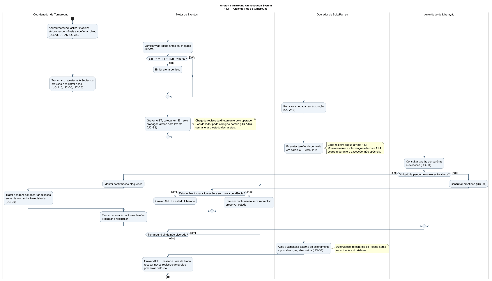
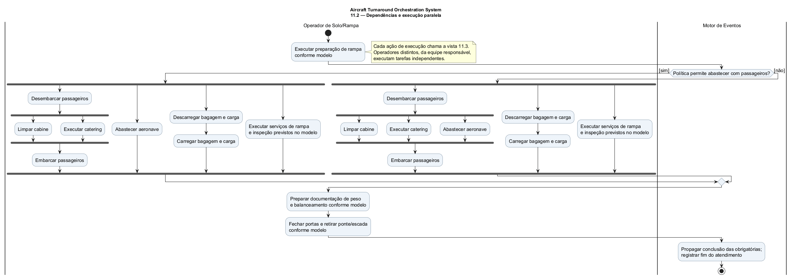
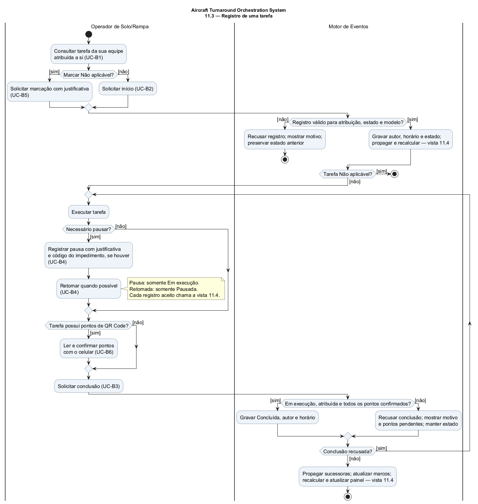
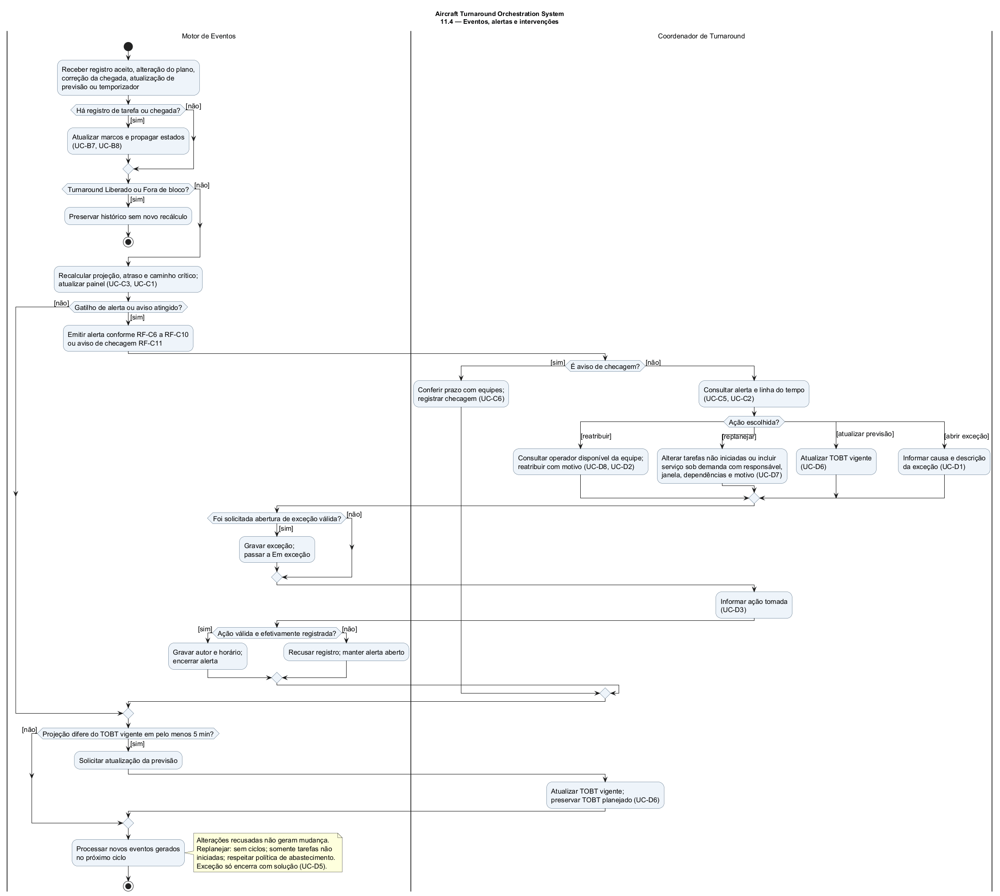

# 11 DIAGRAMA DE ATIVIDADES

O diagrama de atividades do **Aircraft Turnaround Orchestration System** usa a Linguagem de Modelagem Unificada (UML), dividido em quatro vistas complementares. A vista 11.1 acompanha o turnaround; as demais detalham as ações chamadas por ela. As vistas têm início e fim próprios porque representam atividades distintas, não quatro turnarounds consecutivos.

**Referências de tempo e registro.** O planejamento distingue o horário estimado de chegada à posição (EIBT), o tempo mínimo de turnaround (MTTT) e o horário-alvo de prontidão (TOBT). Os registros reais são o horário real de chegada à posição (AIBT), o início real do atendimento em solo (ACGT), o início real do embarque (ASBT), o fim real do atendimento em solo (AEGT), o horário real de prontidão (ARDT) e o horário real de saída da posição (AOBT) [2][4]. Confirmações de pontos usam código de resposta rápida (QR Code), lido com o celular (ADR-0007). Causas de impedimento usam a tabela da Agência Nacional de Aviação Civil (ANAC) [62], conforme ADR-0006.

## 11.1 Ciclo de vida do turnaround

Fonte editável: [11-atividades.puml](diagramas/11-atividades.puml).

Versão vetorial para ampliação e consolidação: [11-atividades.svg](diagramas/11-atividades.svg).

O Coordenador de Turnaround abre o cadastro, aplica o modelo e confirma o plano com responsáveis. O Motor de Eventos verifica a viabilidade antes da chegada (RF-C8). Um risco gera alerta e tratamento, não uma proibição automática de executar o turnaround. O Operador de Solo/Rampa registra diretamente a chegada, após a confirmação do plano, e o Motor de Eventos coloca o turnaround em **Em solo** (ADR-0013). O primeiro início aceito registra ACGT e leva a **Operações em andamento**; o início do embarque registra ASBT; a última obrigatória concluída ou marcada **Não aplicável** registra AEGT e permite **Pronto para liberação** (RF-B7, RF-B8).

Durante a execução, registros são processados pela vista 11.3 e o monitoramento da vista 11.4 ocorre a cada evento e temporizador aplicável. Uma exceção mantém **Em exceção** até seu encerramento com solução; o estado restaurado corresponde ao andamento das tarefas (RF-D5). A Autoridade de Liberação consulta as condições e confirma a prontidão somente em **Pronto para liberação**, sem obrigatória pendente ou exceção aberta. A revalidação na confirmação também recusa uma pendência surgida enquanto a tela estava aberta (UC-D4, E1/E2). O sucesso registra ARDT e leva a **Liberado**.

Depois da autorização de acionamento e push-back recebida fora do sistema, o operador registra AOBT, levando a **Fora de bloco**. A autorização pertence ao controle de tráfego aéreo (ATC); o sistema não a emite nem a verifica (ADR-0004, RF-D9). O histórico é preservado e novos registros de tarefas são recusados.

## 11.2 Dependências e execução paralela

Fonte editável: [11-atividades-paralelas.puml](diagramas/11-atividades-paralelas.puml).

Versão vetorial: [11-atividades-paralelas.svg](diagramas/11-atividades-paralelas.svg).

**[Inferência de modelagem]** Esta vista exemplifica um modelo de atendimento com passageiros, bagagem, abastecimento e serviços de rampa. As relações de desembarque, limpeza, catering e embarque e os fluxos de bagagem se apoiam na pesquisa [20][22][29]. As tarefas efetivas e suas dependências vêm do modelo confirmado, não são criadas automaticamente pelo desenho (RF-A4, RF-A5, RF-A8). Cada ação de execução utiliza os registros da vista 11.3. Uma tarefa permitida como **Não aplicável** satisfaz as dependências sem executar o serviço (RF-B5, RF-B8).

As barras de **fork** distribuem fluxos independentes a operadores distintos das equipes responsáveis; as barras de **join** sincronizam os fluxos necessários antes da sucessora. Limpeza e catering podem ocorrer em paralelo depois do desembarque; bagagem e serviços independentes não precisam esperar o fluxo da cabine inteiro.

A decisão de abastecimento representa a política copiada ao turnaround, imutável após o início das tarefas (RF-A11, ADR-0005) [24][26][27]:

- **[sim]**: permite abastecimento em paralelo com passageiros, sem retirar outras dependências configuradas. O join antes da documentação e do fechamento aguarda os fluxos necessários.
- **[não]**: desembarque precede abastecimento e o join anterior ao embarque exige o término de abastecimento, limpeza e catering. Bagagem e demais serviços independentes seguem em paralelo.

Os serviços sob demanda conhecidos podem integrar o plano inicial. Durante a operação, apenas o Coordenador de Turnaround pode incluir uma tarefa do catálogo, com responsável, janela, dependências e motivo, respeitando as travas de RF-D7. Ela passa a ser executada pela mesma vista 11.3 e, quando obrigatória, bloqueia a liberação até seu término ou marcação permitida como **Não aplicável** (ADR-0014). Os forks ilustram um plano; o teste final de prontidão considera **todas** as obrigatórias efetivamente presentes nele, incluindo as adicionadas depois.

## 11.3 Registro de uma tarefa

Fonte editável: [11-registro-tarefa.puml](diagramas/11-registro-tarefa.puml).

Versão vetorial: [11-registro-tarefa.svg](diagramas/11-registro-tarefa.svg).

O operador consulta somente tarefas da sua equipe atribuídas a ele. Antes do início, pode solicitar **Não aplicável** se o modelo permitir e houver justificativa; caso contrário, solicita início, aceito somente em **Pronta**. Cada registro aceito grava autor e horário e aciona o processamento da vista 11.4. Uma recusa encerra apenas a tentativa, mantendo o estado anterior; uma nova tentativa começa nesta vista.

Durante a execução, a pausa exige justificativa e, quando há impedimento, código da ANAC; a retomada exige **Pausada**. Cada registro passa pelas validações de seu caso de uso (UC-B4). Leituras de QR Code só são aceitas em **Em execução**, para pontos da tarefa atribuída ao operador; pontos inválidos são recusados sem confirmação (UC-B6). A conclusão exige **Em execução** e todos os pontos configurados confirmados (UC-B3). A recusa mantém a tarefa e permite corrigir os pontos ou o estado antes de tentar novamente. A marcação **Não aplicável** não exige nem simula um início.

Sem conexão, os registros de tarefa permanecem no celular como pendentes de envio. Somente após aceitação pelo servidor produzem propagação compartilhada; o servidor revalida estado, atribuição e permissões no envio, conforme os fluxos de exceção da área B e RNF-B2. Esse transporte é abstraído nesta vista; não representa autorização para liberar com registros ainda pendentes no celular.

## 11.4 Eventos, alertas e intervenções

Fonte editável: [11-monitoramento.puml](diagramas/11-monitoramento.puml).

Versão vetorial: [11-monitoramento.svg](diagramas/11-monitoramento.svg).

A vista representa **uma ocorrência** do processamento, repetida a cada registro aceito, alteração do plano, atualização de TOBT, correção de AIBT ou minuto enquanto não houver **Liberado** ou **Fora de bloco** (RF-C1). Não é uma etapa que espera todas as tarefas terminarem. O Motor de Eventos atualiza marcos e estados nos registros aplicáveis, recalcula projeção, atraso e caminho crítico (UC-C3) e fornece os dados ao painel (UC-C1). Exceção aberta prevalece sobre o estado operacional até ser encerrada (RF-D5).

Os gatilhos não são intercambiáveis: RF-C6 trata espera em **Pronta**; RF-C7 compara projeção com **TOBT planejado + 5 min**; RF-C8 trata viabilidade **antes da chegada**; RF-C9 trata ausência de início do embarque no limite configurado; RF-C10 trata falta de prontidão até **TOBT vigente + 5 min**. O aviso **TOBT vigente − 15 min** é checagem com as equipes, não alerta de risco (RF-C11, RF-C14) [2][3][7][13]. Cada um mantém suas condições e regras de emissão conforme os RFs e UC-C4/UC-C6.

O coordenador escolhe reatribuir, replanejar, atualizar a previsão ou abrir uma exceção, e registra a ação para encerrar o alerta (UC-D3). Reatribuição exige operador disponível da mesma equipe; replanejamento só altera tarefas não iniciadas, recusa ciclos e preserva a política de abastecimento. Pode incluir serviço sob demanda (UC-D7). Alterações recusadas mantêm o plano; o alerta só encerra com ação efetivamente registrada. Encerrar um alerta não encerra uma exceção, que exige solução própria (UC-D5).

Quando a projeção se afasta do TOBT vigente em **5 minutos ou mais**, para mais ou para menos, solicita-se a atualização da previsão (RF-D6, ADR-0003) [8][9]. O TOBT planejado permanece fixo como régua de aderência (ADR-0001). Eventos produzidos pelas intervenções voltam ao processamento, com recálculo e atualização do painel.

**Responsabilidades e notação.** As quatro partições usam os nomes do item 5 e das lanes operacionais do item 4: Coordenador de Turnaround, Operador de Solo/Rampa, Motor de Eventos e Autoridade de Liberação. O Administrador do Sistema mantém os cadastros utilizados como pré-condição e não executa atividades do turnaround (ADR-0010). Círculo preenchido = início; círculo com contorno = fim da atividade; retângulo arredondado = ação; losango = decisão ou merge; barras = fork/join. Rótulos entre colchetes indicam guardas. A partição Motor de Eventos reúne o processamento automático e as respostas do sistema dos casos de uso, sem criar um novo ator humano.

Fontes numeradas: [2], [3], [4], [7], [8], [9], [13], [20], [22], [24], [26], [27], [29] e [62], em [fontes da pesquisa](../pesquisa/fontes.md). A decomposição em vistas é uma escolha de modelagem do projeto; não acrescenta regras operacionais às decisões vigentes.
