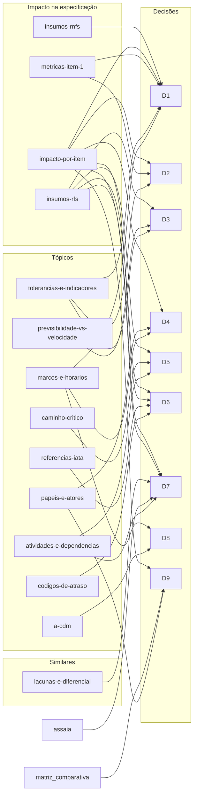

# Pesquisa — mapa da base de conhecimento

> Ponto de partida para quem vai escrever qualquer parte da especificação. Leia antes o [CONTEXT.md](../CONTEXT.md). As decisões estão em [docs/adr/](../docs/adr/README.md) e **prevalecem** sobre a pesquisa. O [relatório consolidado](01-referencias-setor-e-similares.md) de 30/09 e 01/10/2026 está **congelado**: a versão vigente é a destes arquivos.

## Como usar

1. Ache o seu item ou a sua área nas tabelas "Por item" e "Por área" abaixo.
2. Abra só os arquivos indicados. Cada um começa com um cabeçalho de metadados (YAML) e termina com a seção **Ligações**.
3. Se o arquivo traz o quadro **Decisões vigentes**, ele vale mais que o texto da pesquisa.
4. Ao usar um número ou uma sigla do setor, cite a fonte pelo número de [fontes.md](fontes.md).
5. Se o grafo existir (`graphify-out/`), use-o para **achar** o que ler; decida sempre pelos arquivos.

## Resumo (com as decisões aplicadas)

1. **[Fato]** O A-CDM (EUROCONTROL, ACI e IATA) organiza o turnaround em marcos com horários-alvo e responsáveis, com foco declarado em previsibilidade [1][2][4]. O horário-alvo de prontidão (TOBT) é da companhia aérea, que pode delegá-lo ao *handling* [2][5].
2. **Decidido (D1):** a régua do projeto é o **TOBT planejado + 5 min**, unilateral. **[Fato]** Seis aeroportos usam 5 min como janela de prontidão ou limiar de atualização do TOBT [7]–[12], e a EUROCONTROL alerta em TOBT + 5 [2].
3. **Decidido (D2):** metas percentuais do item 1 em **80%**, seguindo as referências de mercado mais próximas [7][15]. Não há meta pública oficial de % para o TOBT.
4. **[Inferência]** O princípio de aderência ao plano está sustentado; encurtar o turnaround é decisão de programação, fora do escopo ([previsibilidade × velocidade](topicos/previsibilidade-vs-velocidade.md)). **Decidido (D3):** antecipação de 5 min ou mais exige atualizar a previsão.
5. **Decidido (D5):** abastecer com passageiros a bordo é regra configurável por operador [26][27].
6. **Decidido (D6):** códigos de atraso = tabela completa da **ANAC** (72 códigos, siglas iguais às da IATA AHM 730) [62].
7. **Decidido (D7):** dados registrados pelo operador, **inclusive QR Code lido pelo celular** (ex.: limpeza da cabine); sem sensores da aeronave nem câmeras fixas no pátio.
8. **Decidido (D4, D9):** 4 atores — Operador de Solo/Rampa, **Coordenador de Turnaround**, Autoridade de Liberação (representante da companhia; não é o ATC) e Motor de Eventos.
9. **[Inferência]** Nenhum dos 5 similares documenta bloqueio de liberação com pendência nem caminho crítico explícito → diferenciais DF1–DF5 ([lacunas e diferencial](similares/lacunas-e-diferencial.md)).
10. **O que muda na especificação:** item 1 com TOBT + 5 min e 80%; "risco ao horário" definido pelos gatilhos do A-CDM; vocabulário de marcos com nome em português; nomes únicos dos atores; tabela da ANAC para causas de atraso; QR Code no "Faz" ([impacto por item](impacto/impacto-por-item.md)).

## Por item do template

As decisões D8 (siglas) e D9 (nome do coordenador) valem para **todos** os itens; a coluna mostra as demais, conforme o campo `itens_template` de cada ADR.

| Item | Leia | Decisões |
|---|---|---|
| [Item 1 — 3 Objetivos](../especificacao/01-3-objetivos.md) | [O que é o A-CDM (P1.1)](topicos/a-cdm.md) [Tolerâncias e indicadores de aderência (P1.3)](topicos/tolerancias-e-indicadores.md) [Previsibilidade × velocidade (P1.4)](topicos/previsibilidade-vs-velocidade.md) [Métricas do item 1 (seção 4.1)](impacto/metricas-item-1.md) [Impacto por item do template (seção 4.2)](impacto/impacto-por-item.md) | [D1](../docs/adr/0001-referencia-horario-tobt-mais-5-min.md), [D2](../docs/adr/0002-metas-percentuais-80.md), [D3](../docs/adr/0003-atualizar-previsao-na-antecipacao.md) |
| [Item 2 — É / Não é / Faz / Não faz](../especificacao/02-e-nao-e-faz-nao-faz.md) | [Previsibilidade × velocidade (P1.4)](topicos/previsibilidade-vs-velocidade.md) [Códigos de atraso (P1.8)](topicos/codigos-de-atraso.md) [Lacunas e diferencial possível (seção 3.4)](similares/lacunas-e-diferencial.md) [Impacto por item do template (seção 4.2)](impacto/impacto-por-item.md) | [D4](../docs/adr/0004-quatro-atores-e-autoridade-de-liberacao.md), [D6](../docs/adr/0006-codigos-de-atraso-tabela-anac.md), [D7](../docs/adr/0007-dados-do-operador-e-qr-code.md) |
| [Item 3 — Visão do Produto](../especificacao/03-visao-do-produto.md) | [O que é o A-CDM (P1.1)](topicos/a-cdm.md) [Previsibilidade × velocidade (P1.4)](topicos/previsibilidade-vs-velocidade.md) [Referências da IATA sobre ground handling (P1.9)](topicos/referencias-iata.md) [Similares de mercado — seleção (seção 3.1)](similares/README.md) [Ficha — Assaia (ApronAI e TurnaroundControl)](similares/assaia.md) [Ficha — INFORM GroundStar](similares/inform-groundstar.md) [Ficha — ADB SAFEGATE (Safedock + Apron Manager)](similares/adb-safegate.md) [Ficha — Veovo (A-CDM)](similares/veovo.md) [Ficha — SITA (Airport Management e CDM)](similares/sita.md) [Matriz comparativa (seção 3.3)](similares/matriz-comparativa.md) [Lacunas e diferencial possível (seção 3.4)](similares/lacunas-e-diferencial.md) [Impacto por item do template (seção 4.2)](impacto/impacto-por-item.md) | [D2](../docs/adr/0002-metas-percentuais-80.md), [D7](../docs/adr/0007-dados-do-operador-e-qr-code.md) |
| [Item 4 — Mapeamento de Negócios (BPMN TO BE)](../especificacao/04-mapeamento-de-negocios.md) | [Marcos e horários do A-CDM (P1.2)](topicos/marcos-e-horarios.md) [Atividades, paralelismo e dependências (P1.5)](topicos/atividades-e-dependencias.md) [Caminho crítico do turnaround (P1.6)](topicos/caminho-critico.md) [Papéis reais e os 4 atores do projeto (P1.7)](topicos/papeis-e-atores.md) [Impacto por item do template (seção 4.2)](impacto/impacto-por-item.md) | [D4](../docs/adr/0004-quatro-atores-e-autoridade-de-liberacao.md), [D5](../docs/adr/0005-abastecimento-com-passageiros-configuravel.md), [D6](../docs/adr/0006-codigos-de-atraso-tabela-anac.md), [D7](../docs/adr/0007-dados-do-operador-e-qr-code.md) |
| [Item 5 — Atores / Usuários](../especificacao/05-atores-usuarios.md) | [Marcos e horários do A-CDM (P1.2)](topicos/marcos-e-horarios.md) [Papéis reais e os 4 atores do projeto (P1.7)](topicos/papeis-e-atores.md) [Impacto por item do template (seção 4.2)](impacto/impacto-por-item.md) | [D4](../docs/adr/0004-quatro-atores-e-autoridade-de-liberacao.md) |
| [Item 6 — Requisitos Funcionais](../especificacao/06-requisitos-funcionais/00-item.md) | [Marcos e horários do A-CDM (P1.2)](topicos/marcos-e-horarios.md) [Atividades, paralelismo e dependências (P1.5)](topicos/atividades-e-dependencias.md) [Caminho crítico do turnaround (P1.6)](topicos/caminho-critico.md) [Códigos de atraso (P1.8)](topicos/codigos-de-atraso.md) [Matriz comparativa (seção 3.3)](similares/matriz-comparativa.md) [Impacto por item do template (seção 4.2)](impacto/impacto-por-item.md) [Insumos para os RFs, por área (seção 4.3)](impacto/insumos-rfs.md) | [D1](../docs/adr/0001-referencia-horario-tobt-mais-5-min.md), [D3](../docs/adr/0003-atualizar-previsao-na-antecipacao.md), [D4](../docs/adr/0004-quatro-atores-e-autoridade-de-liberacao.md), [D5](../docs/adr/0005-abastecimento-com-passageiros-configuravel.md), [D6](../docs/adr/0006-codigos-de-atraso-tabela-anac.md), [D7](../docs/adr/0007-dados-do-operador-e-qr-code.md) |
| [Item 7 — Estórias de Usuário](../especificacao/07-estorias-de-usuario/00-item.md) | [Tolerâncias e indicadores de aderência (P1.3)](topicos/tolerancias-e-indicadores.md) [Atividades, paralelismo e dependências (P1.5)](topicos/atividades-e-dependencias.md) [Códigos de atraso (P1.8)](topicos/codigos-de-atraso.md) [Insumos para os RFs, por área (seção 4.3)](impacto/insumos-rfs.md) | [D1](../docs/adr/0001-referencia-horario-tobt-mais-5-min.md), [D3](../docs/adr/0003-atualizar-previsao-na-antecipacao.md), [D6](../docs/adr/0006-codigos-de-atraso-tabela-anac.md), [D7](../docs/adr/0007-dados-do-operador-e-qr-code.md) |
| [Item 8 — Requisitos Não Funcionais](../especificacao/08-requisitos-nao-funcionais/00-item.md) | [Tolerâncias e indicadores de aderência (P1.3)](topicos/tolerancias-e-indicadores.md) [Referências da IATA sobre ground handling (P1.9)](topicos/referencias-iata.md) [Impacto por item do template (seção 4.2)](impacto/impacto-por-item.md) [Insumos para os RNFs (seção 4.4)](impacto/insumos-rnfs.md) | [D1](../docs/adr/0001-referencia-horario-tobt-mais-5-min.md) |
| [Item 9 — Diagrama Geral de Casos de Uso](../especificacao/09-diagrama-geral-de-casos-de-uso.md) | [Marcos e horários do A-CDM (P1.2)](topicos/marcos-e-horarios.md) [Papéis reais e os 4 atores do projeto (P1.7)](topicos/papeis-e-atores.md) [Insumos para os RFs, por área (seção 4.3)](impacto/insumos-rfs.md) | [D4](../docs/adr/0004-quatro-atores-e-autoridade-de-liberacao.md) |
| [Item 10 — Especificações de Caso de Uso](../especificacao/10-especificacoes-de-caso-de-uso/00-item.md) | [Atividades, paralelismo e dependências (P1.5)](topicos/atividades-e-dependencias.md) [Caminho crítico do turnaround (P1.6)](topicos/caminho-critico.md) [Papéis reais e os 4 atores do projeto (P1.7)](topicos/papeis-e-atores.md) [Códigos de atraso (P1.8)](topicos/codigos-de-atraso.md) [Insumos para os RFs, por área (seção 4.3)](impacto/insumos-rfs.md) | [D1](../docs/adr/0001-referencia-horario-tobt-mais-5-min.md), [D3](../docs/adr/0003-atualizar-previsao-na-antecipacao.md), [D4](../docs/adr/0004-quatro-atores-e-autoridade-de-liberacao.md), [D5](../docs/adr/0005-abastecimento-com-passageiros-configuravel.md), [D6](../docs/adr/0006-codigos-de-atraso-tabela-anac.md), [D7](../docs/adr/0007-dados-do-operador-e-qr-code.md) |
| [Item 11 — Diagrama de Atividades](../especificacao/11-diagrama-de-atividades.md) | [Marcos e horários do A-CDM (P1.2)](topicos/marcos-e-horarios.md) [Atividades, paralelismo e dependências (P1.5)](topicos/atividades-e-dependencias.md) [Caminho crítico do turnaround (P1.6)](topicos/caminho-critico.md) [Papéis reais e os 4 atores do projeto (P1.7)](topicos/papeis-e-atores.md) | [D4](../docs/adr/0004-quatro-atores-e-autoridade-de-liberacao.md), [D5](../docs/adr/0005-abastecimento-com-passageiros-configuravel.md) |

## Por área do plano RA1

| Área | Leia |
|---|---|
| Área A — Acesso e planejamento | [Marcos e horários do A-CDM (P1.2)](topicos/marcos-e-horarios.md) [Atividades, paralelismo e dependências (P1.5)](topicos/atividades-e-dependencias.md) [Papéis reais e os 4 atores do projeto (P1.7)](topicos/papeis-e-atores.md) [Insumos para os RFs, por área (seção 4.3)](impacto/insumos-rfs.md) [Insumos para os RNFs (seção 4.4)](impacto/insumos-rnfs.md) |
| Área B — Execução em solo | [Marcos e horários do A-CDM (P1.2)](topicos/marcos-e-horarios.md) [Atividades, paralelismo e dependências (P1.5)](topicos/atividades-e-dependencias.md) [Códigos de atraso (P1.8)](topicos/codigos-de-atraso.md) [Insumos para os RFs, por área (seção 4.3)](impacto/insumos-rfs.md) [Insumos para os RNFs (seção 4.4)](impacto/insumos-rnfs.md) |
| Área C — Monitoramento | [Marcos e horários do A-CDM (P1.2)](topicos/marcos-e-horarios.md) [Tolerâncias e indicadores de aderência (P1.3)](topicos/tolerancias-e-indicadores.md) [Caminho crítico do turnaround (P1.6)](topicos/caminho-critico.md) [Insumos para os RFs, por área (seção 4.3)](impacto/insumos-rfs.md) [Insumos para os RNFs (seção 4.4)](impacto/insumos-rnfs.md) |
| Área D — Exceções e liberação | [Marcos e horários do A-CDM (P1.2)](topicos/marcos-e-horarios.md) [Tolerâncias e indicadores de aderência (P1.3)](topicos/tolerancias-e-indicadores.md) [Papéis reais e os 4 atores do projeto (P1.7)](topicos/papeis-e-atores.md) [Códigos de atraso (P1.8)](topicos/codigos-de-atraso.md) [Insumos para os RFs, por área (seção 4.3)](impacto/insumos-rfs.md) [Insumos para os RNFs (seção 4.4)](impacto/insumos-rnfs.md) |

## Todos os arquivos

| Arquivo | Seção original | Itens | Áreas | Decisões |
|---|---|---|---|---|
| [O que é o A-CDM (P1.1)](topicos/a-cdm.md) | 2.1 | 1, 3 | — | D8 |
| [Marcos e horários do A-CDM (P1.2)](topicos/marcos-e-horarios.md) | 2.2 | 4, 5, 6, 9, 11 | A, B, C, D | D1, D4, D8 |
| [Tolerâncias e indicadores de aderência (P1.3)](topicos/tolerancias-e-indicadores.md) | 2.3 | 1, 7, 8 | C, D | D1, D2, D3 |
| [Previsibilidade × velocidade (P1.4)](topicos/previsibilidade-vs-velocidade.md) | 2.4 | 1, 2, 3 | — | D3 |
| [Atividades, paralelismo e dependências (P1.5)](topicos/atividades-e-dependencias.md) | 2.5 | 4, 6, 7, 10, 11 | A, B | D5, D7 |
| [Caminho crítico do turnaround (P1.6)](topicos/caminho-critico.md) | 2.6 | 4, 6, 10, 11 | C | D5 |
| [Papéis reais e os 4 atores do projeto (P1.7)](topicos/papeis-e-atores.md) | 2.7 | 4, 5, 9, 10, 11 | A, D | D4, D9 |
| [Códigos de atraso (P1.8)](topicos/codigos-de-atraso.md) | 2.8 | 2, 6, 7, 10 | B, D | D6 |
| [Referências da IATA sobre ground handling (P1.9)](topicos/referencias-iata.md) | 2.9 | 3, 8 | — | D6 |
| [Similares de mercado — seleção (seção 3.1)](similares/README.md) | 3.1 | 3 | — | — |
| [Ficha — Assaia (ApronAI e TurnaroundControl)](similares/assaia.md) | 3.2 | 3 | — | D7 |
| [Ficha — INFORM GroundStar](similares/inform-groundstar.md) | 3.2 | 3 | — | — |
| [Ficha — ADB SAFEGATE (Safedock + Apron Manager)](similares/adb-safegate.md) | 3.2 | 3 | — | — |
| [Ficha — Veovo (A-CDM)](similares/veovo.md) | 3.2 | 3 | — | — |
| [Ficha — SITA (Airport Management e CDM)](similares/sita.md) | 3.2 | 3 | — | — |
| [Matriz comparativa (seção 3.3)](similares/matriz-comparativa.md) | 3.3 | 3, 6 | — | D9 |
| [Lacunas e diferencial possível (seção 3.4)](similares/lacunas-e-diferencial.md) | 3.4 | 2, 3 | — | D7 |
| [Métricas do item 1 (seção 4.1)](impacto/metricas-item-1.md) | 4.1 | 1 | — | D1, D2 |
| [Impacto por item do template (seção 4.2)](impacto/impacto-por-item.md) | 4.2 | 1, 2, 3, 4, 5, 6, 8 | — | D1, D2, D4, D6, D7, D9 |
| [Insumos para os RFs, por área (seção 4.3)](impacto/insumos-rfs.md) | 4.3 | 6, 7, 9, 10 | A, B, C, D | D3, D5, D6, D7 |
| [Insumos para os RNFs (seção 4.4)](impacto/insumos-rnfs.md) | 4.4 | 8 | A, B, C, D | D1 |
| [Fontes da pesquisa](fontes.md) | 6 | — | — | — |

## Correspondência com o relatório consolidado

| Seção do relatório | Arquivo vigente |
|---|---|
| 2.1 | [O que é o A-CDM (P1.1)](topicos/a-cdm.md) |
| 2.2 | [Marcos e horários do A-CDM (P1.2)](topicos/marcos-e-horarios.md) |
| 2.3 | [Tolerâncias e indicadores de aderência (P1.3)](topicos/tolerancias-e-indicadores.md) |
| 2.4 | [Previsibilidade × velocidade (P1.4)](topicos/previsibilidade-vs-velocidade.md) |
| 2.5 | [Atividades, paralelismo e dependências (P1.5)](topicos/atividades-e-dependencias.md) |
| 2.6 | [Caminho crítico do turnaround (P1.6)](topicos/caminho-critico.md) |
| 2.7 | [Papéis reais e os 4 atores do projeto (P1.7)](topicos/papeis-e-atores.md) |
| 2.8 | [Códigos de atraso (P1.8)](topicos/codigos-de-atraso.md) |
| 2.9 | [Referências da IATA sobre ground handling (P1.9)](topicos/referencias-iata.md) |
| 3.1 | [Similares de mercado — seleção (seção 3.1)](similares/README.md) |
| 3.2 | [Ficha — Assaia (ApronAI e TurnaroundControl)](similares/assaia.md) |
| 3.2 | [Ficha — INFORM GroundStar](similares/inform-groundstar.md) |
| 3.2 | [Ficha — ADB SAFEGATE (Safedock + Apron Manager)](similares/adb-safegate.md) |
| 3.2 | [Ficha — Veovo (A-CDM)](similares/veovo.md) |
| 3.2 | [Ficha — SITA (Airport Management e CDM)](similares/sita.md) |
| 3.3 | [Matriz comparativa (seção 3.3)](similares/matriz-comparativa.md) |
| 3.4 | [Lacunas e diferencial possível (seção 3.4)](similares/lacunas-e-diferencial.md) |
| 4.1 | [Métricas do item 1 (seção 4.1)](impacto/metricas-item-1.md) |
| 4.2 | [Impacto por item do template (seção 4.2)](impacto/impacto-por-item.md) |
| 4.3 | [Insumos para os RFs, por área (seção 4.3)](impacto/insumos-rfs.md) |
| 4.4 | [Insumos para os RNFs (seção 4.4)](impacto/insumos-rnfs.md) |
| 5 | [Decisões (ADRs)](../docs/adr/README.md) |
| 6 e 6.1 | [Fontes](fontes.md) |
| 1 (resumo executivo) | este mapa, seção "Resumo" |

## Diagrama: arquivos × decisões

## Convenções de leitura

- **[Fato]** = está na fonte citada entre colchetes (ex.: `[Fato][2]`). Citações literais ficam entre aspas, no idioma original.
- **[Inferência]** = conclusão deste relatório a partir das fontes; não está escrita na fonte.
- **(declarado pelo fornecedor)** = número ou capacidade anunciada por empresa em material próprio; não foi verificado de forma independente.
- **Não confirmado** = procurei e não encontrei fonte acessível que confirme.
- Os números entre colchetes remetem a [fontes.md](fontes.md).
- Siglas do setor ficam no original e são explicadas na primeira ocorrência. O glossário completo está em [marcos e horários](topicos/marcos-e-horarios.md).

---

## Ligações

- **Decisões:** [docs/adr/README.md](../docs/adr/README.md)
- **Contexto geral:** [CONTEXT.md](../CONTEXT.md)
- **Fontes:** [fontes.md](fontes.md)
- **Relatório consolidado (congelado):** [01-referencias-setor-e-similares.md](01-referencias-setor-e-similares.md)
